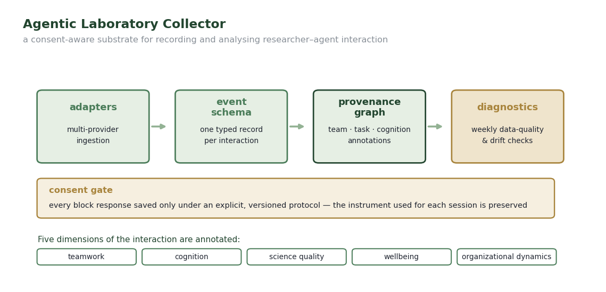

# Agentic Lab

A consent-aware substrate for collecting and analysing researcher–agent interaction — across teamwork, cognition, science quality, wellbeing, and organizational dynamics.

<figure><figcaption>Ingestion to provenance graph, gated by a versioned consent protocol.</figcaption></figure>

## Why the interaction has to be the record

Research work is moving into agents faster than the evidence about its effects is accumulating, and the evidence that exists is not reassuring. AI assistance has been found to impair conceptual understanding, code reading and debugging without average efficiency gains. In a randomized trial, experienced developers were slowed by 19% while believing afterwards that they had been sped up by 20%.

Self-report is therefore not a usable instrument. The interaction itself has to be the record.

## The problem it addresses

As people do more of their research work *with* agents, the interaction itself becomes data — but data that is scattered across providers, uneven in quality, and ethically loaded. Agentic Lab is the collection-and-analysis layer that makes that interaction into something you can study without losing the consent context that makes studying it legitimate.

## The shape of it

**Adapters** ingest from multiple providers into one place. A typed **event schema** turns each interaction into one structured record. Those records assemble into a **provenance graph** annotated along five dimensions — teamwork, cognition, science quality, wellbeing, and organizational dynamics — so the same interaction can be read as a coordination event, a cognitive step, or a wellbeing signal. Weekly **diagnostics** watch for data-quality problems and drift.

Under all of it sits a **consent gate**: block responses are saved only under an explicit, versioned protocol, so the exact instrument used for every session is preserved even as later protocol versions appear.

## The study it is for

Collection from graduate students and postdoctoral researchers in Computer Science first, then more widely across the College of Engineering, with graduate students as the major driving force of the study as well as its subjects.

How agents are used in research work. What that use does to research productivity and to research quality. What it does over time to the growth and health of a research community.

## Status

The build is under way. What is fixed: the event schema for human–agent interactions, the multi-provider ingestion adapters, the provenance graph with team, task and cognition annotations, and the weekly data-quality-and-drift diagnostics.

## More

* [Design](design.md) — the schema, the provenance graph, and the consent model

_Last updated: 2026-08_
