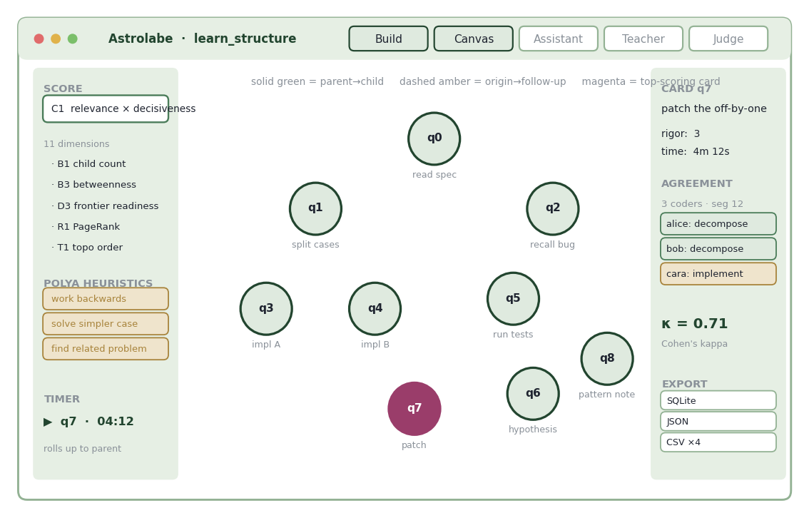

# Astrolabe

A local research app for turning recorded work sessions into coded, comparable data — and for finding out whether independent coders actually agree on what they saw.

<figure><figcaption>
One session as a graph. Green edges are decomposition; amber are follow-ups; magenta is the highest-scoring card.
</figcaption></figure>

Built for the [problem-solving](../../overview/3-year-agenda/mental-world-modeling/problem-solving/) studies. Get a transcript in, let several people annotate it against a shared scheme, and measure the agreement rather than assuming it.

## What it does

**Intake.** Typed text, uploaded transcripts as plain text or JSON, or audio recorded straight from the browser and transcribed with Whisper.

**Structure.** A session is organised as question-cards — "qcards" — parsed from the source document. Structural edges (parent → child) capture decomposition; origin edges (dashed) capture which question spawned which. A timeline view lays the cards out in the topological order of those origin edges, so you can watch the solve unfold.

**Annotation.** Multiple coders label the same session against a shared scheme, with optional item identifiers so segments line up across coders.

**Agreement.** Stage-level percent agreement and Cohen's kappa between annotators, exportable as CSV. Where coders diverge is treated as a finding, not a defect.

**Scoring.** Eleven graph metrics — blocking, decisiveness, relevance, and combinations — shade the nodes live, with the single top-scoring card highlighted. Which subproblem was the hinge becomes visible rather than argued.

**Assistance.** Reusable prompt scaffolds and templates for candidate actions, operations, concepts and questions, wired to configurable model providers — Anthropic, OpenAI, or a mock provider when you want the pipeline without the calls.

**Export.** Six formats: SQLite, JSON, and CSV for graph, scores, timeline, and agreement — compatible with Gephi, NetworkX, R and Python.

## Two commitments

**It runs entirely on your own machine.** Nothing is hosted, and the model calls are optional.

**It never writes to your source material.** On first load it takes one snapshot and works from that, keeps all its own state in a separate SQLite database, and hands changes back as pasteable text you apply yourself. You can keep editing the original while the app is running.

## More

* [Design](design.md) — the architecture, the read-only guarantee, and the eleven scores
* [Use](use.md) — running a study session end to end

_Last updated: 2026-08_
