# In Action

At the desk on **The Website**.



<figure>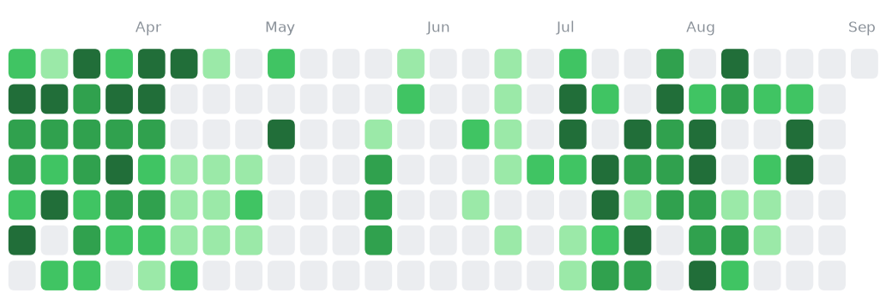<figcaption>
518 hours logged in the last six months
</figcaption></figure>


<figure>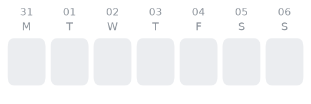<figcaption>
Work across the last week
</figcaption></figure>


<figure>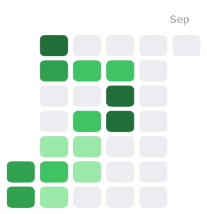<figcaption>
28 hours logged in the last month
</figcaption></figure>


<figure>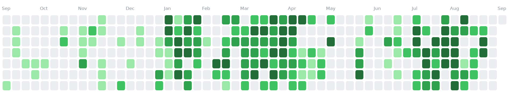<figcaption>
715 hours logged in the last year
</figcaption></figure>



#### Writing and upkeep

The Website — removed design.md

_at the desk · Aug 27_

<figure>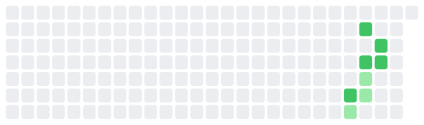<figcaption></figcaption></figure>

* **Aug 27** — removed future-of-work-in-agentic-laboratories-open-science-health-scientists.md
* **Aug 27** — removed trustworthy-controllable-causal-world-model-for-operational-network-defense.md
* **Aug 27** — removed what-makes-it-so-difficult-competitive-cybersecurity-learning-and-workforce-expertise-maintenance.md
* **Aug 26** — wrote into case study
* **Aug 26** — wrote into panel organization
* **Aug 26** — wrote into poster and work in progress

[The Website on the site](../site-dev-log.md)

What to Read — nothing recorded yet

_resting · Aug 15_

<figure><figcaption></figcaption></figure>

[What to Read on the site](../personal/overview.md)

Research Statement — Next steps and key questions in HAT projects

_resting · Aug 09_

<figure><figcaption></figcaption></figure>

* 77.1 hours logged in this window

[Research Statement on the site](../research/projects/research-statement/overview.md)

#### Cyber World Modeling

FOE-Dreamer — Harvest the side products, such as tips, actionable templates, and methodology for this…

_warm · Aug 26 · 21.3h this week_

<figure><figcaption></figcaption></figure>

* **Aug 26** — logged 0.6h — Harvest the side products, such as tips, actionable templates, and methodology for this specific type of rebuttal, slides and pedagogical materials related to the project, reflection on the community's interest &amp; expertise and next steps in this project, logistics and action items for hypothetical next stage, plans for backup and cleansing of artifacts
* **Aug 26** — logged 3.0h — Reflect on lucrative research questions highlighted by reviewer's comments
* **Aug 26** — logged 3.2h — Harvest the side products, such as tips, actionable templates, and methodology for this specific type of rebuttal, slides and pedagogical materials related to the project, reflection on the community's interest &amp; expertise and next steps in this project, logistics and action items for hypothetical next stage, plans for backup and cleansing of artifacts
* **Aug 26** — logged 4.0h — Third draft and submission.
* **Aug 26** — logged 4.3h — Second draft, inspect the comments from various angle, outline rebuttal (template, theme, key papers), infer the stance of reviewers, prioritize and cluster comments, narrow done todo items for each comment, and compile into spreadsheet for the tweak and play next round.
* **Aug 25** — logged 3.9h — First draft, identified the deeper questions in reviewers' comments that worth discussing, and collected some tips about addressing comments for ACSAC
* 23.2 hours logged in this window

[FOE-Dreamer on the site](../overview/3-year-agenda/cyber-world-modeling/environment.md)

World Model Failure — nothing recorded yet

_resting · Aug 10_

<figure><figcaption></figcaption></figure>

[World Model Failure on the site](../research/projects/lucid-world/world-model-failure-track.md)

Learn Structure — first time using the touch screen of yoga, it frees up creativity.

_resting · Aug 06_

<figure><figcaption></figcaption></figure>

* **Aug 06** — logged 2.8h — first time using the touch screen of yoga, it frees up creativity.
* 114.9 hours logged in this window

[Learn Structure on the site](../overview/3-year-agenda/cyber-world-modeling/strategic-structure.md)

AcceleratePSRO — An extended search from the three papers.

_resting · Apr 09_

<figure><figcaption></figcaption></figure>

* **Apr 09** — logged 1.1h — An extended search from the three papers.
* **Apr 09** — logged 1.0h — The seed papers, Dyna-PSRO, GenBR, and DiscoverPSROVariants
* 203.0 hours logged in this window

[AcceleratePSRO on the site](../overview/3-year-agenda/cyber-world-modeling/accelerate-psro.md)

#### Toward Deployment

What Is a Realistic Cyber Environment — Draft survey and interview

_warm · Aug 25 · 3.4h this week_

<figure><figcaption></figcaption></figure>

* **Aug 25** — logged 0.2h — Draft survey and interview
* **Aug 25** — logged 1.6h — Read relevant chapters from Antti's book, outline survey and interview
* 62.1 hours logged in this window

[What Is a Realistic Cyber Environment on the site](../overview/3-year-agenda/toward-deployment/when-we-say-a-realistic-cyber-environment.md)

Sim2Sim before Sim2Real — 01.23 Weekly Meeting. Debug Encoder. The most likely cause is mismatch between source and…

_resting · Aug 06_

<figure><figcaption></figcaption></figure>

* 16.6 hours logged in this window

[Sim2Sim before Sim2Real on the site](../overview/3-year-agenda/toward-deployment/transfer-to-realistic-environments.md)

Emulators — nothing recorded yet

_resting · —_

[Emulators on the site](../research/projects/be-realistic/emulator-track.md)

#### Mental World Modeling

Progressive Problem Design — Note next steps: connect with the algorithmic primitive paper, write new ideas to overleaf,…

_warm · Aug 24 · 2.9h this week_

<figure>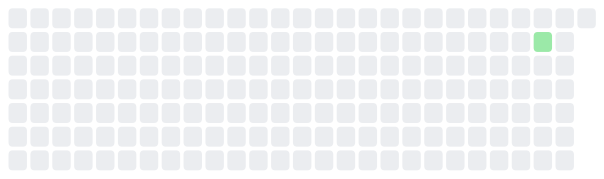<figcaption></figcaption></figure>

* **Aug 24** — logged 0.2h — Note next steps: connect with the algorithmic primitive paper, write new ideas to overleaf, implement proof of concepts, profile the ctftime, ibm, and Jaime’s course materials as the three basis, design the human experiments for mental operations consensus
* **Aug 24** — logged 2.7h — Project design: map out the space of mental operations, connect write up processing, cognitive based challenge profiling, automated generation of challenges with reasoning demands, specified the role of Stackelberg and PSRO.
* 2.9 hours logged in this window

[Progressive Problem Design on the site](../overview/3-year-agenda/mental-world-modeling/problem-solving/capture-the-flag.md)

Human Relationships in Networks — Created a template that I am satisfied with. Now finally back to track on the progression of…

_resting · Aug 10_

<figure><figcaption></figcaption></figure>

* 45.3 hours logged in this window

[Human Relationships in Networks on the site](../overview/3-year-agenda/mental-world-modeling/opponent-agent-modeling/social-intelligence.md)

Mental Operations Consensus — nothing recorded yet

_resting · Aug 09_

<figure><figcaption></figcaption></figure>

[Mental Operations Consensus on the site](../overview/3-year-agenda/mental-world-modeling/problem-solving/general-cs.md)

What Makes a Problem Difficult — CTFTime Crawler

_resting · Aug 06_

<figure><figcaption></figcaption></figure>

* **Aug 06** — logged 1.2h — CTFTime Crawler
* **Jul 17** — logged 0.2h — poster
* **Jul 17** — logged 2.3h — poster
* 67.6 hours logged in this window

[What Makes a Problem Difficult on the site](../research/projects/design-the-game/difficulty-lineage.md)

Attacker Behavior Modeling — Working in VS Code

_resting · Jul 06_

<figure><figcaption></figcaption></figure>

* **Jul 06** — logged 0.2h — Working in VS Code
* 8.2 hours logged in this window

[Attacker Behavior Modeling on the site](../overview/3-year-agenda/mental-world-modeling/opponent-agent-modeling/bias/README.md)

#### Human-AI Complementarity

Team Defense Game — nothing recorded yet

_resting · Aug 09_

<figure><figcaption></figcaption></figure>

[Team Defense Game on the site](../overview/3-year-agenda/human-ai-complementarity/team-defense-game.md)

CHART — Found out who is the mean editor and made a plan. Now I have to put this down to attend to…

_resting · Jul 15_

<figure><figcaption></figcaption></figure>

* 41.6 hours logged in this window

[CHART on the site](../overview/3-year-agenda/human-ai-complementarity/chart.md)

RL4ThreadSecurity — I can probably do some reading, understand my method better to be prepared for the questions,…

_resting · Apr 01_

<figure>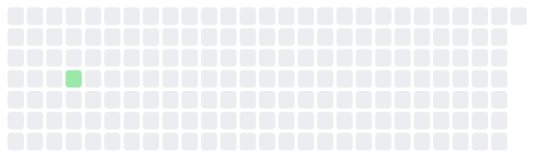<figcaption></figcaption></figure>

* **Jan 21** — logged 1.5h — I can probably do some reading, understand my method better to be prepared for the questions, and read some CPS papers if Sai shares with me. In terms of proposal, i have to wait for their contacts and their pointers on potential programs
* 32.4 hours logged in this window

[RL4ThreadSecurity on the site](../research/projects/united-forces/overview.md)

Team Dependencies — Updated a few todo items

_resting · Mar 23_

<figure><figcaption></figcaption></figure>

* **Mar 23** — logged 0.3h — Updated a few todo items
* 7.3 hours logged in this window

[Team Dependencies on the site](../research/projects/united-forces/team-dependencies-track.md)

CyberAgentFlow — Thomas's talk

_resting · Mar 13_

<figure><figcaption></figcaption></figure>

* **Mar 13** — logged 0.8h — Thomas's talk
* 13.2 hours logged in this window

[CyberAgentFlow on the site](../overview/3-year-agenda/human-ai-complementarity/cyberagenttrace.md)

#### Study approvals

IRB Logistics — nothing recorded yet

_resting · Aug 04_

<figure><figcaption></figcaption></figure>

[IRB Logistics on the site](../research/projects/irb-applications/overview.md)

#### Around the work

Thinking — Analogical thinking run wild.

_at the desk · Aug 27 · 5.3h this week_

<figure>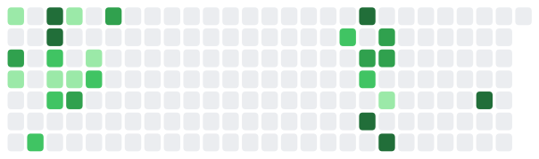<figcaption></figcaption></figure>

* **Aug 27** — logged 2.7h — Analogical thinking run wild.
* **Aug 27** — logged 2.6h — Filter through opportunities collected by my opportunity scouts and the ones shared by linkedin hub accounts. Found several astonishingly well matching fellowships. I am not sure if I could have always tried to match my work with buzz words and rebrand myself constantly, or if it really is the most recent thing, that the trending of AI agents suddenly made my skills marketable
* **Jul 25** — logged 4.6h — Toward a theory of "pull it together"
* 64.2 hours logged in this window

[Thinking on the site](../home/what-is-she-thinking.md)

Overhead — Working on

_warm · Aug 26 · 0.3h this week_

<figure>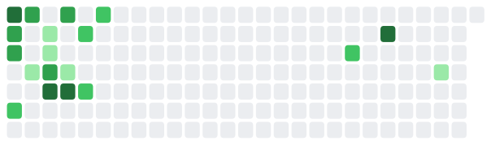<figcaption></figcaption></figure>

* **Jul 06** — logged 0.0h — Working on
* **Apr 09** — logged 0.7h — https://www.science.org/content/article/writing-research-plan
* 39.1 hours logged in this window

Service — Aritran's survey

_resting · Jul 25_

<figure>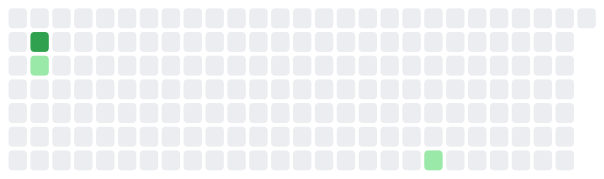<figcaption></figcaption></figure>

* **Jul 25** — logged 0.6h — Aritran's survey
* **Mar 17** — logged 0.6h — Filling in the research activity form and feeling jealous
* **Mar 16** — logged 1.3h — Review for Computational Brain and Behavior. Claude is not good at this.
* 2.5 hours logged in this window

[Service on the site](../overview-3/README.md)

Mentoring — How to prepare for the reading group?

_resting · Apr 09_

<figure>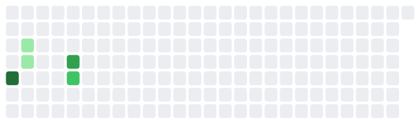<figcaption></figcaption></figure>

* **Mar 12** — logged 1.1h — How to prepare for the reading group?
* 3.3 hours logged in this window

[Mentoring on the site](../mentor/README.md)

AAAI Summer Symposium — Meet Carmela, wild gov person

_resting · Apr 06_

<figure>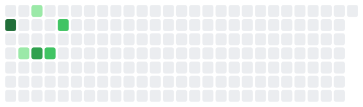<figcaption></figcaption></figure>

* **Mar 09** — logged 1.3h — Meet Carmela, wild gov person
* 20.6 hours logged in this window

[AAAI Summer Symposium on the site](../overview-3/aaai-summer-symposium-2026.md)

Reading Group — Invite a speaker and register for the seminar series website

_resting · Mar 27_

<figure>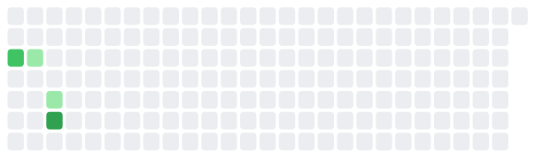<figcaption></figcaption></figure>

* **Mar 26** — logged 0.6h — Invite a speaker and register for the seminar series website
* **Mar 17** — logged 0.2h — Making a post for Maria Rigaki
* 16.0 hours logged in this window

[Reading Group on the site](../overview-3/cyberai-reading-group/README.md)

_Last looked at Aug 27, 22:52_
