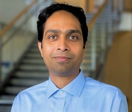

# AAAI Summer Symposium

I co-organized this symposium, part of the AAAI 2026 Summer Symposium Series, held June 22–24, 2026 at Dongguk University in Seoul, South Korea.

**Official website:** [sites.google.com/view/suss26-ai-agents-for-cyber](https://sites.google.com/view/suss26-ai-agents-for-cyber/home) **Series page:** [AAAI 2026 Summer Symposium Series](https://aaai.org/conference/summer-symposia/suss26/)

## What it was about

AI in cybersecurity has moved past passive detection. Agents now simulate attackers, run autonomous defenses, and sit beside human analysts during incidents. Language-model penetration testers chain exploits; hybrid reinforcement-learning systems defend networks and explain their reasoning; copilots assist security operations centers.

Technical progress alone does not settle the question. Analysts supply the context, judgment, and ethical oversight that agents lack, and they also bring bias, workload limits, and well-founded distrust of opaque tools. Modeling how attackers and defenders actually learn and reason makes cyber agents more effective; calibrated trust and explainability make collaboration possible at all. The symposium convened the community working at that intersection.

## Themes

* attacker agents for ethical hacking and red-teaming
* autonomous defenders and multi-agent coordination
* human-centered assistants for security operations centers
* human-AI teaming in cyber domains
* cognitive and behavioral models of attackers and defenders
* trustworthy AI for high-stakes operations

## Agenda

Five half-day parts, with a keynote each morning.

| Part | Focus                                                  |
| ---- | ------------------------------------------------------ |
| 1    | Attacker and pen-testing agents                        |
| 2    | Defender and autonomous defense agents                 |
| 3    | Cyber ranges, challenges, and benchmarks               |
| 4    | AI assistants and human-in-the-loop attack and defense |
| 5    | Cross-community lightning talks                        |

## Organizing committee

|                                                                                                     | Organizer                                                                                    | Affiliation                    |
| --------------------------------------------------------------------------------------------------- | -------------------------------------------------------------------------------------------- | ------------------------------ |
|            | [Arunesh Sinha](https://aruneshsinha.net/)                                                   | Rutgers University             |
|                                                                                                     | [Kimberly J. Ferguson-Walter](https://scholar.google.com/citations?user=o0yhhe8AAAAJ\&hl=en) | Leidos                         |
|          | [Palvi Aggarwal](https://expertise.utep.edu/profiles/paggarwal)                              | University of Texas at El Paso |
|                | [Quanyan Zhu](https://engineering.nyu.edu/faculty/quanyan-zhu)                               | New York University            |
|  | [Sridhar Venkatesan](https://scholar.google.com/citations?user=ikJ6saoAAAAJ\&hl=en)          | Peraton Labs                   |
|                      | Yinuo Du                                                                                     | University of Texas at El Paso |

**Related:** [Community](./) | [CyberAI Reading Group](cyberai-reading-group/cyberai-reading-group-1.md) | [Research overview](../research/overview.md)

_Last updated: 2026-08_
