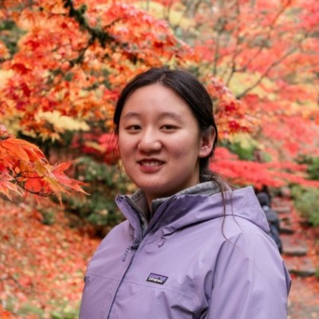
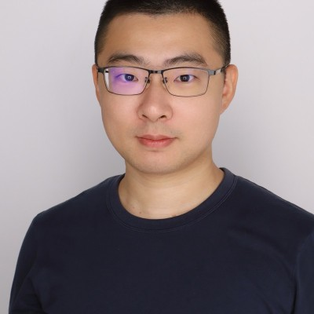

# 2026 Spring

The group meets on Fridays through the spring term, which runs from January 20 to May 8, 2026, with a break the week of March 16–20. A few speakers without a public headshot show a placeholder tile — drop a photo into the matching asset file to replace one.

## Guest talks

|                                                                                                                                                                        | Date         | Speaker                                                                         | Affiliation                          | Talk                                                   |
| ---------------------------------------------------------------------------------------------------------------------------------------------------------------------- | ------------ | ------------------------------------------------------------------------------- | ------------------------------------ | ------------------------------------------------------ |
|                                                                                          | Jan 23, 2026 | [Siyu Liu](https://www.linkedin.com/in/siyu-liu-435707259/)                     | —                                    | LLMs for vulnerability discovery                       |
|                                                                                                 | Jan 30, 2026 | [Omer Akgul](https://oakgul.com/)                                               | Incalmo                              | Hack the AI Hackers                                    |
|  | Feb 6, 2026  | [Maria Rigaki](https://mariarigaki.github.io/)                                  | Czech Technical University in Prague | LLM defense agents                                     |
|                                                                             | Feb 13, 2026 | [Mingming Chen](https://mzc796.github.io/)                                      | University of Texas at Dallas        | RL for SDN poisoning                                   |
|                                                                       | Feb 20, 2026 | [Michael Lanier](https://scholar.google.com/citations?user=qANuP04AAAAJ\&hl=en) | Washington University in St. Louis   | Cyber range; game-theoretic simulation for APT Typhoon |
|                                                                                          | Mar 6, 2026  | [Yongzhao Wang](https://sites.google.com/umich.edu/yongzhao-wang/)              | University of North Florida          | EGTA and applications in cybersecurity                 |
|                                                                                   | Mar 13, 2026 | [Mingyu Guo](https://mingyuguo.github.io/)                                      | University of Adelaide               | GT/RL for Active Directory defense                     |
|                                                                                | Apr 3, 2026  | Jeongkeun Shin                                                                  | Carnegie Mellon University           | —                                                      |

## Student presentations

|                                                                                                                | Date | Presenter                      | Paper or topic |
| -------------------------------------------------------------------------------------------------------------- | ---- | ------------------------------ | -------------- |
|  |      | Emilia Rivas and Sabrina Saika | —              |
|                 |      | Thomas Guerra                  | —              |

_Last updated: 2026-08_
