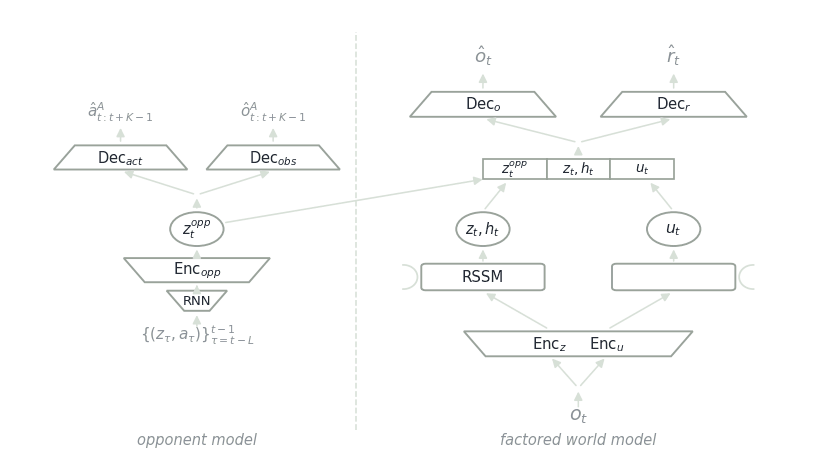

# FOE-Dreamer

A world-model agent for network defense, built so that learning can happen where the network actually is rather than only in a simulator.

<figure><figcaption>
FOE-Dreamer, traced in the order information moves through it.
</figcaption></figure>

The right side is the **factored world model**. An observation $$o_t$$ is split and passed through two encoders, $$Enc_z$$ and $$Enc_u$$. Each feeds a recurrent state-space model that carries its own history forward, producing two latents: $$z_t, h_t$$ for the part of the world the agent models directly, and $$u_t$$ for the part it keeps factored out.

The left side is the **opponent model**. A window of recent latent-action pairs runs through a recurrent encoder into $$z^{opp}_t$$, a compact representation of who the agent is up against. Two decoders read it: $$Dec_{act}$$ predicts the opponent's next actions, $$Dec_{obs}$$ predicts what the opponent will observe.

The two sides meet at the concatenation. $$z^{opp}_t$$, $$z_t, h_t$$ and $$u_t$$ are joined and read by $$Dec_o$$ and $$Dec_r$$, which reconstruct the observation and the reward.

## Publications

<table><thead><tr><th width="100"></th><th width="400">Paper</th><th>Authors</th><th></th></tr></thead><tbody><tr><td></td><td><mark style="color:green;">FOE-Dreamer: Deployment-Efficient Learning of Cyber Defense Policies in Operational Networks</mark> <em>Under review, ACSAC</em></td><td><strong>Y. Du</strong>, <a href="https://www.cs.utep.edu/kiekintveld/">C. Kiekintveld</a></td><td></td></tr></tbody></table>

## Collaborators

<table data-header-hidden><thead><tr><th></th></tr></thead><tbody><tr><td> <a href="https://www.cs.utep.edu/kiekintveld/"><strong>Christopher Kiekintveld</strong></a> University of Texas at El Paso</td></tr></tbody></table>

_Last updated: 2026-08_
