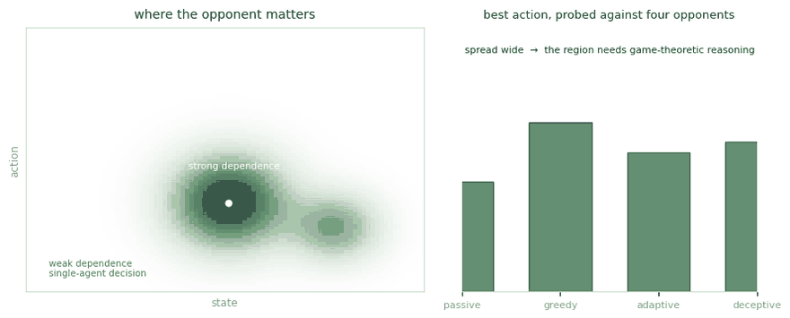

# Learn Structure

Not every part of a game is strategic. Most of it isn't.

<figure><figcaption>
Left: how much the best action depends on the opponent, across the space. Right: probing one region against four opponent behaviours.
</figcaption></figure>

## The intuition

**Strategic dependence** is how much a player's best action, in a given region of states and actions, turns on what the other player does.

Two parts to it. First, dependence: sometimes your choice genuinely hinges on the opponent, and often it doesn't. Second, what that implies for the right action: where dependence is strong, the region needs game-theoretic reasoning; where it's weak or absent, the region collapses into an ordinary single-agent decision.

The dependence is not uniform. It concentrates in pockets, and those pockets move during a single interaction as the opponent shifts.

## Why it forces a choice

A defender in a game too large to solve whole has to decide where game-theoretic reasoning is necessary and where the opponent can be treated as part of the environment. The cost of the analysis is what forces that choice: in empirical game-theoretic analysis every payoff entry is estimated by simulation, already prohibitive beyond two players, so which strategies enter the empirical game governs what the analysis can deliver. A fourteen-day engagement decided inside a twenty-nine-minute window turns the budget question from a tuning decision into the problem itself.

## Why existing notions of structure do not capture it

The dependency graph of a factored MDP, the relations of an object-oriented state, the causal graph, and empirical payoff dependence are all properties of the game **as written**. Strategic dependence is a property of **how the game is played**. Hold a green security game fixed and vary only the poacher's behaviour: all four are unchanged, and the reasoning the defender requires is not.

## The classification

Strategic dependence is classified by the mechanism that carries one player's behaviour into another's best action.

<table><thead><tr><th width="150">Mechanism</th><th>Carries behaviour through</th></tr></thead><tbody><tr><td><strong>Time</strong></td><td>when a move lands relative to another</td></tr><tr><td><strong>Space</strong></td><td>where in the state space the two players meet</td></tr><tr><td><strong>Control</strong></td><td>what one player's actions make available or deny to the other</td></tr><tr><td><strong>Cause</strong></td><td>what one player's actions change that the other depends on</td></tr><tr><td><strong>Information</strong></td><td>what one player can observe of the other</td></tr></tbody></table>

Each mechanism carries an ordered scale, with a test separating adjacent levels.

A structure is strategically relevant to a player when four conditions all fail to excuse ignoring it:

1. it varies over its admissible values
2. its variation changes the player's best response
3. it lies within reach of play
4. the party that would exploit it can observe it

## Where the existing measures sit

The classification positions measures built for other purposes: graphical games, influence-based abstraction, information-theoretic influence, and attention weights. Value-based abstraction is excluded as a contrast case, since it measures abstraction quality within one agent rather than dependence between players. Attention is left unplaced, because no result ties its score to a quantity of the game.

Two gaps in the measure set remain. Nothing measures agent-to-component causal strength by edge-cutting, and nothing measures regret per ordered pair of players.

## Publications

<table><thead><tr><th width="100"></th><th width="400">Paper</th><th>Authors</th><th></th></tr></thead><tbody><tr><td></td><td><mark style="color:green;">Learning Strategic Structure in Sequential Adversarial Games</mark></td><td><strong>Y. Du</strong>, <a href="https://www.cs.utep.edu/kiekintveld/">C. Kiekintveld</a></td><td></td></tr></tbody></table>

## Collaborators

<table><thead><tr><th width="150"></th></tr></thead><tbody><tr><td> <a href="https://www.cs.utep.edu/kiekintveld/"><strong>Christopher Kiekintveld</strong></a> University of Texas at El Paso</td></tr></tbody></table>

_Last updated: 2026-08_
