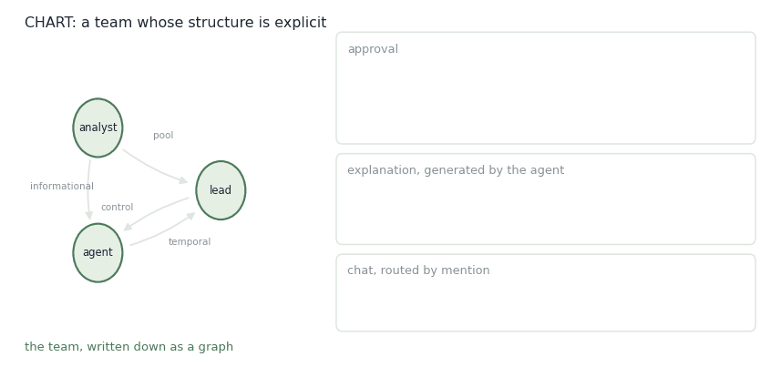

# CHART

Most teams describe how they work together and then hope. CHART writes it down as a graph and makes the software enforce it.

<figure><figcaption>
One session. The structure is not a description — it decides what can happen.
</figcaption></figure>

CHART is a **Configurable Human-AI Research Testbed**. Existing platforms fix the team: CybORG and the CAGE challenges put the human outside the loop as an evaluator; the Team Defense Game brought the human in, but with one hard-wired coordination pattern. That makes it hard to ask the question that actually matters — whether a result about trust or workload survives a change in how the team is organised. CHART makes the structure of teamwork the independent variable.

## Two layers and a recorder

The inner layer is **taskwork interdependence**: a directed acyclic graph over teammates, human and AI, whose edges say who must coordinate with whom, under what condition, in what order.

The outer layer is **teamwork modalities**: the interaction mechanisms through which that coordination actually happens — pre-task configuration, approval workflows, explanation panels, chat.

Underneath both sits **data collection**, instrumenting every step with time-stamped traces. Together they support controlled structure × interaction experiments with reproducible comparisons on quality, time, error and human load.

## Five dependency types

Nodes are agents and pools; edges are typed. Each type is a coordination pattern that shows up in real security operations.

**Control** — an action requires authorization from another agent before it executes. Approval chains and escalation protocols: shutting down a production server, deploying a honeypot. Configurable with escalation chains, risk-tier gating, and a timeout policy that either auto-approves or auto-denies.

**Pool** — contributions must reach a threshold before a composite action fires. Isolating an enterprise-wide subnet takes concurrence from two of three analysts. Configurable with contribution weights, sliding windows, k-of-n quorum, and reset policy.

**Synchrony** — designated actions must occur in the same turn or window to take effect. Coordinated shutdowns to cut off lateral movement. Configurable with a tolerance window and precedence rules against other dependencies.

**Temporal** — strict ordering. Forensic analysis before containment, so evidence survives; scanning before remediation. Configurable with validity windows, evidence requirements, and exception roles allowed to bypass.

**Informational** — what one agent may see of another's observations. A junior analyst gets filtered alert logs; a senior responder integrates across sources. Configurable with redaction level, time-gated access, clearance conditions and event-triggered reveals.

The contribution is not the graph formalism. It's using the graph to vary authority distribution, information flow and sequencing across experiments, and then reading the effect on resilience, trust and performance.

## The modalities

**Pre-task configuration.** A lobby where teams assemble, roles are assigned, the AI teammate's capability profile is chosen, and the dependency graph is previewed before anyone starts. Either the experimenter sets it, or the participants do — which itself becomes a manipulation: how people react to an imposed structure versus one they wrote.

**Approval.** Actions on `#control` edges enter a queue visible to their supervisor, who can grant, deny, or ask for an explanation. Vary which actions need approval, vary the escalation delay, and the trade-off becomes measurable: auto-approve for throughput, abort for safety. The point is to externalize the authority mechanism — agents do not reliably self-regulate, and humans should not have to improvise oversight mid-incident.

**Explanation.** When the agent proposes an action, the panel shows a rationale: a short summary, a detailed view with links to the evidence. Humans can edit it as a decision tree or flowchart, adding and removing nodes, which steers the agent rather than just interrogating it. Consultation patterns are logged — how often, at what depth, and whether looking changed the approval.

**Communication.** Public channel, private messages, @-mentions. The agent posts status and asks clarifying questions; the system posts key events automatically. Researchers can restrict visibility to simulate compartmentalization, cap message length, or inject misinformation to test robustness. Conversation becomes an empirical variable rather than an uncontrolled one.

## What the traces are for

Data is organized along the Input–Process–Outcome cycle. Inputs: session setup, AI selection, graph configuration. Processes: approvals, explanation consultations, chat, execution under dependency checks. Outcomes: mission results, trust and workload signals, and behaviour that feeds forward into the next mission.

The value is in the linking, not the individual streams. A single sequence — agent proposes isolation, human opens the explanation, asks a clarifying question in chat, modifies the proposal to quarantine instead, approves the revision, system checks that scanning already happened — arrives as one connected object. That supports questions isolated logs cannot answer: whether consulting an explanation improves approval quality, whether chat clarification reduces modification rates, whether trust calibrates differently under synchrony than under control.

The same traces double as training data. Approvals mark acceptable behaviour, denials mark boundaries, modifications identify the preferred alternative — structured preference data for RLHF. Explanation edits reveal how people structure causal reasoning. Configuration traces encode the authority boundaries an agent should be trained never to violate.

Scientific transparency comes first: reproducible, auditable logs, with learning layered on top as an optional consumer of the same data.

## Beyond cyber

Cybersecurity is the motivating case — tiered authority, compartmentalized access, decisions on a timescale where hesitation costs. But the design principles carry to any high-stakes interdependent domain: emergency response, healthcare, autonomous vehicle coordination.

## Publications

<table><thead><tr><th width="100"></th><th width="400">Paper</th><th>Authors</th></tr></thead><tbody><tr><td></td><td><mark style="color:green;">CHART: A Configurable Testbed for Human-AI Teaming Research in Cybersecurity Operations</mark> <em>Advancements in Human Agent Teaming Research Infrastructure: Testbeds, Metrics, and Concepts. CRC Press, Taylor &#x26; Francis.</em></td><td><strong>Y. Du</strong>, V. Miloserdov, M. J. Ferreira, B. Prébot, T. Malloy, C. Gonzalez</td></tr><tr><td></td><td><mark style="color:green;">Experimental evaluation of cognitive agents for collaboration in human-autonomy cyber defense teams</mark> <em>Computers in Human Behavior: Artificial Humans, 4, 100148</em></td><td><strong>Y. Du</strong>, B. Prébot, T. Malloy, F. Fang, C. Gonzalez</td></tr></tbody></table>

## Collaborators

<table><thead><tr><th width="150"></th><th width="150"></th><th width="150"></th><th width="150"></th><th width="150"></th></tr></thead><tbody><tr><td>

 <a href="https://www.linkedin.com/in/vladmiloserdov/"><strong>Volodymyr (Vlad) Miloserdov</strong></a> Carnegie Mellon University
</td><td>

 <a href="https://www.cmu.edu/dietrich/sds/people/post-docs/maria-jose-rodrigues-ferreira.html"><strong>Maria José Ferreira</strong></a> Carnegie Mellon University
</td><td>

 <a href="https://sites.google.com/view/baptisteprebot"><strong>Baptiste Prébot</strong></a> Carnegie Mellon University
</td><td>

 <a href="https://scholar.google.com/citations?user=jktsx4EAAAAJ"><strong>Tyler Malloy</strong></a> University of Luxembourg
</td><td>

 <a href="https://www.cmu.edu/dietrich/sds/ddmlab/cotyweb/"><strong>Cleotilde Gonzalez</strong></a> Carnegie Mellon University
</td></tr></tbody></table>

## Acknowledgements

_This project is supported by_ [_URI_](../../../funding.md)_._&#x20;

_Last updated: 2026-08_
