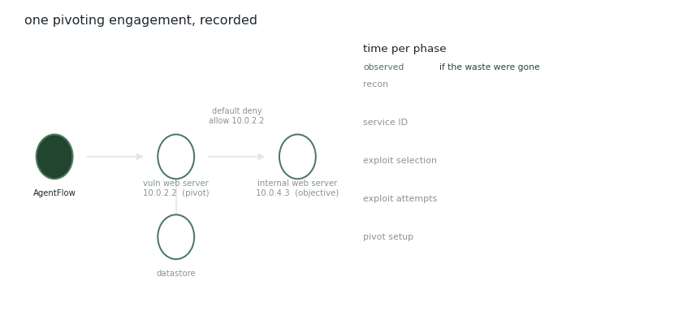

# CyberAgentFlow

Most evaluations of agentic cyber tools ask whether the task got done. That tells you almost nothing about how it got done, or what it cost.

<figure><figcaption>
One pivoting engagement, instrumented. The gap on the right is the finding.
</figcaption></figure>

## What gets recorded

Cyber-Agent-Flow instruments the whole interaction lifecycle of an agent-driven engagement: prompts, model responses, tool invocations, command outputs, analyst annotations, and timing. Sessions are archived as structured execution traces, and an analysis model inspects them afterwards for inefficiency.

The stack runs locally. Tools are exposed through Model Context Protocol interfaces — Kali utilities like nmap and Metasploit behind an MCP server — with the language model hosted privately through Ollama and a LiteLLM gateway handling routing and access control. That's a deliberate choice: cloud-hosted agents send prompts and network telemetry off-site, which is not acceptable on a real engagement.

The analyst stays in the loop through a web interface: issuing objectives in natural language, watching actions as they happen, annotating throughout, and constraining what the agent may touch through tool permissions and IP allowlists. Long engagements are handled with a context budget that summarises older history while keeping recent exchanges intact.

## What it found

The scenario is a pivot. The agent starts on an externally reachable host, works through reconnaissance and service identification, exploits a vulnerable web server, and uses it to route into an internal server it could not reach directly.

It completed the task. The interesting part is where the time went — exploit selection, exploit attempts, and pivot setup dominated. Reaching the pivot took roughly **50 minutes**. With the identified waste removed, the estimated time is roughly **11 minutes**.

## The failure patterns

Five recurring ones, visible only because the trace existed:

**Redundant tool invocations** — the same reconnaissance command run again with unchanged parameters, when the earlier result was still valid.

**Command-context confusion** — commands written for the system shell issued inside Metasploit, or Meterpreter commands issued outside a session. Sometimes hallucinated outright, sometimes correct for a different tool version.

**Exploit retry loops** — module after module tried with minimal parameter changes, without folding in what the previous failure revealed.

**Environment constraint violations** — commands assuming shell features or permissions the environment doesn't offer.

**Pivot configuration complexity** — routing requires coordinating Meterpreter session commands with Metasploit modules, and the agent struggles to keep straight which command belongs to which.

## Why this matters

The lesson is not that the agent is bad at reasoning. It reached the objective. The lesson is that orchestrating the tools it already has may matter as much as choosing them well — and that you cannot see any of this from a success rate.

_Observations come from a single run. They illustrate common failure modes rather than establishing their frequency._

## Publications

<table><thead><tr><th width="100"></th><th width="400">Paper</th><th>Authors</th><th></th></tr></thead><tbody><tr><td></td><td><mark style="color:green;">Cyber-Agent-Flow: Execution Trace Instrumentation and Analysis for Cybersecurity Agent Workflows</mark> Extended abstract, AAAI Symposium Series, 9(1), 337–340</td><td><a href="https://www.utep.edu/cs/people/faculty-websites/jacosta.html">J. Acosta</a>, M. T. B. Nazim, T. Guerra, <strong>Y. Du</strong>, <a href="https://expertise.utep.edu/profiles/paggarwal">P. Aggarwal</a></td><td></td></tr></tbody></table>

## Collaborators

<table data-header-hidden><thead><tr><th></th><th></th><th></th><th></th></tr></thead><tbody><tr><td> <a href="https://www.utep.edu/cs/people/faculty-websites/jacosta.html"><strong>Jaime Acosta</strong></a> University of Texas at El Paso / DEVCOM ARL</td><td> <a href="https://scholar.google.com/citations?user=v3qB098AAAAJ"><strong>Mohammad Taneem Bin Nazim</strong></a> University of Texas at El Paso</td><td> <strong>Thomas Guerra</strong> University of Texas at El Paso</td><td> <a href="https://expertise.utep.edu/profiles/paggarwal"><strong>Palvi Aggarwal</strong></a> University of Texas at El Paso</td></tr></tbody></table>

_Last updated: 2026-08_
