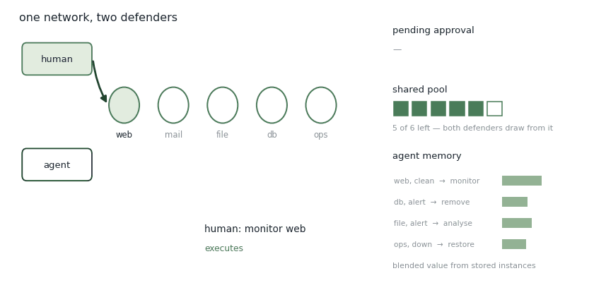

# Team Defense Game

Two defenders, one network, one attacker working against them. The question isn't which of them is better. It's what passes between them.

<figure><figcaption>
One episode. Watch the three channels connecting the two defenders.
</figcaption></figure>

## Approval

The agent does not only act. Actions that carry a **control dependency** are proposed and then wait — they sit in the pending strip until the human signs off. Approved, the action executes. Left alone, it expires and the moment passes.

This is where authority actually lives. Not in a policy document, but in whether the action fires.

## The shared pool

Both defenders draw from the same budget. Every action either of them takes leaves less for the other, whether or not they coordinated.

That's a **pool dependency**, and it means the two are coupled even when they're working on opposite ends of the network. The human spending on one host narrows what the agent can do about another, without either of them being told.

## Learning from the partner

On the right, the agent's memory. Each entry is a situation paired with an action, and a value blended from the instances it has stored.

The values shift as the episode runs — including from outcomes the human produced. The agent never chose those actions, but it lives with their consequences, so it learns from them.

At the end of the episode the whole thing re-settles at once: every instance from that episode is re-scored against how the episode actually went. Credit isn't assigned move by move. It's assigned in retrospect, to everything the team did.

## Why build it this way

Interdependence is usually described and then assumed. Writing approval and pooling into the game makes it something you can vary and measure — you can tighten the authority boundary, shrink the pool, and see what it does to the pair.

## What the three channels are called

Three things pass between the two defenders, and the platform has a name for each. Naming them is what makes the game a manipulation rather than a scene.

_**Control dependency.**_ A directed requirement that one agent obtain another's authorization before a listed action executes. The requirement attaches to named actions, not to the agent as a whole. Not an advisory recommendation, which the human may ignore with no effect on whether the action happens. Under a control dependency the default is that nothing happens: silence is a denial, not a deferral. The test: take the approver out of the room for one turn. If the proposed action still executes, there was no control dependency, only a notification.

_**Pool dependency.**_ Here, a single account both defenders spend from, so that the two are joined even when acting on unrelated hosts. Not two separate budgets of equal size, which produce the same per-action cost and none of the interference. The dependency is in the sharing, not in the pricing.

_**Learning from the partner.**_ Outcomes produced by the human teammate enter the agent's memory, because the agent's situation slots record network state rather than agent action history, and the network state carries what the human did. Not imitation learning, which needs the partner's action as a label and trains toward reproducing it. Here the human's action is never recorded as a target. Only its effect on the board is. The test: ask whether the agent could reconstruct which action the human took. If it cannot, and its values still moved, this is the channel. It is also the only one of the three that runs in one direction. Approval flows human to agent. The account is shared both ways. This one flows agent-ward only.

## The four places one word is doing two jobs

_**Pool names two different mechanisms.**_ On this page it is a shared account, where one defender's spending subtracts from what the other can afford and no joint action is triggered by anything. On [CHART](chart.md) and in the book chapter it is a threshold, where contributions accumulate and crossing the line fires a composite action. In the pilot code the threshold is a required set of contributions rather than a count, which is a third mechanism again. Both senses are defensible and the game uses only the first. A condition description that says pool without saying which one is ambiguous, and this is the term most likely to be read wrong by someone who learned it from the chapter.

_**Which four actions, and whether there are five.**_ The Journal of Cybersecurity paper and the AAAI paper both give the defender four buttons: Monitor, Analyze, Remove, Restore. The merged workspace gives four command values and they are not the same four, because Analyze is gone and Misinform has taken its slot. The environment file prices five, adding Shield. The set grew as the game moved from one defender to two, so a written condition that says the standard four actions no longer names a fixed set. Whichever paper is cited, the action list has to be given rather than referred to.

_**Control here, leader in the study.**_ [FriendOrFoe](friendorfoe.md) names its authority manipulation Leader and defines it in the platform's own words for Control. The mechanism is the same and the instantiation differs: a human holding the final decision rather than a supervisor holding a veto. Control names the constraint on the one who must ask. Leader names the standing of the one who is asked.

_**Two things update, and confusing them is the error worth avoiding.**_ The values shift as the episode runs, including from outcomes the human produced. The re-scoring at the end is a second, separate event that touches every instance from that episode. Interrupt an episode before it terminates and the within-episode shifts will have happened while the re-scoring will not.

## The board, in one paragraph

Two things are known about each machine at each step. Activity is what was observed on it this turn, and it is cleared at the start of the next. Status is how far the attacker has got, and it persists. The pair per host is also the slot structure of the agent's instances, which is why the agent and the person are looking at the same thing. Two scripted attackers set the difficulty: Beeline knows the network and drives straight at the operational server, Meander does not and works through the hosts it can reach. Human defenders lose more against Beeline and improve more against Beeline over episodes, and the model shows the same two patterns, which is the result the Turing-like comparison rests on.

The vocabulary, tier by tier, with what each term is not and how to tell: [**download the Team Defense Game lexicon (.pdf)**](https://github.com/aduyinuo/yinuo-d-is-an-open-book/raw/main/templates/project-lexicons/hac_team_defense_game.pdf)

## Publications

<table><thead><tr><th width="100"></th><th width="400">Paper</th><th>Authors</th><th></th></tr></thead><tbody><tr><td></td><td><mark style="color:green;">Experimental evaluation of cognitive agents for collaboration in human-autonomy cyber defense teams</mark> Computers in Human Behavior: Artificial Humans, 4, 100148</td><td><strong>Y. Du</strong>, <a href="https://sites.google.com/view/baptisteprebot">B. Prébot</a>, <a href="https://scholar.google.com/citations?user=jktsx4EAAAAJ">T. Malloy</a>, <a href="https://feifang.info/">F. Fang</a>, <a href="https://www.cmu.edu/dietrich/sds/ddmlab/cotyweb/">C. Gonzalez</a></td><td></td></tr><tr><td></td><td><mark style="color:green;">Learning about simulated adversaries from human defenders using interactive cyber-defense games</mark> Journal of Cybersecurity, 9(1), tyad022</td><td><a href="https://sites.google.com/view/baptisteprebot">B. Prébot</a>, <strong>Y. Du</strong>, <a href="https://www.cmu.edu/dietrich/sds/ddmlab/cotyweb/">C. Gonzalez</a></td><td></td></tr><tr><td></td><td><mark style="color:green;">Turing-like experiment in a cyber defense game</mark> AAAI Symposium Series, 3(1), 547-550</td><td><strong>Y. Du</strong>, <a href="https://sites.google.com/view/baptisteprebot">B. Prébot</a>, <a href="https://www.cmu.edu/dietrich/sds/ddmlab/cotyweb/">C. Gonzalez</a></td><td></td></tr></tbody></table>

## Collaborators

<table><thead><tr><th width="150"></th><th width="150"></th><th width="150"></th><th width="150"></th></tr></thead><tbody><tr><td> <a href="https://sites.google.com/view/baptisteprebot"><strong>Baptiste Prébot</strong></a> Carnegie Mellon University</td><td> <a href="https://scholar.google.com/citations?user=jktsx4EAAAAJ"><strong>Tyler Malloy</strong></a> University of Luxembourg</td><td> <a href="https://feifang.info/"><strong>Fei Fang</strong></a> Carnegie Mellon University</td><td> <a href="https://www.cmu.edu/dietrich/sds/ddmlab/cotyweb/"><strong>Cleotilde Gonzalez</strong></a> Carnegie Mellon University</td></tr></tbody></table>

_Last updated: 2026-08_
