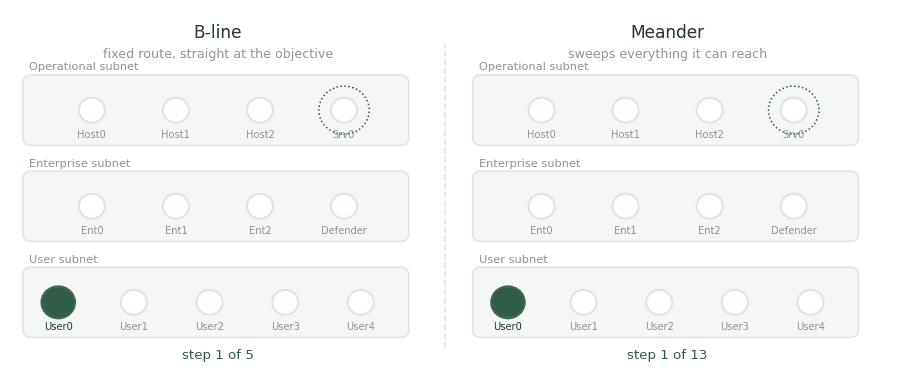

# Challenging Attacker

<figure><figcaption>
Both are heading for the operational server. They get there very differently.
</figcaption></figure>

## B-line

A fixed route. The agent carries a prepared sequence of actions — discover, exploit, escalate, repeat — aimed straight at the operational server, with a jump table telling it where to fall back to when a step fails. It touches almost nothing it doesn't need.

Cheap to detect if you know the route. Almost impossible to detect from volume, because there isn't any.

## Meander

Breadth first. It scans every subnet it can see, discovers services on every address it has learned, exploits what it can, escalates where it can, and only then arrives at the same server. It leaves marks across the whole network on its way.

Loud, slow, and much harder to predict, because what it does next depends on what it happened to find.

##

## Slides


Step through this project as slides, with the text for each slide below it.


## Publications

<table><thead><tr><th width="100"></th><th width="400">Paper</th><th>Authors</th><th></th></tr></thead><tbody><tr><td></td><td><mark style="color:green;">A cyber-war between bots: cognitive attackers are more challenging for defenders than strategic attackers</mark> ACM Transactions on Social Computing, 8(3–4), 1–22</td><td><strong>Y. Du</strong>, <a href="https://sites.google.com/view/baptisteprebot">B. Prébot</a>, <a href="https://scholar.google.com/citations?user=jktsx4EAAAAJ">T. Malloy</a>, <a href="https://www.cmu.edu/dietrich/sds/ddmlab/cotyweb/">C. Gonzalez</a></td><td></td></tr><tr><td></td><td><mark style="color:green;">Towards autonomous cyber defense: predictions from a cognitive model</mark> Human Factors and Ergonomics Society Annual Meeting, 66(1)</td><td><strong>Y. Du</strong>, <a href="https://sites.google.com/view/baptisteprebot">B. Prébot</a>, X. Xi, <a href="https://www.cmu.edu/dietrich/sds/ddmlab/cotyweb/">C. Gonzalez</a></td><td></td></tr></tbody></table>

## Collaborators

<table><thead><tr><th width="150"></th><th width="150"></th><th width="150"></th></tr></thead><tbody><tr><td> <a href="https://sites.google.com/view/baptisteprebot"><strong>Baptiste Prébot</strong></a> Carnegie Mellon University</td><td> <a href="https://scholar.google.com/citations?user=jktsx4EAAAAJ"><strong>Tyler Malloy</strong></a> University of Luxembourg</td><td> <a href="https://www.cmu.edu/dietrich/sds/ddmlab/cotyweb/"><strong>Cleotilde Gonzalez</strong></a> Carnegie Mellon University</td></tr></tbody></table>

_Last updated: 2026-08_
