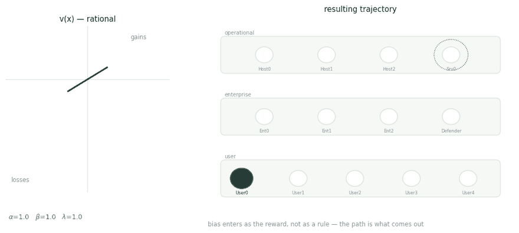

# Biased Attacker

Real attackers are not expected-utility maximisers. Most models of them are.

<figure><figcaption>
Three parameter settings. The curve on the left decides the path on the right.
</figcaption></figure>

## Bias as a reward, not a rule

The usual options are both unsatisfying: assume game-theoretic rationality, or hand-write behavioural rules until the agent looks human. The first is wrong about people; the second doesn't generalise past the cases you wrote down.

The move here is to put the bias in the reward function. Prospect theory's value function goes directly into the POMDP:

$$v(x) = x^{\alpha} \text{ for } x \ge 0, \qquad v(x) = -\lambda(-x)^{\beta} \text{ for } x < 0$$

Three parameters, three levers. $$\alpha$$ and $$\beta$$ set the curvature on gains and losses, which is risk sensitivity. $$\lambda$$ is the loss-aversion multiplier — how much more a loss weighs than an equivalent gain.

| Profile     | $$\alpha$$ | $$\beta$$ | $$\lambda$$ |
| ----------- | ---------- | --------- | ----------- |
| Rational    | 1.0        | 1.0       | 1.0         |
| Loss averse | 1.0        | 1.0       | 2.25        |
| Risk averse | 0.5        | 1.0       | 1.0         |

Risk aversion also needs the environment to cooperate: targets are presented with different success probabilities, and risky attacks are penalised, so uncertainty becomes psychologically expensive rather than merely uncertain.

## The setting

CAGE Challenge 2, built on CybORG. Thirteen hosts across three subnets, with the operational subnet reachable only through the enterprise layer. The attacker starts with a permanent foothold on User0. Holding a user host pays 0.1 per step, an enterprise or operational server pays 1.0, and Impact on Op\_Server0 pays 10.0.

Two defenders: one that removes attacker sessions, one that restores hosts to a clean state. The restoring defender makes the environment non-stationary from the attacker's side — lose the server, lose the reward, re-exploit or fall behind.

## Why it matters

Change the curve and the trajectory changes with it. Nothing about the network, the action space, or the objective moved — only how outcomes are valued.

If those deviations are systematic and separable, they are behavioural fingerprints: you could tell one kind of adversary from another by how they move, and train defenders against a population rather than a single idealised opponent.

_The trajectories shown are illustrative of the mechanism. Measured results are still being written up._

## Publications

<table><thead><tr><th width="100"></th><th width="400">Paper</th><th>Authors</th><th></th></tr></thead><tbody><tr><td></td><td><mark style="color:green;">Simulating Attackers with Cognitive Biases using Reinforcement Learning</mark></td><td><a href="https://www.linkedin.com/in/jannat-akbar/">Jannat Akbar</a>, <a href="https://users.aalto.fi/~oulasvir/">Antti Oulasvirta</a>, <a href="https://expertise.utep.edu/profiles/paggarwal">P. Aggarwal</a>, <strong>Y. Du</strong></td><td></td></tr><tr><td></td><td><mark style="color:green;">Evidence of cognitive biases in cyber attackers from an empirical study</mark> Hawaii International Conference on System Sciences (HICSS) Hawaii International Conference on System Sciences</td><td><a href="https://expertise.utep.edu/profiles/paggarwal">P. Aggarwal</a>, S. Rubaiyet Nowmi, <strong>Y. Du</strong>, <a href="https://www.cmu.edu/dietrich/sds/ddmlab/cotyweb/">C. Gonzalez</a></td><td></td></tr></tbody></table>

## Collaborators

* [Jannat Akbar](https://www.linkedin.com/in/jannat-akbar/) — Aalto University
* [Antti Oulasvirta](https://users.aalto.fi/~oulasvir/) — Aalto University
* [Palvi Aggarwal](https://expertise.utep.edu/profiles/paggarwal) — University of Texas at El Paso
* Saeefa Rubaiyet Nowmi — University of Texas at El Paso
* [Cleotilde Gonzalez](https://www.cmu.edu/dietrich/sds/ddmlab/cotyweb/) — Carnegie Mellon University

_Last updated: 2026-08_
