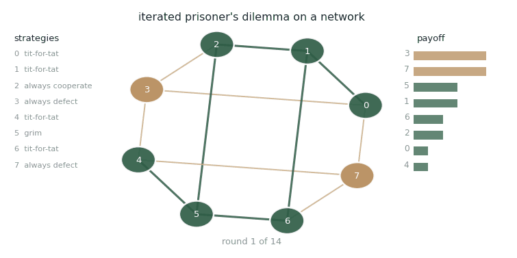
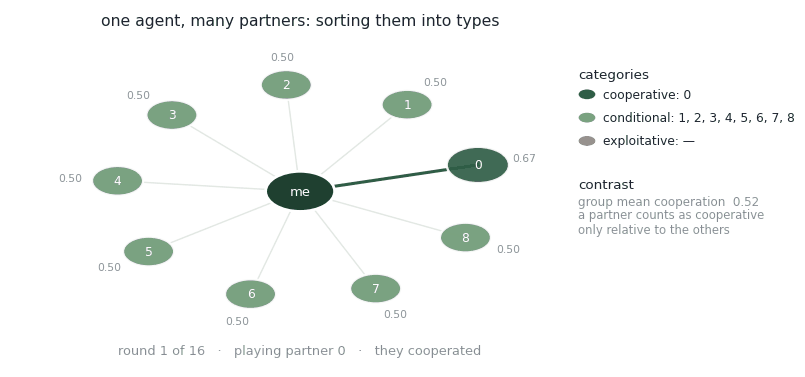

# Iterated Strategic Interaction

## Dynamic Sociality

<figure><figcaption>
Eight agents, twelve ties, fourteen rounds. Green edges are mutual cooperation.
</figcaption></figure>

Each agent plays its neighbours repeatedly, and each carries a fixed strategy — tit-for-tat, always cooperate, always defect, grim. Nobody sees the strategy list; they only see what happened last round.

Watch what the always-defect nodes do to their neighbourhoods. A tit-for-tat agent next to a defector stops cooperating, and its other ties go cold too. The damage is not confined to the pair that caused it, because the retaliating agent cannot separate the neighbour who exploited it from the neighbours who didn't. Payoffs on the right make the cost visible: defection pays early and then starves the neighbourhood it depends on.

## Catagorization

<figure><figcaption>
One agent, nine partners, sorted and re-sorted as evidence arrives.
</figcaption></figure>

The second animation drops the network and takes a single agent's point of view. It plays each partner in turn and keeps a running estimate of how often each one cooperates.

It does not track nine separate people. It compresses them into a small number of types — cooperative, conditional, exploitative — because carrying nine independent models is not what people do.

The categories are relative, not absolute. A partner is classified against the group mean, not against a fixed threshold, so the same behaviour lands in different categories depending on who else is in the room. Move a mildly cooperative partner into a generous group and they become the exploiter; move them into a harsh one and they become the cooperator. That is the contrast effect, and it is doing real work here: identical evidence, different judgement.

## _Contrast_

## Publications

<table><thead><tr><th width="100"></th><th width="400">Paper</th><th>Authors</th><th></th></tr></thead><tbody><tr><td></td><td><mark style="color:green;">Toward a Cognitive Theory of Interdependent Decisions in Groups: Dynamic Prosociality, Categorization, and Contrast</mark> <em>Under revision, Psychological Review</em></td><td><strong>Y. Du</strong>, <a href="https://expertise.utep.edu/profiles/paggarwal">P. Aggarwal</a>, <a href="https://www.cmu.edu/dietrich/sds/ddmlab/cotyweb/">C. Gonzalez</a></td><td></td></tr><tr><td></td><td><mark style="color:green;">Degree of Interdependence in Networks: Why More Connections Reduce Group Performance</mark> Collective Intelligence 2026, talk</td><td><strong>Y. Du</strong>, <a href="https://expertise.utep.edu/profiles/paggarwal">P. Aggarwal</a>, <a href="https://www.cmu.edu/dietrich/sds/ddmlab/cotyweb/">C. Gonzalez</a></td><td></td></tr><tr><td></td><td><mark style="color:green;">Emergent cooperative decision-making in triadic prisoner's dilemma: effects of incentives and information</mark> Acta Psychologica, 260</td><td><strong>Y. Du</strong>, <a href="https://scholar.google.com/citations?user=SPaXALYAAAAJ">K. Singh</a>, <a href="https://expertise.utep.edu/profiles/paggarwal">P. Aggarwal</a>, <a href="https://feifang.info/">F. Fang</a>, <a href="https://www.cmu.edu/dietrich/sds/ddmlab/cotyweb/">C. Gonzalez</a></td><td></td></tr></tbody></table>

## Collaborators

* [Palvi Aggarwal](https://expertise.utep.edu/profiles/paggarwal) — University of Texas at El Paso
* [Kuldeep Singh](https://scholar.google.com/citations?user=SPaXALYAAAAJ)
* [Fei Fang](https://feifang.info/) — Carnegie Mellon University
* [Cleotilde Gonzalez](https://www.cmu.edu/dietrich/sds/ddmlab/cotyweb/) — Carnegie Mellon University

_Last updated: 2026-08_
