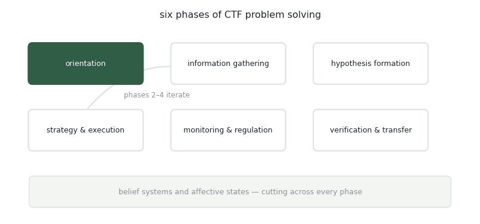
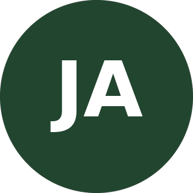

# Capture-the-Flag

## TLDR

<figure><figcaption>
A solve, traced through the six phases. Phases two to four are a loop, not a line.
</figcaption></figure>

### The six phases

Orientation. Information gathering and reconnaissance. Hypothesis formation. Strategy selection and execution. Monitoring and regulation. Verification and transfer.

Beneath all six sits a layer that isn't a phase at all — belief systems and affective states. What the solver thinks this kind of challenge usually requires, and how they feel about being stuck, colour every phase above.

### Two deliberate choices

**The middle is a loop.** Gathering, hypothesising and executing don't run once in order. A solver cycles through them, and the cycling is the solve.

**The grain is coarse.** Finer metacognitive coding schemes have a history of collapsing under inter-rater disagreement, so the phases stay broad and the specific operations live inside them. That's a reliability decision, not an omission.

### Getting the data

Concurrent think-aloud is the gold standard and too intrusive for a timed competition. Retrospective think-aloud invites invention. Experience sampling interrupts. Cognitive task analysis interviews are expensive and depend on having an expert on hand. Platform logs are cheap but only tell you behaviour.

The workable combination is stimulated recall — replay the solver their own session as a retrieval cue — anchored to submission logs, so the recall has timestamps to hang on.

## Slides

## Publications

<table><thead><tr><th width="100"></th><th width="400">Paper</th><th>Authors</th><th></th></tr></thead><tbody><tr><td></td><td><mark style="color:green;">Capture-The-Flag Universe: Design Considerations, System Behavior, and Player Experiences</mark> <em>Under review, SIGCSE Virtual 2026</em></td><td><strong>Y. Du</strong>, Y. Keim, <a href="https://expertise.utep.edu/profiles/apiplai">A. Piplai</a>, <a href="https://www.utep.edu/cs/people/faculty-websites/jacosta.html">J. Acosta</a>, <a href="https://anantaakotal.github.io/">A. Kotal</a></td><td></td></tr></tbody></table>

## Collaborators

<table><thead><tr><th width="150"></th><th width="150"></th><th width="150"></th><th width="150"></th></tr></thead><tbody><tr><td>

 <a href="https://www.albany.edu/business/faculty/yansi-keim"><strong>Yansi Keim</strong></a> University at Albany, SUNY
</td><td>

 <a href="https://expertise.utep.edu/profiles/apiplai"><strong>Aritran Piplai</strong></a> University of Texas at El Paso
</td><td>

 <a href="https://www.utep.edu/cs/people/faculty-websites/jacosta.html"><strong>Jaime Acosta</strong></a> University of Texas at El Paso / DEVCOM ARL
</td><td>

 <a href="https://anantaakotal.github.io/"><strong>Anantaa Kotal</strong></a> University of Texas at El Paso
</td></tr></tbody></table>

_Last updated: 2026-08_
