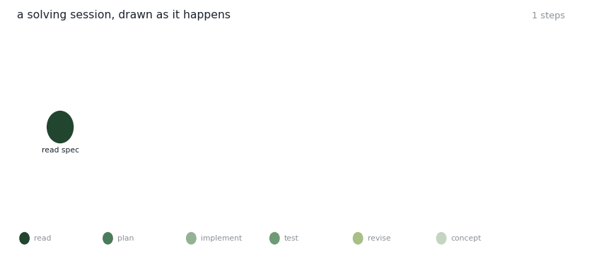
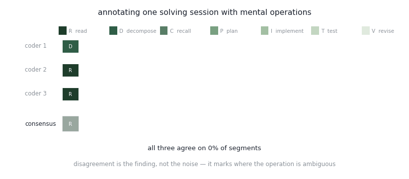

# General CS Problem-Solving

<figure><figcaption>
The same session as a graph, drawn as it happens.
</figcaption></figure>

## Solving as a graph

A session isn't a list. Reading the spec spawns two things at once — a plan to split the problem into cases, and the memory of a similar bug. The plan spawns two pieces of implementation. Running the tests produces a failure, the failure produces a hypothesis, and the hypothesis produces both a patch and a note about the pattern that will outlive this problem.

Drawn this way, the shape of the solve is visible: where it branched, where it looped back, and which step turned out to be the hinge.

## The question

When someone works through a computing problem, what are they doing at each moment? Reading, decomposing, recalling something they've seen before, planning, implementing, testing, revising.

Naming those operations is easy. Getting independent observers to agree on where one ends and the next begins is not, and that agreement is the whole ballgame — a construct nobody can code reliably isn't a construct.

## Can observers agree on it

<figure><figcaption>
One session, three independent coders, one consensus track.
</figcaption></figure>

Three coders labelling the same session, segment by segment, with the consensus track underneath. Where all three agree, the consensus block is solid and outlined. Where they don't, it fades.

The running agreement figure is deliberately not flattering. Disagreement is treated as the finding rather than the noise: the segments where coders split are the segments where the operation genuinely is ambiguous, and those are worth studying rather than smoothing away.

## The instrument

The coding in that animation is not done by hand on paper. It runs in **Astrolabe**, a local research app built for this work.

Astrolabe takes in transcripts — typed, uploaded, or recorded in the browser and transcribed with Whisper — and lets multiple annotators code the same session against a shared scheme. It then reports stage-level percent agreement and Cohen's kappa between coders, and exports the agreement report and the full annotation bundle for downstream analysis.

It also carries the question-card structure the project is organised around, with hypergraph overlays for grouping operations at different scales, and reusable prompt scaffolds when a language model is used to propose candidate operations or concepts.

Two design commitments worth naming: it runs entirely on the researcher's own machine, nothing hosted; and it never writes to the source material. It reads a snapshot, keeps all app state in its own database, and hands changes back as text you paste yourself.

## Where it connects

This is the layer underneath the tooling. If mental operations can be identified reliably, then a system that watches a work session can say something useful about _where_ someone is stuck rather than only that they are — which is what the assistive side of the work needs in order to be more than a faster autocomplete.

## Publications

_In preparation. Astrolabe, the annotation instrument this work runs on, is described under_ [_Artifacts_](../../../../artifacts/astrolabe/)_._

## Collaborators

<table><thead><tr><th width="150"></th></tr></thead><tbody><tr><td> <a href="https://anantaakotal.github.io/"><strong>Anantaa Kotal</strong></a> University of Texas at El Paso</td></tr></tbody></table>

_Last updated: 2026-08_
