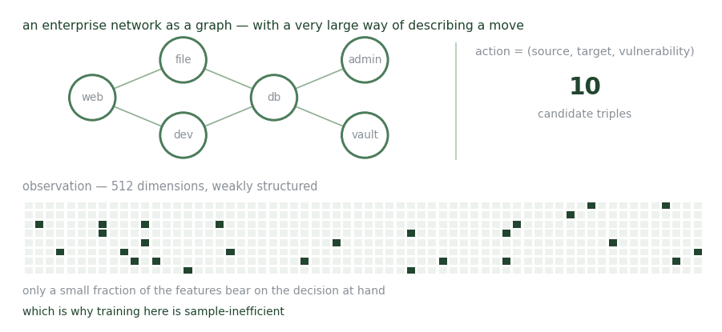

# Cyber Battle Field

**CyberBattleSim — an enterprise network as a graph, with an enormous action space.**

<figure><figcaption>
Hard to search, quick to finish. Both at once.
</figcaption></figure>

CyberBattleSim models a network as a graph and trains attacker agents on privilege escalation, lateral movement, and exploitation, with rewards tied to node value.

It is the awkward one, and usefully so. The observation is 512-dimensional but weakly structured, with a large fraction of features irrelevant to the decision at hand. The action space is a set of (source, target, vulnerability) triples on the order of 10¹⁰. Training is sample-inefficient as a result. Once a policy exists, though, the task horizon is short — discovery is supplied, and a credential-passing chain can be completed in a handful of steps.

For transfer experiments it serves as the **far target**: its action space only partially aligns with a kill-chain source environment and its observation space is substantially different, which makes it the larger of the two domain gaps tested.

## Publications

_Work of mine that runs on this environment._

<table><thead><tr><th width="100"></th><th width="400">Paper</th><th>Authors</th><th></th></tr></thead><tbody><tr><td></td><td><mark style="color:green;">Crossing the Cyber Divide: Sim-to-Sim and Sim-to-Real Transfer for RL Agents</mark> RAISE workshop, at ESORICS 2026 — CyberBattleSim is the far transfer target</td><td>S. Saika, <strong>Y. Du</strong>, <a href="https://expertise.utep.edu/profiles/apiplai">A. Piplai</a></td><td></td></tr></tbody></table>

## Collaborators

* Sabrina Saika — University of Texas at El Paso
* [Aritran Piplai](https://expertise.utep.edu/profiles/apiplai) — University of Texas at El Paso

_Last updated: 2026-08_
