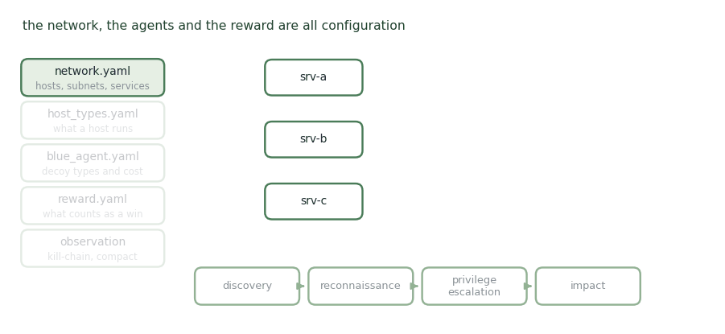

# Cyber Wheel

**A configurable RL environment where the defender's main move is deception.**

<figure><figcaption>
Everything is a config file — including where the fake servers go.
</figcaption></figure>

Cyberwheel is a reinforcement learning simulation environment for training and evaluating autonomous cyber defence models, built for modularity. Networks, services, host types, and both offensive and defensive agents are specified through configuration files, and the reward function, observation space, and action space can be redefined without rewriting the environment.

The blue agent's characteristic action is deploying decoys — the aim is to get the red agent to spend its attack on a decoy server rather than a real one. Recent versions support training red and blue agents simultaneously, each learning against the other.

For transfer work it makes a good **source** environment: a competent policy arrives under a modest training budget, its kill-chain observation is compact with a high proportion of decision-relevant features, and hosts and subnets are fully configurable through YAML.

## Publications

_Work of mine that runs on this environment._

<table><thead><tr><th width="100"></th><th width="400">Paper</th><th>Authors</th><th></th></tr></thead><tbody><tr><td></td><td><mark style="color:green;">Crossing the Cyber Divide: Sim-to-Sim and Sim-to-Real Transfer for RL Agents</mark> RAISE workshop, at ESORICS 2026 — Cyber Wheel is the source environment</td><td>S. Saika, <strong>Y. Du</strong>, <a href="https://expertise.utep.edu/profiles/apiplai">A. Piplai</a></td><td></td></tr></tbody></table>

## Collaborators

<table data-header-hidden><thead><tr><th></th><th></th></tr></thead><tbody><tr><td> <strong>Sabrina Saika</strong> University of Texas at El Paso</td><td> <a href="https://expertise.utep.edu/profiles/apiplai"><strong>Aritran Piplai</strong></a> University of Texas at El Paso</td></tr></tbody></table>

_Last updated: 2026-08_
