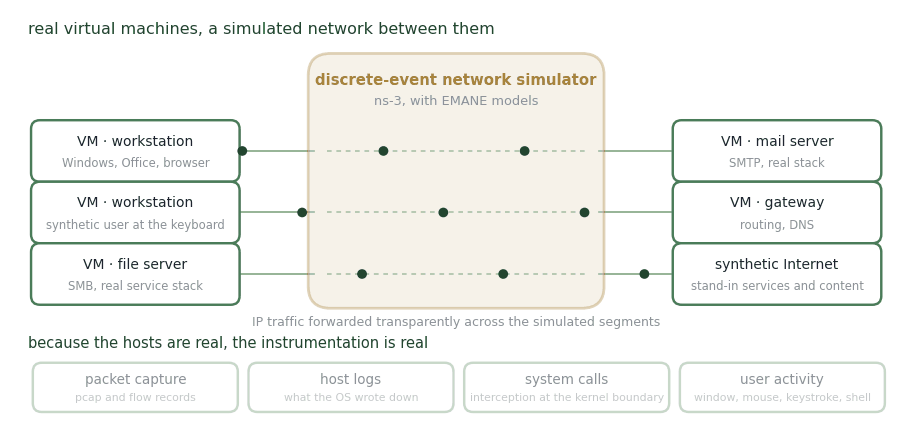

# CyberVAN

**Virtual machines communicating over a simulated network.**

<figure><figcaption>
Real hosts, simulated wire, real telemetry.
</figcaption></figure>

CyberVAN aims at the highest fidelity short of deploying the real thing. The network itself lives in a discrete-event simulator — ns-3, with support for EMANE models — while the hosts are actual virtual machines. Transparent forwarding carries IP traffic generated by services on those VMs across the simulated segments to their destination.

Because the hosts are real, the instrumentation is real too: packet captures and flow records, host logs and system-call interception, and a user-activity tracker capturing window, mouse and keystroke events and shell commands. Configurable synthetic users drive applications through the keyboard and mouse to generate traffic with a particular cyber persona, inside a synthetic Internet that stands in for the services and content a real network would reach.

**Use it for** questions where the answer depends on what a real operating system and a real protocol stack actually do — and where you can afford the setup.

## Related

A high-fidelity reference point rather than a training environment for this work. The fidelity question it raises is taken up on [When We Say "A Realistic Cyber Environment"](../when-we-say-a-realistic-cyber-environment.md).

## Slides


Step through this project as slides, with the text for each slide below it.


_Last updated: 2026-08_
