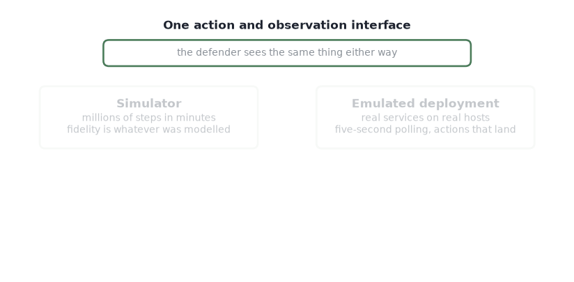

# Training in "Realistic" Environments

If transfer from a simulator is where the fidelity is lost, train where the fidelity is.

<figure><figcaption>
Same interface, two costs per step. Which box is reachable is a question about sample efficiency.
</figcaption></figure>

## What the field usually does, and what it costs

Most autonomous cyber defense trains in a simulator and transfers the resulting policy. Simulators omit authentication delays, partial action failures, service dependencies, and realistic user traffic. Simulator-trained policies succeed only 66% of the time on the matching emulator, and realistic training environments and sim-to-real transfer remain the field's two principal open problems.

[FOE-Dreamer](../cyber-world-modeling/environment.md) takes the other route: it trains the defender directly in an emulated operational network, with no simulator stage. The architecture that makes that possible is on its own page; what this page is about is whether the route pays, and what "realistic" is doing in the sentence.

## The environment it trains in

[Daedalus](../../artifacts/daedalus/) is an eight-host OpenStack network across three subnets — two public web servers, a workstation tier, and an NTP and database tier — provisioned with real services, so its behaviour is executed rather than modelled.

A gRPC command-and-control server carries each defender action to the host it names, enabling or disabling an actual service on an actual operating system. The attacker is a scripted red agent that executes a genuine web exploit, establishes persistence over SSH, and pivots toward the interior hosts, so a defender is measured against real tool execution. Background user activity is generated rather than assumed away.

Two backends sit behind one action and observation interface: a fast simulator for the millions of steps reinforcement learning requires, and the live emulated deployment for evaluation. A policy can be trained cheaply and tested honestly — and the difference between the two is itself a measurement of what the simulator abstracted away.

## The experiment

Against both scripted attacker profiles, FOE-Dreamer roughly halves episode loss relative to Rainbow and IQN under matched compute, and trains inside a three-day budget on one GPU.

Ablations show the factoring and the opponent model each contribute — the result is not one of them carrying the other.

The number that matters for this page is the budget, not the loss. Three days on one GPU is what makes training in an emulated network a real option rather than a thought experiment. Every step there costs seconds of wall-clock and a real state change on a real host, so what limits the result is sample efficiency, not asymptotic performance.

## What "realistic" is doing in that sentence

Narrowly, and deliberately so. The substrate, the services, the exploit paths, the five-second polling and the consequences of defender actions are real. The user and attacker populations and the CVE catalogue are emulated.

That distinction is the whole point of the quotation marks in the title. An environment is not realistic or unrealistic; it is realistic in some respects and not others, and which respects it got right is what decides whether a result transfers. Deciding that per claim rather than per environment is what [When We Say "A Realistic Cyber Environment"](when-we-say-a-realistic-cyber-environment.md) is for, and [Sim2Sim before Sim2Real](transfer-to-realistic-environments.md) is how the gap gets measured without an operational network to measure against.

## Publications

<table><thead><tr><th width="100"></th><th width="400">Paper</th><th>Authors</th><th></th></tr></thead><tbody><tr><td></td><td><mark style="color:green;">FOE-Dreamer: Deployment-Efficient Learning of Cyber Defense Policies in Operational Networks</mark></td><td><strong>Y. Du</strong>, <a href="https://www.cs.utep.edu/kiekintveld/">C. Kiekintveld</a></td><td>Under review, ACSAC</td></tr></tbody></table>

## Collaborators

<table><thead><tr><th width="150"></th></tr></thead><tbody><tr><td>

 <a href="https://www.cs.utep.edu/kiekintveld/"><strong>Christopher Kiekintveld</strong></a> University of Texas at El Paso
</td></tr></tbody></table>

_Last updated: 2026-08_
