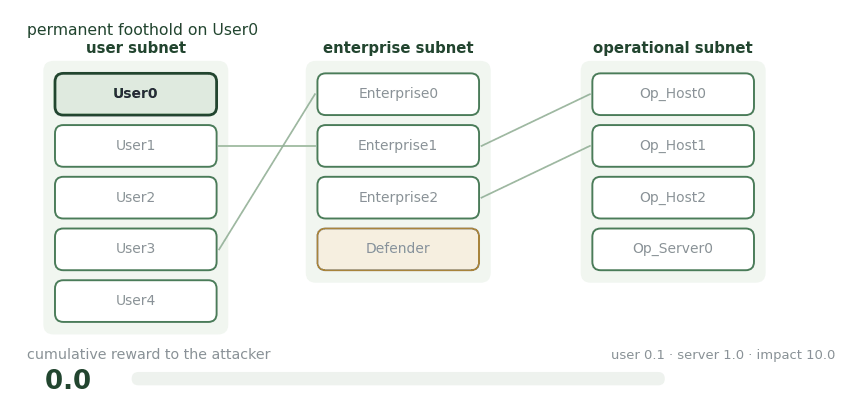

# CybORG

**Cyber Operations Research Gym — the substrate under the CAGE challenges.**

<figure><figcaption>
Thirteen hosts, three subnets, one mandatory waypoint — and a defender that undoes your work.
</figcaption></figure>

CybORG is a network simulator built for reinforcement learning research in autonomous cyber defence. It handles concurrent red, blue, and green agents — attacker, defender, and ordinary users — across a network of connected hosts.

The CAGE Challenge 2 scenario is the version most of this work uses. Thirteen hosts across three subnets: five user workstations, three enterprise servers plus a Defender host, and an operational subnet holding three workstations and Op\_Server0. The operational subnet cannot be reached directly from the user subnet, so the enterprise layer is a mandatory waypoint.

The attacker begins with a permanent foothold on User0. Holding a user host pays 0.1 per step, an enterprise or operational server pays 1.0, and Impact on Op\_Server0 pays 10.0. Two defender configurations matter: one removes attacker sessions, the other restores hosts to a clean state. The restoring defender is what makes the environment non-stationary from the attacker's side.

**Use it for** comparable results — it is the closest thing the field has to a common baseline, and the B-line and Meander attackers are defined here.

## Publications

_Work of mine that runs on this environment._

<table><thead><tr><th width="100"></th><th width="400">Paper</th><th>Authors</th><th></th></tr></thead><tbody><tr><td></td><td><mark style="color:green;">Experimental evaluation of cognitive agents for collaboration in human-autonomy cyber defense teams</mark> Computers in Human Behavior: Artificial Humans, 4, 100148</td><td><strong>Y. Du</strong>, <a href="https://sites.google.com/view/baptisteprebot">B. Prébot</a>, <a href="https://scholar.google.com/citations?user=jktsx4EAAAAJ">T. Malloy</a>, <a href="https://feifang.info/">F. Fang</a>, <a href="https://www.cmu.edu/dietrich/sds/ddmlab/cotyweb/">C. Gonzalez</a></td><td></td></tr><tr><td></td><td><mark style="color:green;">A cyber-war between bots: cognitive attackers are more challenging for defenders than strategic attackers</mark> ACM Transactions on Social Computing, 8(3–4)</td><td><strong>Y. Du</strong>, <a href="https://sites.google.com/view/baptisteprebot">B. Prébot</a>, <a href="https://scholar.google.com/citations?user=jktsx4EAAAAJ">T. Malloy</a>, <a href="https://www.cmu.edu/dietrich/sds/ddmlab/cotyweb/">C. Gonzalez</a></td><td></td></tr></tbody></table>

## Collaborators

<table><thead><tr><th width="150"></th><th width="150"></th><th width="150"></th><th width="150"></th></tr></thead><tbody><tr><td>

 <a href="https://sites.google.com/view/baptisteprebot"><strong>Baptiste Prébot</strong></a> Inria Bordeaux
</td><td>

 <a href="https://scholar.google.com/citations?user=jktsx4EAAAAJ"><strong>Tyler Malloy</strong></a> University of Luxembourg
</td><td>

 <a href="https://feifang.info/"><strong>Fei Fang</strong></a> Carnegie Mellon University
</td><td>

 <a href="https://www.cmu.edu/dietrich/sds/ddmlab/cotyweb/"><strong>Cleotilde Gonzalez</strong></a> Carnegie Mellon University
</td></tr></tbody></table>

_Last updated: 2026-08_
