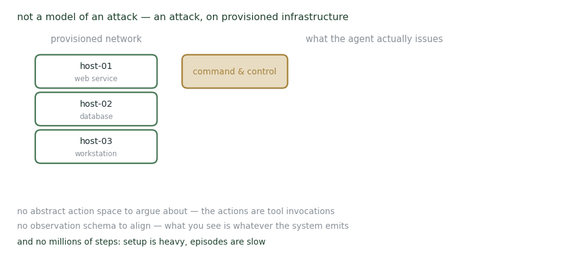

# Daedelus

**Live command-and-control on provisioned infrastructure.**

<figure><figcaption>
The action space is whatever the tools accept.
</figcaption></figure>

Daedelus sits at the emulation end of the range. Rather than modelling an attack, it runs one: a command-and-control stack deployed onto provisioned network infrastructure, with attacker tooling executing real exploits against real services.

That places it in a different category from the simulators. There is no abstract action space to argue about, because the actions are tool invocations, and no observation schema to align, because what you see is whatever the system emits.

The cost is the usual one. Setup is heavy, episodes are slow, and you cannot run the millions of steps that reinforcement learning wants. Its role is as the honest end of the pipeline — the place a policy trained cheaply elsewhere has to survive.

**Use it for** checking whether something learned in simulation does anything at all against live services.

## Publications

_Work of mine that runs on this environment._

<table><thead><tr><th width="100"></th><th width="400">Paper</th><th>Authors</th><th></th></tr></thead><tbody><tr><td></td><td><mark style="color:green;">Learning to play an adaptive cyber deception game</mark> OptLearnMAS workshop, at AAMAS 2022</td><td><strong>Y. Du</strong>, Z. Song, <a href="https://stephmilani.github.io/">S. Milani</a>, <a href="https://www.cmu.edu/dietrich/sds/ddmlab/cotyweb/">C. Gonzalez</a>, <a href="https://feifang.info/">F. Fang</a></td><td></td></tr></tbody></table>

_The tool that runs this environment is documented under_ [_Artifacts → Daedalus_](../../../artifacts/daedelus/)_._

## Collaborators

<table><thead><tr><th width="150"></th><th width="150"></th><th width="150"></th><th width="150"></th></tr></thead><tbody><tr><td>

 <strong>Zimeng Song</strong>
</td><td>

 <a href="https://stephmilani.github.io/"><strong>Stephanie Milani</strong></a> Carnegie Mellon University
</td><td>

 <a href="https://www.cmu.edu/dietrich/sds/ddmlab/cotyweb/"><strong>Cleotilde Gonzalez</strong></a> Carnegie Mellon University
</td><td>

 <a href="https://feifang.info/"><strong>Fei Fang</strong></a> Carnegie Mellon University
</td></tr></tbody></table>

_Last updated: 2026-08_
