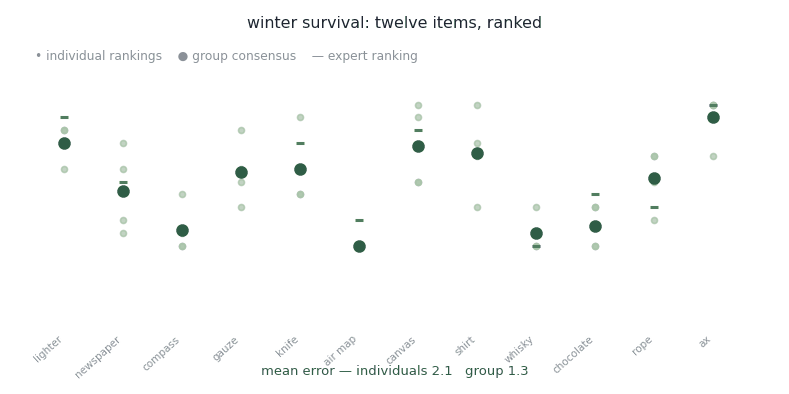

# Small Groups

<figure><figcaption>
Four people rank twelve items. The group then has to agree on one ranking.
</figcaption></figure>

The winter survival task. A plane goes down in a frozen forest and twelve salvaged items have to be ranked by how much they matter to staying alive — a lighter, newspaper, a compass, gauze, a knife, an air map, canvas, a shirt, whisky, chocolate, rope, an ax.

There is an expert ranking, so error is measurable. Each person ranks alone first. Then the group has to produce one ranking together.

## What the discussion does

The animation shows the talk and the ranking side by side. Three error figures track along with it: how wrong the average member was alone, how wrong the simple pool of their four rankings is, and how wrong the ranking is after they argue.

Pooling already helps before anyone says a word — four noisy rankings average out. The question is whether talking adds anything on top of that, and if so, which exchanges did the work.

## Groups of language models, on the same task

We ran the same kind of task with groups of LLM agents talking freely, and compared them against human groups on an open dataset.

The agent groups **outperformed the human groups**, and gained more from discussion — their scores improved further after free conversation than the humans' did.

The way they talked was different too. Agent groups produced **more disagreements**, **more complex statements**, and a marked **preference for positive statements** compared with people. So the advantage doesn't come from being agreeable and converging quickly. It comes with more argument, not less.

That cuts against the intuition that synthetic groups would collapse into consensus. It also raises the obvious question for anyone thinking about mixed teams: whether an agent's willingness to disagree survives contact with a human who outranks it.

## Publications

<table><thead><tr><th width="100"></th><th width="400">Paper</th><th>Authors</th><th></th></tr></thead><tbody><tr><td></td><td><mark style="color:green;">Large language models for collective problem-solving: insights into group consensus decision-making</mark> Proceedings of the Annual Meeting of the Cognitive Science Society, 46</td><td><strong>Y. Du</strong>, <a href="https://ise.washington.edu/facultyfinder/prashanth-rajivan">P. Rajivan</a>, <a href="https://www.cmu.edu/dietrich/sds/ddmlab/cotyweb/">C. Gonzalez</a></td><td></td></tr></tbody></table>

## Collaborators

* [Prashanth Rajivan](https://ise.washington.edu/facultyfinder/prashanth-rajivan) — University of Washington
* [Cleotilde Gonzalez](https://www.cmu.edu/dietrich/sds/ddmlab/cotyweb/) — Carnegie Mellon University

_Last updated: 2026-08_
