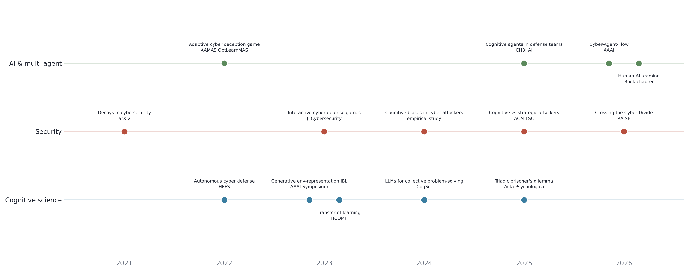

# Publications

<figure><figcaption></figcaption></figure>

Full list on [Google Scholar](https://scholar.google.com/citations?user=XdY3VB0AAAAJ\&hl=en).

## Preprints


`FOE-Dreamer`

**Sample-efficient world-model agents for network defense**

In preparation



`Learn Structure`

**Strategic dependence: from definition through generation to structure learning**

In preparation


## 2026


`RAISE`

**Crossing the Cyber Divide: Sim-to-Sim and Sim-to-Real Transfer for RL Agents**

S. Saika, **Y. Du**, A. Piplai · Workshop on Real-world AI Security and Engineering for Cybersecurity Systems, ESORICS



`AAAI`

**Cyber-Agent-Flow: Execution Trace Instrumentation and Analysis for Cybersecurity Agent Workflows**

J. Acosta, M. T. Nazim, T. Guerra, **Y. Du**, P. Aggarwal · AAAI Symposium Series, 9(1), 337–340



`Book chapter`

**Human-AI teaming in cyber defense** — accepted, title to be confirmed

CHART testbed pilot study


## 2025


`CHB: AI`

**Experimental evaluation of cognitive agents for collaboration in human-autonomy cyber defense teams**

**Y. Du**, B. Prébot, T. Malloy, F. Fang, C. Gonzalez · Computers in Human Behavior: Artificial Humans, 4, 100148



`ACM TSC`

**A cyber-war between bots: cognitive attackers are more challenging for defenders than strategic attackers**

**Y. Du**, B. Prébot, T. Malloy, C. Gonzalez · ACM Transactions on Social Computing, 8(3–4), 1–22



`Acta Psych.`

**Emergent cooperative decision-making in triadic prisoner's dilemma: effects of incentives and information**

**Y. Du**, K. Singh, P. Aggarwal, F. Fang, C. Gonzalez · Acta Psychologica, 260


## 2024


`CogSci`

**Large language models for collective problem-solving: insights into group consensus decision-making**

**Y. Du**, P. Rajivan, C. Gonzalez · Proceedings of the Annual Meeting of the Cognitive Science Society, 46



`Empirical`

**Evidence of cognitive biases in cyber attackers from an empirical study**

P. Aggarwal, S. Rubaiyet Nowmi, **Y. Du**, C. Gonzalez


## 2023


`J. Cybersec.`

**Learning about simulated adversaries from human defenders using interactive cyber-defense games**

B. Prébot, **Y. Du**, C. Gonzalez · Journal of Cybersecurity, 9(1), tyad022



`HCOMP`

**Accounting for transfer of learning using human behavior models**

T. Malloy, **Y. Du**, F. Fang, C. Gonzalez · AAAI Conference on Human Computation and Crowdsourcing, 11



`AAAI`

**Generative environment-representation instance-based learning: a cognitive model**

T. Malloy, **Y. Du**, F. Fang, C. Gonzalez · AAAI Symposium Series, 2(1), 326–333


## 2022


`HFES`

**Towards autonomous cyber defense: predictions from a cognitive model**

**Y. Du**, B. Prébot, X. Xi, C. Gonzalez · Human Factors and Ergonomics Society Annual Meeting, 66(1)



`AAMAS`

**Learning to play an adaptive cyber deception game**

**Y. Du**, Z. Song, S. Milani, C. Gonzalez, F. Fang · 13th Workshop on Optimization and Learning in Multiagent Systems


## 2021


`arXiv`

**Decoys in cybersecurity: an exploratory study to test the effectiveness of 2-sided deception**

P. Aggarwal, **Y. Du**, K. Singh, C. Gonzalez · [arXiv:2108.11037](https://arxiv.org/abs/2108.11037)


_Last updated: 2026-08_
