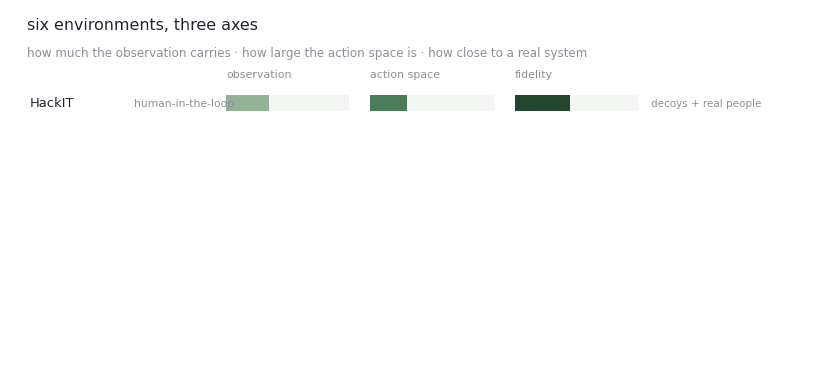

# Cyber Environments & Benchmarks

Every claim about an autonomous cyber agent is a claim about the environment it was measured in. These are the ones this work runs on, and they do not agree with each other.

<figure><figcaption>Three axes, six environments. No single ordering.</figcaption></figure>

Notice that fidelity and tractability pull against each other. The environments closest to a real system are the ones you can least afford to train in; the ones you can train in fastest are the ones whose results transfer least. Everything here is a position on that trade, not a point on a scale.

* [HackIT](hackit.md) — human attackers, real deception
* [CybORG](cyborg.md) — the CAGE challenge substrate
* [Daedelus](daedelus.md) — live command-and-control on provisioned infrastructure
* [Cyber Wheel](cyber-wheel.md) — configurable, decoy-first, cheap to train in
* [Cyber Battle Field](cyber-battle-field.md) — a graph with an enormous action space
* [CyberVAN](cybervan.md) — virtual machines over a simulated network

_Last updated: 2026-08_
