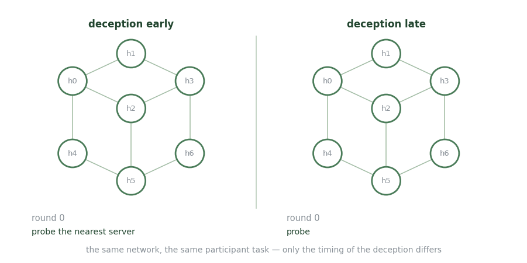

# HackIT

**Human-in-the-loop simulation for cyber deception experiments.**

<figure><figcaption>
Same network, same task. Only when the fake hosts show up differs.
</figcaption></figure>

HackIT exists to put real people in front of a network and watch what they do when some of it is fake. Researchers configure networks of different sizes, designate web servers as honeypots, and populate them with fictitious ports, services, operating systems, and files.

What it buys you is the thing simulators cannot: an attacker who is actually surprised. In deception studies run on it, participants tasked with stealing information over multiple rounds adopted visibly different strategies depending on whether the deception arrived early or late in the engagement.

**Use it for** studying human attacker behaviour under deception, and for grounding cognitive models of attackers in observed human play rather than assumed rationality.

**Don't use it for** training reinforcement learning agents — the loop runs at human speed.

_Last updated: 2026-08_
