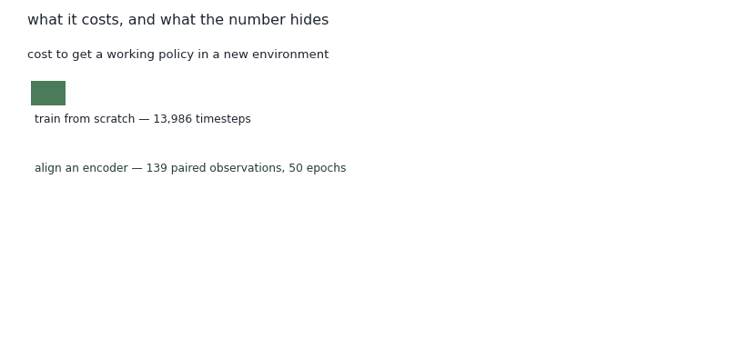

# Training in "Realistic" Environments

<figure><figcaption>What it costs, and what the usual number fails to show.</figcaption></figure>

## The cost asymmetry

Training a policy from scratch in a new environment takes on the order of **200,000 timesteps**.

Aligning an encoder so an existing policy can read that environment takes **2,000 paired observations and 50 epochs** — and the observations come from a random policy, so there are no trajectories to collect and no rewards needed from the target.

That is roughly one percent of the cost. For a deployment workflow where the target changes often, retraining per environment is the expensive habit, not the safe one.

## The metric that hides the answer

Here is the trap. Measure transfer by **win rate** and the two conditions look the same — because the action translation layer alone is often enough to finish the task. The encoder appears to contribute nothing.

It hasn't. Win rate is saturated; it can't distinguish a policy that stumbles to the goal from one that goes straight there. What separates them is **step efficiency**, progress rate, or performance on harder instances — more nodes to own, tighter budgets, branching topologies.

So the practical guidance for anyone building this kind of tooling: pick the metric before you conclude a component is useless.

## When you need the encoder at all

If the target environment already shares the source's observation schema, direct deployment works and reaches non-trivial win rates with no bridge at all. Operators moving between two kill-chain-based simulators, or a simulator and an emulator with structured instrumentation, may not need an encoder.

The encoder earns its place when the schema matches but the *statistics* don't — distributional differences at the transition-dynamic level, invisible in the feature layout and plainly there in the collected observations.

For linear attack paths — initial access, then staged lateral movement along a fixed credential chain — the translation layer alone is sufficient. For branching attack graphs, where the agent has to choose among viable paths, alignment starts to matter.

_Last updated: 2026-08_
