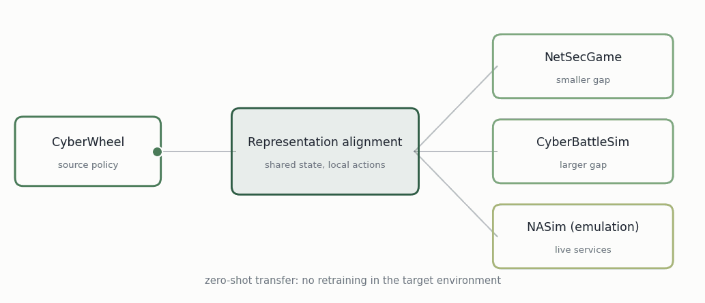

# Transfer to "Realistic" Environments

An agent that learns to attack or defend a network learns it *somewhere*. That somewhere is a simulator, because letting a learning agent explore production infrastructure by trial and error is not an option. The question this line of work asks is what happens next.

<figure><figcaption>A policy trained in one environment, moved to others without retraining.</figcaption></figure>

## The problem

A policy trained in simulator A cannot simply be run in simulator B. The two describe the world differently: different state spaces, different action vocabularies, different assumptions about what the agent can see. Formally, given environments with state and action spaces that do not coincide, can a policy trained to competence in one be executed in the other without retraining?

This shows up in two places that look separate but are not:

* An organization trains a red-teaming agent in simulation and wants to run it against its own network.
* An organization wants to compare its agent against one trained in a different simulator.

Both reduce to the same thing — aligning policies across environments that speak different representations. Sim-to-real is the same problem as sim-to-sim, with one extra difficulty: the target is only partially known. Supplying the missing ground truth would collapse it back to sim-to-sim, which is still hard; finding the abstraction that relates two fully specified environments is itself computationally difficult.

## The approach

Split transfer into two mappings and build each without touching the underlying simulators.

**Action translation.** A shared, deterministic action vocabulary in which each action advances a chosen host along the kill chain. Wrapper logic resolves the choice into whatever the target simulator natively expects. The policy's intent — which host to move on next — is decoupled from the mechanics of expressing it.

**State alignment.** Each raw observation is projected into a fixed-size vector organized by kill-chain stage per host: phase, reachability, attacker presence, target designation, plus a small block of episode-level context. This is computed deterministically per environment, with nothing learned.

That handles structural mismatch but leaves a distributional gap — the same feature carries different numbers across simulators, because networks differ in size, discovery rates, and reward scales. A lightweight encoder closes it, trained with adversarial domain confusion so a discriminator cannot tell which simulator an observation came from, with reconstruction to stop the encoder collapsing everything to one point, and a mean-alignment term to steady early training.

One detail that turned out to matter: features that mean the same thing in both environments — the flags identifying the goal — bypass the encoder entirely. Routing them through adversarial alignment suppresses the goal signal and the agent stops behaving goal-directedly.

Encoder pretraining needs only observations from a random policy in each environment. No trajectories, no rewards from the target.

## Questions being asked

1. Can offensive cyber policies transfer zero-shot across environments, with no retraining?
2. Which parts of a policy actually transfer — the state understanding, the action selection, or neither?
3. Does transfer survive when the target is only partially observable, as in emulation or a live deployment?

## Where it runs

Evaluated across [CyberWheel](cyber-environments-and-benchmarks/cyber-wheel.md) as the source, with NetSecGame and [CyberBattleSim](cyber-environments-and-benchmarks/cyber-battle-field.md) as targets at different distances from it, and NASim's emulation mode — Docker containers, live services, real exploit execution — as a proxy for deployment.

**Related:** [Toward Deployment](./) | [Training in Realistic Environments](training-in-realistic-environments.md) | [Cyber Environments & Benchmarks](cyber-environments-and-benchmarks/)

## Publications

<table><thead><tr><th width="100"></th><th width="400">Paper</th><th>Authors</th><th></th></tr></thead><tbody><tr><td></td><td><mark style="color:green;">Crossing the Cyber Divide: Sim-to-Sim and Sim-to-Real Transfer for RL Agents</mark> RAISE workshop, at ESORICS 2026</td><td>S. Saika, <strong>Y. Du</strong>, <a href="https://expertise.utep.edu/profiles/apiplai">A. Piplai</a></td><td></td></tr></tbody></table>

## Collaborators

* Sabrina Saika — University of Texas at El Paso
* [Aritran Piplai](https://expertise.utep.edu/profiles/apiplai) — University of Texas at El Paso

_Last updated: 2026-08_
