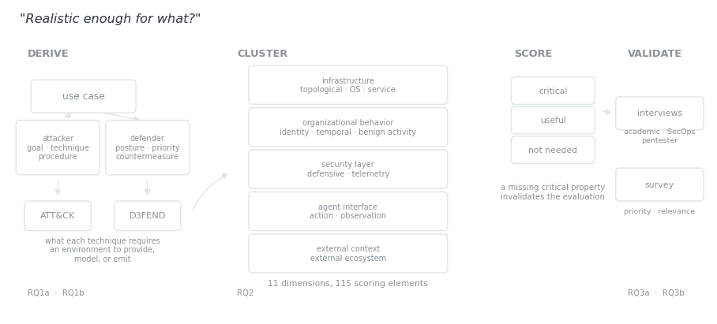

# When We Say "A Realistic Cyber Environment"

Environments get described by the features they implement, or by a broad claim of being realistic. Neither tells you whether the environment supports the claim you want to make with it.

<figure><figcaption>Metrion, built from the question rather than from a feature list.</figcaption></figure>

## The failure it fixes

Picture a defender benchmark where attacks raise alerts but ordinary enterprise life is thin — few normal logins, little admin maintenance, hardly any background traffic. A defender scores well there because malicious behaviour is being read against a clean baseline. The result is valid for that benchmark and says nothing about an enterprise full of noisy legitimate activity.

The offensive side has the mirror image. In NASimEmu an action can succeed deterministically in the simulator and fail against the corresponding real service in the emulator, because the simulator abstracted away the service and operating-system fidelity that decides whether an exploit lands. PenGym reports the same gap.

So the score reflects the agent's capability *and* which conditions the environment modelled or omitted, with no way to separate the two.

## The method

**Derive.** Start from a use case, decomposed on both sides — attacker goal, technique, procedure; defender posture, detection priority, countermeasure. Walk MITRE ATT&CK and D3FEND, recording what each technique requires the environment to provide, model, or emit.

**Cluster.** Those per-technique requirements converge into eleven realism dimensions, in five groups: infrastructure (topological, operating system, service), organizational behaviour (identity, temporal, benign activity), security layer (defensive, telemetry), agent interface (action, observation), and external context (external ecosystem). Each is operationalised through concrete scoring elements — 115 of them — set at the level where a missing property makes a class of techniques inexpressible or unobservable.

**Score.** For a given objective, each element is critical, useful, or not needed. Coverage of each is full, partial, absent, or unknown. Critical weighs 2 and useful 1; full counts 1, partial 0.5, absent 0. The weighted average is a fit score from 0 to 1.

One rule overrides it: **if any critical requirement is absent, the environment is not suitable for that objective** — a single missing critical property can invalidate the evaluation. Otherwise, suitable above a provisional threshold of 0.75, partially suitable below, and incomplete when too much is unknown.

**Validate.** ATT&CK and D3FEND are themselves curated abstractions, so the dimension set needs outside checking: interviews with academic, SecOps and pentesting practitioners, then a broader survey, asking what to add, remove, split or merge and whether people agree on what matters.

## What it shows

Applied to GOAD, an emulated multi-domain Active Directory environment: **suitable** for credential-based privilege escalation at a fit of 0.88, and **not suitable** for targeted data exfiltration at 0.39 with five critical requirements unmet — the same environment, unchanged.

Suitability is a property of the *pair*, not of the environment.

Across thirteen publicly inspectable enterprise environments two families appear. Real-software emulators reproduce service, operating-system and action-level realism. Abstract simulators reproduce topology and the agent interface but abstract away temporal dynamics, defensive controls, benign activity and telemetry. Those context dimensions are the least represented anywhere — which means the objectives that depend on them, including targeted exfiltration, evasive operations and threat hunting, are currently supported by no environment at all.

[Interactive scorecard](https://stratosphereips.github.io/realism-framework/)

_Metrion is a poster at ACM CCS 2026, with Maria Rigaki and Carlos A. Catania. The current comparison uses dimension-level proxy grades rather than element-level scoring, and is not yet validated._

## Publications

<table><thead><tr><th width="100"></th><th width="400">Paper</th><th>Authors</th><th></th></tr></thead><tbody><tr><td></td><td><mark style="color:green;">Realistic Enough for What? Metrion: A Multidimensional Framework for Evaluating Cyber Environments</mark> Poster, ACM CCS 2026</td><td><strong>Y. Du</strong>, M. Rigaki, C. A. Catania</td><td></td></tr></tbody></table>

## Collaborators

* [Maria Rigaki](https://mariarigaki.github.io/) — Czech Technical University in Prague
* Carlos A. Catania — Czech Technical University in Prague

_Last updated: 2026-08_
