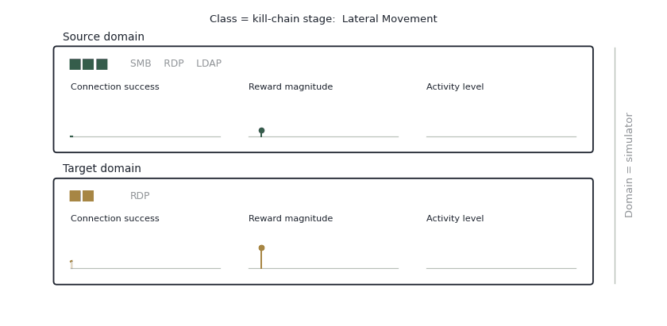

# When We Say "A Realistic Cyber Environment"

<figure><figcaption>The same stage of the same attack, in two environments.</figcaption></figure>

## Reading it

Both panels describe **the same class** — lateral movement, one stage of the kill chain. Both are described by **the same three features**: how often connections succeed, how large the rewards are, how much activity is going on.

What differs is the domain. A domain here is a simulator. The source has three servers running SMB, RDP and LDAP; the target has two desktops running RDP alone.

And once you look at the distributions, they have almost nothing in common. Connection success peaks late and tight in the source, early and broad in the target. Reward magnitude climbs to a peak in the source and decays from the first step in the target. Activity sits high and narrow in the source, low and wide in the target.

## Why this is the whole problem

A policy trained on the top panel has learned what those numbers mean. Not the feature names — the values. Put it in the bottom panel and every feature it reads is still there, correctly labelled, and quietly wrong.

This is why "realistic" isn't a single dial. Two environments can agree on what to measure and disagree completely on what the measurements look like. Structural alignment — same fields, same layout — closes none of that gap.

## What follows

If the gap is distributional, the bridge has to be distributional too. That is what the encoder in [Transfer to "Realistic" Environments](transfer-to-realistic-environments.md) is for: not renaming features, but pulling the two distributions into a shared latent space so a policy trained on one can read the other.

_Last updated: 2026-08_
