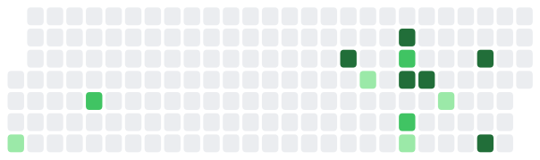
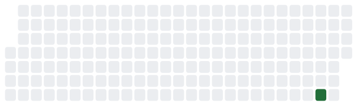
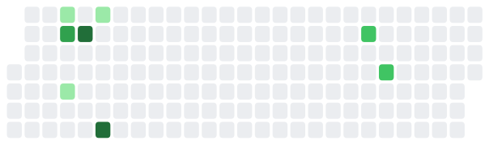

# What is she up to?

Away from the desk right now.

<figure><figcaption>
Work across the last six months
</figcaption></figure>

## Across threads

Reading Notes — nothing recorded yet

_warm · 4 days ago_

<figure><figcaption></figcaption></figure>

[Reading Notes on the site](../personal/overview.md)

## Cyber World Modeling

Learn Structure — nothing recorded yet

_warm · 6 days ago_

<figure><figcaption></figcaption></figure>

[Learn Structure on the site](../research/projects/lucid-world/learn-structure-flagship.md)

World Model Failure — nothing recorded yet

_resting · Aug 09_

<figure><figcaption></figcaption></figure>

[World Model Failure on the site](../research/projects/lucid-world/world-model-failure-track.md)

FOE-Dreamer — nothing recorded yet

_resting · Aug 08_

<figure><figcaption></figcaption></figure>

[FOE-Dreamer on the site](../research/projects/lucid-world/foe-dreamer-track.md)

## Mental World Modeling

Human Relationships in Networks — nothing recorded yet

_resting · Aug 10_

<figure><figcaption></figcaption></figure>

[Human Relationships in Networks on the site](../research/projects/read-the-room/human-relationships-in-networks-line.md)

Attacker Behavior Modeling — nothing recorded yet

_resting · —_

[Attacker Behavior Modeling on the site](../research/projects/read-the-room/attacker-behavior-line.md)

## Mental World Modeling

Difficulty Lineage — nothing recorded yet

_resting · Aug 09_

<figure><figcaption></figcaption></figure>

[Difficulty Lineage on the site](../research/projects/design-the-game/difficulty-lineage.md)

Mental Operations Consensus — nothing recorded yet

_resting · Aug 09_

<figure><figcaption></figcaption></figure>

[Mental Operations Consensus on the site](../research/projects/design-the-game/mental-operations-consensus-line.md)

Progressive Difficulty — nothing recorded yet

_resting · —_

[Progressive Difficulty on the site](../research/projects/design-the-game/overview.md)

## Across threads

Research Statement — nothing recorded yet

_resting · Aug 09_

<figure><figcaption></figcaption></figure>

[Research Statement on the site](../research/projects/research-statement/overview.md)

## Toward Deployment

Realism SoK — nothing recorded yet

_resting · Aug 08_

<figure><figcaption></figcaption></figure>

[Realism SoK on the site](../research/projects/be-realistic/realism-sok-track.md)

Sim2Sim2Real — nothing recorded yet

_resting · Aug 06_

<figure><figcaption></figcaption></figure>

[Sim2Sim2Real on the site](../research/projects/be-realistic/sim2sim2real-track.md)

Emulators — nothing recorded yet

_resting · —_

[Emulators on the site](../research/projects/be-realistic/emulator-track.md)

## Human-AI Complementarity

Human-AI Team Defense — nothing recorded yet

_resting · Aug 08_

<figure><figcaption></figcaption></figure>

[Human-AI Team Defense on the site](../overview/3-year-agenda/human-ai-complementarity/team-defense-game.md)

Team Dependencies — nothing recorded yet

_resting · Jul 21_

<figure><figcaption></figcaption></figure>

[Team Dependencies on the site](../research/projects/united-forces/team-dependencies-track.md)

CHART Testbed — nothing recorded yet

_resting · Jul 15_

<figure><figcaption></figcaption></figure>

[CHART Testbed on the site](../research/projects/united-forces/chart-testbed-track.md)

AgentFlow for Pentesters — nothing recorded yet

_resting · Jan 11_

<figure><figcaption></figcaption></figure>

[AgentFlow for Pentesters on the site](../research/projects/united-forces/agentflow-track.md)

## Across threads

IRB Logistics — nothing recorded yet

_resting · Aug 04_

<figure><figcaption></figcaption></figure>

[IRB Logistics on the site](../research/projects/irb-applications/overview.md)

## Cyber World Modeling

AcceleratePSRO — nothing recorded yet

_resting · Jun 21_

<figure><figcaption></figcaption></figure>

[AcceleratePSRO on the site](../research/projects/pick-your-battles/accelerate-psro-track.md)

## What changed on this site

* **13 minutes ago** — Re-render the board
* **14 minutes ago** — Activity board: subfolder projects, heatmaps, Clockify, settings window
* **23 minutes ago** — Refresh the activity board
* **23 minutes ago** — activity board
* **2 days ago** — Create capture_changes.py
* **4 days ago** — slides integration: one-step publish
* **4 days ago** — ASU talk: embed the live slide viewer
* **4 days ago** — ASU talk: keep multiple rows with arrows; add eager loading

_Last looked at Aug 19, 17:10_
