# What is she up to?

Away from the desk right now.

<figure><figcaption>
Work across the last six months
</figcaption></figure>

## Across threads

What to Read — nothing recorded yet

_warm · 4 days ago_

<figure>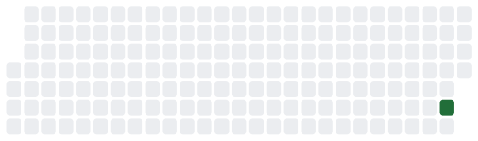<figcaption></figcaption></figure>

[What to Read on the site](../personal/overview.md)

## Cyber World Modeling

Learn Structure — nothing recorded yet

_warm · 6 days ago_

<figure><figcaption></figcaption></figure>

[Learn Structure on the site](../overview/3-year-agenda/cyber-world-modeling/strategic-structure.md)

World Model Failure — nothing recorded yet

_resting · Aug 09_

<figure>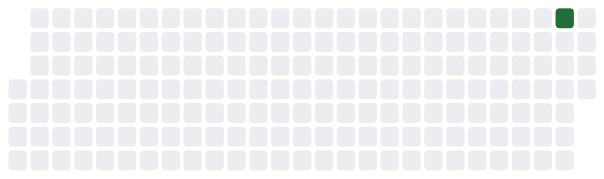<figcaption></figcaption></figure>

[World Model Failure on the site](../research/projects/lucid-world/world-model-failure-track.md)

FOE-Dreamer — nothing recorded yet

_resting · Aug 08_

<figure>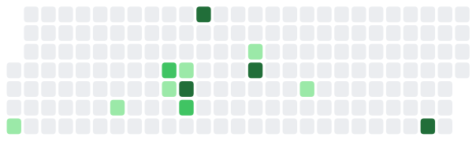<figcaption></figcaption></figure>

[FOE-Dreamer on the site](../overview/3-year-agenda/cyber-world-modeling/environment.md)

## Mental World Modeling

Human Relationships in Networks — nothing recorded yet

_resting · Aug 10_

<figure>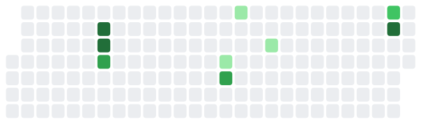<figcaption></figcaption></figure>

[Human Relationships in Networks on the site](../overview/3-year-agenda/mental-world-modeling/opponent-agent-modeling/social-intelligence.md)

Attacker Behavior Modeling — nothing recorded yet

_resting · —_

[Attacker Behavior Modeling on the site](../overview/3-year-agenda/mental-world-modeling/opponent-agent-modeling/bias/README.md)

## Mental World Modeling

What Makes a Problem Difficult — nothing recorded yet

_resting · Aug 09_

<figure>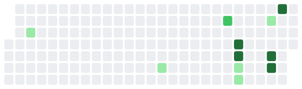<figcaption></figcaption></figure>

[What Makes a Problem Difficult on the site](../research/projects/design-the-game/difficulty-lineage.md)

Mental Operations Consensus — nothing recorded yet

_resting · Aug 09_

<figure>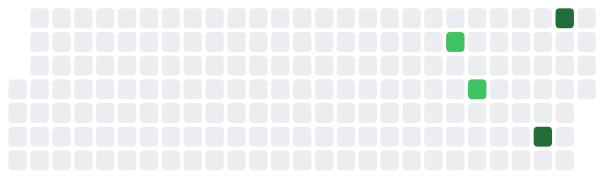<figcaption></figcaption></figure>

[Mental Operations Consensus on the site](../overview/3-year-agenda/mental-world-modeling/problem-solving/general-cs.md)

Progressive Problem Design — nothing recorded yet

_resting · —_

[Progressive Problem Design on the site](../overview/3-year-agenda/mental-world-modeling/problem-solving/capture-the-flag.md)

## Across threads

Research Statement — nothing recorded yet

_resting · Aug 09_

<figure><figcaption></figcaption></figure>

[Research Statement on the site](../research/projects/research-statement/overview.md)

## Toward Deployment

What Is a Realistic Cyber Environment — nothing recorded yet

_resting · Aug 08_

<figure>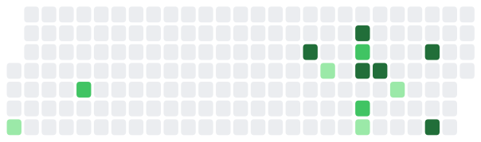<figcaption></figcaption></figure>

[What Is a Realistic Cyber Environment on the site](../overview/3-year-agenda/toward-deployment/when-we-say-a-realistic-cyber-environment.md)

Sim2Sim before Sim2Real — nothing recorded yet

_resting · Aug 06_

<figure>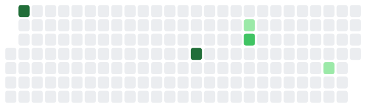<figcaption></figcaption></figure>

[Sim2Sim before Sim2Real on the site](../overview/3-year-agenda/toward-deployment/transfer-to-realistic-environments.md)

Emulators — nothing recorded yet

_resting · —_

[Emulators on the site](../research/projects/be-realistic/emulator-track.md)

## Human-AI Complementarity

Team Defense Game — nothing recorded yet

_resting · Aug 08_

<figure>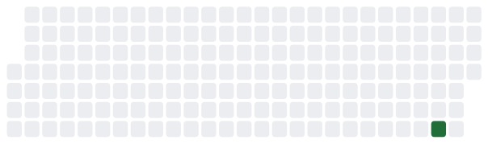<figcaption></figcaption></figure>

[Team Defense Game on the site](../overview/3-year-agenda/human-ai-complementarity/team-defense-game.md)

Team Dependencies — nothing recorded yet

_resting · Jul 21_

<figure>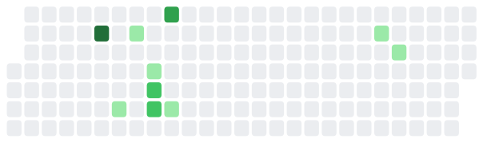<figcaption></figcaption></figure>

[Team Dependencies on the site](../research/projects/united-forces/team-dependencies-track.md)

CHART — nothing recorded yet

_resting · Jul 15_

<figure>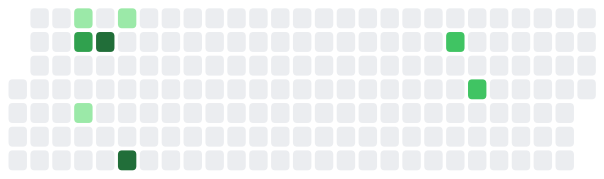<figcaption></figcaption></figure>

[CHART on the site](../overview/3-year-agenda/human-ai-complementarity/chart.md)

CyberAgentFlow — nothing recorded yet

_resting · Jan 11_

<figure>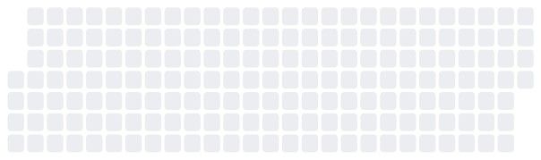<figcaption></figcaption></figure>

[CyberAgentFlow on the site](../overview/3-year-agenda/human-ai-complementarity/cyberagenttrace.md)

## Across threads

IRB Logistics — nothing recorded yet

_resting · Aug 04_

<figure>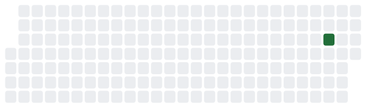<figcaption></figcaption></figure>

[IRB Logistics on the site](../research/projects/irb-applications/overview.md)

## Cyber World Modeling

AcceleratePSRO — nothing recorded yet

_resting · Jun 21_

<figure>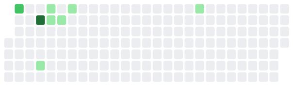<figcaption></figcaption></figure>

[AcceleratePSRO on the site](../research/projects/pick-your-battles/accelerate-psro-track.md)

## What changed on this site

* **2 minutes ago** — Re-render the board
* **3 minutes ago** — Point projects at their real pages on the 3-year agenda
* **5 minutes ago** — Refresh the activity board
* **6 minutes ago** — Re-render the board
* **6 minutes ago** — Name projects after their pages on the site
* **19 minutes ago** — Refresh the activity board
* **19 minutes ago** — Re-render the board
* **20 minutes ago** — Activity board: subfolder projects, heatmaps, Clockify, settings window

_Last looked at Aug 19, 17:17_
