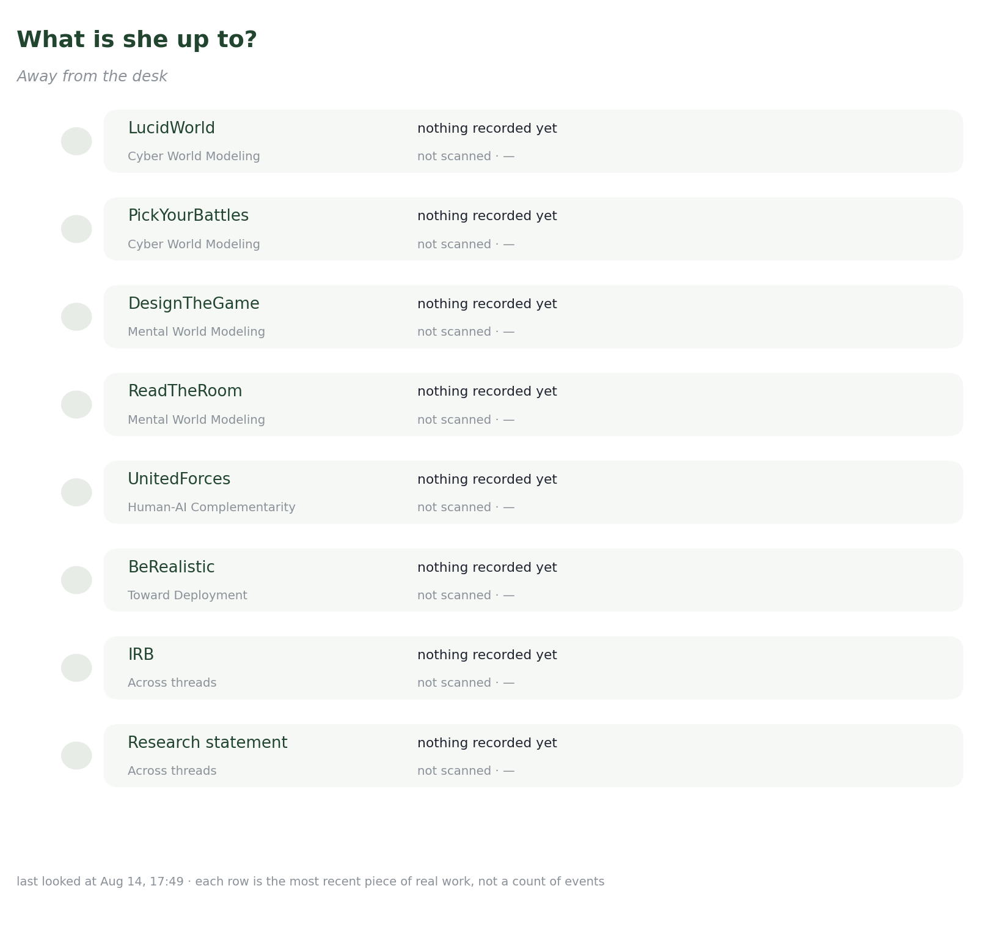

# What to do?

Away from the desk right now.

<figure><figcaption>
Where the work actually is.
</figcaption></figure>

<table><thead><tr><th width="170">Project</th><th width="120">State</th><th>Last piece of work</th></tr></thead><tbody><tr><td><a href="../overview/3-year-agenda/cyber-world-modeling/">LucidWorld</a> <em>Cyber World Modeling</em></td><td>not scanned</td><td>— <em>—</em></td></tr><tr><td><a href="../overview/3-year-agenda/cyber-world-modeling/next.md">PickYourBattles</a> <em>Cyber World Modeling</em></td><td>not scanned</td><td>— <em>—</em></td></tr><tr><td><a href="../overview/3-year-agenda/mental-world-modeling/problem-solving/">DesignTheGame</a> <em>Mental World Modeling</em></td><td>not scanned</td><td>— <em>—</em></td></tr><tr><td><a href="../overview/3-year-agenda/mental-world-modeling/opponent-agent-modeling/">ReadTheRoom</a> <em>Mental World Modeling</em></td><td>not scanned</td><td>— <em>—</em></td></tr><tr><td><a href="../overview/3-year-agenda/human-ai-complementarity/">UnitedForces</a> <em>Human-AI Complementarity</em></td><td>not scanned</td><td>— <em>—</em></td></tr><tr><td><a href="../overview/3-year-agenda/toward-deployment/">BeRealistic</a> <em>Toward Deployment</em></td><td>not scanned</td><td>— <em>—</em></td></tr><tr><td><a href="../overview/3-year-agenda/">IRB</a> <em>Across threads</em></td><td>not scanned</td><td>— <em>—</em></td></tr><tr><td><a href="../research/overview.md">Research statement</a> <em>Across threads</em></td><td>not scanned</td><td>— <em>—</em></td></tr></tbody></table>

_Last updated: 2026-08_
