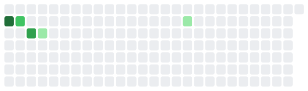

# What is she up to?

Away from the desk right now.

<figure><figcaption>
581 hours logged in the last six months
</figcaption></figure>

## Across threads

What to Read — nothing recorded yet

_warm · 5 days ago_

<figure><figcaption></figcaption></figure>

[What to Read on the site](../personal/overview.md)

## Mental World Modeling

Human Relationships in Networks — Created a template that I am satisfied with. Now finally back to track on the progression of…

_resting · Aug 10_

<figure><figcaption></figcaption></figure>

* 38.3 hours logged in this window

[Human Relationships in Networks on the site](../overview/3-year-agenda/mental-world-modeling/opponent-agent-modeling/social-intelligence.md)

Attacker Behavior Modeling — Working in VS Code

_resting · Jul 06_

<figure><figcaption></figcaption></figure>

* **Jul 06** — logged 0.2h — Working in VS Code
* 8.2 hours logged in this window

[Attacker Behavior Modeling on the site](../overview/3-year-agenda/mental-world-modeling/opponent-agent-modeling/bias/README.md)

## Cyber World Modeling

World Model Failure — nothing recorded yet

_resting · Aug 09_

<figure><figcaption></figcaption></figure>

[World Model Failure on the site](../research/projects/lucid-world/world-model-failure-track.md)

Learn Structure — first time using the touch screen of yoga, it frees up creativity.

_resting · Aug 06_

<figure><figcaption></figcaption></figure>

* **Aug 06** — logged 2.8h — first time using the touch screen of yoga, it frees up creativity.
* 114.9 hours logged in this window

[Learn Structure on the site](../overview/3-year-agenda/cyber-world-modeling/strategic-structure.md)

FOE-Dreamer — A seed idea about realism conceptual framework and evaluation. We need a viable strategy to…

_resting · Feb 21_

<figure><figcaption></figcaption></figure>

* **Feb 21** — logged 1.9h — A seed idea about realism conceptual framework and evaluation. We need a viable strategy to take off a piece of that general problem.
* 1.9 hours logged in this window

[FOE-Dreamer on the site](../overview/3-year-agenda/cyber-world-modeling/environment.md)

## Mental World Modeling

What Makes a Problem Difficult — nothing recorded yet

_resting · Aug 09_

<figure><figcaption></figcaption></figure>

[What Makes a Problem Difficult on the site](../research/projects/design-the-game/difficulty-lineage.md)

Mental Operations Consensus — nothing recorded yet

_resting · Aug 09_

<figure><figcaption></figcaption></figure>

[Mental Operations Consensus on the site](../overview/3-year-agenda/mental-world-modeling/problem-solving/general-cs.md)

Progressive Problem Design — nothing recorded yet

_resting · —_

[Progressive Problem Design on the site](../overview/3-year-agenda/mental-world-modeling/problem-solving/capture-the-flag.md)

## Across threads

Research Statement — Next steps and key questions in HAT projects

_resting · Aug 09_

<figure><figcaption></figcaption></figure>

* 77.1 hours logged in this window

[Research Statement on the site](../research/projects/research-statement/overview.md)

## Human-AI Complementarity

Team Defense Game — nothing recorded yet

_resting · Aug 08_

<figure><figcaption></figcaption></figure>

[Team Defense Game on the site](../overview/3-year-agenda/human-ai-complementarity/team-defense-game.md)

CHART — Found out who is the mean editor and made a plan. Now I have to put this down to attend to…

_resting · Jul 15_

<figure><figcaption></figcaption></figure>

* 41.6 hours logged in this window

[CHART on the site](../overview/3-year-agenda/human-ai-complementarity/chart.md)

Team Dependencies — Updated a few todo items

_resting · Mar 23_

<figure><figcaption></figcaption></figure>

* **Mar 23** — logged 0.3h — Updated a few todo items
* 7.3 hours logged in this window

[Team Dependencies on the site](../research/projects/united-forces/team-dependencies-track.md)

CyberAgentFlow — Thomas's talk

_resting · Mar 13_

<figure><figcaption></figcaption></figure>

* **Mar 13** — logged 0.8h — Thomas's talk
* 13.2 hours logged in this window

[CyberAgentFlow on the site](../overview/3-year-agenda/human-ai-complementarity/cyberagenttrace.md)

## Toward Deployment

Sim2Sim before Sim2Real — 01.23 Weekly Meeting. Debug Encoder. The most likely cause is mismatch between source and…

_resting · Aug 06_

<figure><figcaption></figcaption></figure>

* 16.6 hours logged in this window

[Sim2Sim before Sim2Real on the site](../overview/3-year-agenda/toward-deployment/transfer-to-realistic-environments.md)

What Is a Realistic Cyber Environment — diagram

_resting · Jul 13_

<figure><figcaption></figcaption></figure>

* **Jul 13** — logged 2.0h — diagram
* **Jul 11** — logged 1.8h — diagram
* **Jul 08** — logged 0.4h — fix the compile error
* 58.7 hours logged in this window

[What Is a Realistic Cyber Environment on the site](../overview/3-year-agenda/toward-deployment/when-we-say-a-realistic-cyber-environment.md)

Emulators — nothing recorded yet

_resting · —_

[Emulators on the site](../research/projects/be-realistic/emulator-track.md)

## Across threads

IRB Logistics — nothing recorded yet

_resting · Aug 04_

<figure><figcaption></figcaption></figure>

[IRB Logistics on the site](../research/projects/irb-applications/overview.md)

## Cyber World Modeling

AcceleratePSRO — An extended search from the three papers.

_resting · Apr 09_

<figure><figcaption></figcaption></figure>

* **Apr 09** — logged 1.1h — An extended search from the three papers.
* **Apr 08** — logged 1.0h — The seed papers, Dyna-PSRO, GenBR, and DiscoverPSROVariants
* 203.0 hours logged in this window

[AcceleratePSRO on the site](../overview/3-year-agenda/cyber-world-modeling/accelerate-psro.md)

## What changed on this site

* **4 hours ago** — Re-render the board
* **4 hours ago** — Wire in Clockify, and fix the heatmap shading
* **4 hours ago** — Refresh the activity board
* **4 hours ago** — Re-render the board
* **4 hours ago** — Add an AcceleratePSRO page under Cyber World Modeling
* **4 hours ago** — Refresh the activity board
* **4 hours ago** — Re-render the board
* **4 hours ago** — Keep projects off the blog pages

_Last looked at Aug 19, 21:46_
