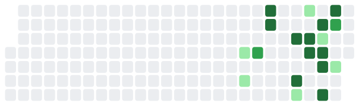
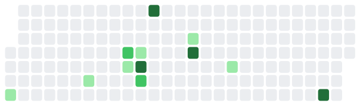
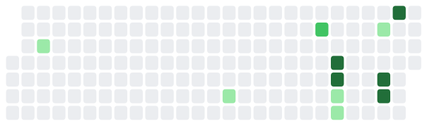
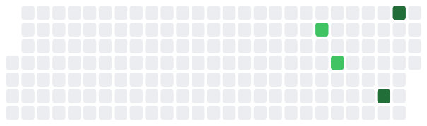
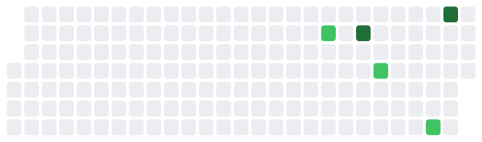
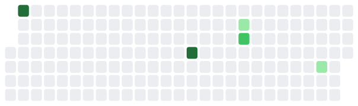
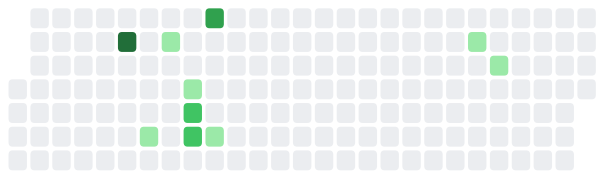
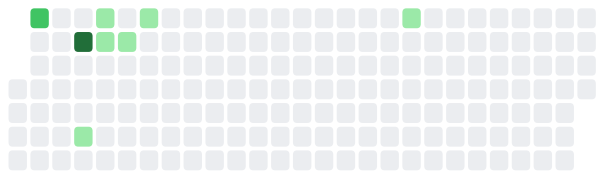

# What is she up to?

Away from the desk right now.

<figure><figcaption>
Work across the last six months
</figcaption></figure>

## Across threads

READING NOTES — nothing recorded yet

_warm · 4 days ago_

<figure><figcaption></figcaption></figure>

[Across threads](../personal/overview.md)

## Cyber World Modeling

Learn structure — nothing recorded yet

_warm · 6 days ago_

<figure><figcaption></figcaption></figure>

[Cyber World Modeling](../overview/3-year-agenda/cyber-world-modeling/)

When world model defend agent fail — nothing recorded yet

_resting · Aug 10_

<figure><figcaption></figcaption></figure>

[Cyber World Modeling](../overview/3-year-agenda/cyber-world-modeling/)

Sample efficient FOEDreamer — nothing recorded yet

_resting · Aug 08_

<figure><figcaption></figcaption></figure>

[Cyber World Modeling](../overview/3-year-agenda/cyber-world-modeling/)

## Mental World Modeling

Coty Palvi how do human handle relationships in networks — nothing recorded yet

_resting · Aug 10_

<figure><figcaption></figcaption></figure>

[Mental World Modeling](../overview/3-year-agenda/mental-world-modeling/opponent-agent-modeling/)

Antti Palvi RL based attacker behavior modeling — nothing recorded yet

_resting · —_

[Mental World Modeling](../overview/3-year-agenda/mental-world-modeling/opponent-agent-modeling/)

## Mental World Modeling

Yansi Ana but what is difficult — nothing recorded yet

_resting · Aug 10_

<figure><figcaption></figcaption></figure>

[Mental World Modeling](../overview/3-year-agenda/mental-world-modeling/problem-solving/)

Ana concensus on mental operations in cs problem solving — nothing recorded yet

_resting · Aug 09_

<figure><figcaption></figcaption></figure>

[Mental World Modeling](../overview/3-year-agenda/mental-world-modeling/problem-solving/)

Aritran Jaime progressively more difficult — nothing recorded yet

_resting · —_

[Mental World Modeling](../overview/3-year-agenda/mental-world-modeling/problem-solving/)

## Across threads

RESEARCH STATEMENT — nothing recorded yet

_resting · Aug 09_

<figure><figcaption></figcaption></figure>

[Across threads](../research/overview.md)

## Toward Deployment

CTU UTEP sok what is real — nothing recorded yet

_resting · Aug 09_

<figure><figcaption></figcaption></figure>

[Toward Deployment](../overview/3-year-agenda/toward-deployment/)

Aritran sim2sim2real — nothing recorded yet

_resting · Aug 06_

<figure><figcaption></figcaption></figure>

[Toward Deployment](../overview/3-year-agenda/toward-deployment/)

PaloAltoNetwork emulators — nothing recorded yet

_resting · —_

[Toward Deployment](../overview/3-year-agenda/toward-deployment/)

## Human-AI Complementarity

Chart-human-ai-team-defense — nothing recorded yet

_resting · Aug 09_

<figure><figcaption></figcaption></figure>

[Human-AI Complementarity](../overview/3-year-agenda/human-ai-complementarity/)

Grace team dependencies — nothing recorded yet

_resting · Jul 21_

<figure><figcaption></figcaption></figure>

[Human-AI Complementarity](../overview/3-year-agenda/human-ai-complementarity/)

Testbed CHART — nothing recorded yet

_resting · Jul 15_

<figure><figcaption></figcaption></figure>

[Human-AI Complementarity](../overview/3-year-agenda/human-ai-complementarity/)

Jaime AgentFlow for pentesters — nothing recorded yet

_resting · Jan 11_

<figure><figcaption></figcaption></figure>

[Human-AI Complementarity](../overview/3-year-agenda/human-ai-complementarity/)

## Across threads

Utep irb logistics — nothing recorded yet

_resting · Aug 04_

<figure><figcaption></figcaption></figure>

[Across threads](../overview/3-year-agenda/)

## Cyber World Modeling

Chris AcceleratePSRO — nothing recorded yet

_resting · Jun 22_

<figure><figcaption></figcaption></figure>

[Cyber World Modeling](../overview/3-year-agenda/cyber-world-modeling/next.md)

## testgit

Testgit — nothing recorded yet

_resting · —_

## What changed on this site

* **10 minutes ago** — activity board
* **2 days ago** — Create capture_changes.py
* **4 days ago** — slides integration: one-step publish
* **4 days ago** — ASU talk: embed the live slide viewer
* **4 days ago** — ASU talk: keep multiple rows with arrows; add eager loading
* **4 days ago** — ASU talk: keep tabs, WebP images, eager loading
* **4 days ago** — ASU talk: drop tabs for anchored slides with prev/next, JPG to WebP
* **4 days ago** — Reading page: one table, per-row download links

_Last looked at Aug 19, 22:53_
