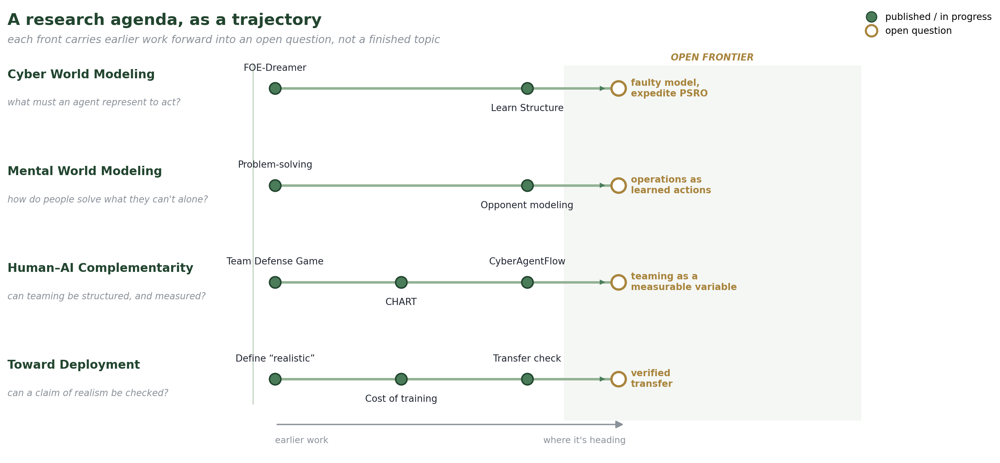

# Research

I study decision-making in cybersecurity — the machine's, the attacker's, the defender's, and the one a person and an agent sometimes have to make together.

The hard part of defending a network has never been the network. It is that every consequential move depends on something that cannot be fully written down: an adversary who adapts and hides, a teammate whose judgment you cannot see inside, an analyst weighing whether the recommendation on the screen is worth trusting. Both sides of that encounter hold knowledge they cannot completely put into words. A defender's sense that _this doesn't look right_ and a model's latent state are each real and each partly inarticulate. Much of my work is about moving that knowledge along a ladder — from intuition, to rules of thumb, to something explicit enough to build on and to check — and about pairing people and agents precisely because each holds what the other cannot state.

<figure><figcaption>
The program as four trajectories, not four topics — each carries earlier work into a question it hasn't answered yet.
</figcaption></figure>

Three questions run under the whole program, and they are meant to meet rather than sit in separate boxes.

**What must an agent represent in order to act?** A defender that models the whole state space equally is spending its budget in the wrong place; a defender that treats the people in the loop as noise is modeling the wrong thing. [Cyber World Modeling](../overview/cyber-world-modeling/) asks what to represent about the network and the adversary, and how to factor it so that being wrong about one is not being wrong about the other. [Mental World Modeling](../overview/mental-world-modeling/) asks the same question about the people the agent shares the problem with — how they solve what they cannot solve alone, and how they read and misread each other across repeated play.

**How should a human and an AI combine when each knows things the other cannot say?** [Human-AI Complementarity](../overview/human-ai-complementarity/) treats collaboration as a structure rather than an attitude: who may authorize what, which actions must happen together, what each teammate is allowed to see. Written down, teamwork becomes something you can vary and measure instead of something you assert after the fact — and something detailed enough to say what went wrong, not only that it did.

**How do we know any of it survives contact with a real deployment?** [Toward Deployment](../overview/toward-deployment/) is the discipline of not believing your own results — pinning down what anyone means by a "realistic" environment, what a heavier one costs to train in, and whether a policy that wins after moving to a new environment is winning for the right reasons or just reading the benchmark.

None of the four is a closed topic. Each is a trajectory: a durable question, the work done against it so far, and the open question it is pointed at next — which is what the figure is trying to show, and what each thread's own page picks up in detail.

***

[Publications](../publications.md) lists the work these pages draw on. Each project page carries its own papers and the people I did them with.

_Last updated: 2026-08_
