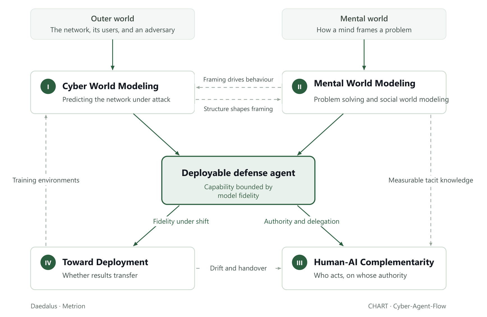

# Research

An intrusion runs reconnaissance, exploitation, lateral movement, exfiltration. Median dwell time is fourteen days. Average breakout — landing on one host and pivoting to a second — is twenty-nine minutes, the fastest recorded twenty-seven seconds, and initial access is handed to the next operator a median of twenty-two seconds after compromise.

I design practical AI agents that can be deployed in operational cyber environments with humans in the loop.

A cyber defender is an artifact standing between an operational network and the operator accountable for it, and what it can achieve is bounded by what it represents of each. Two representations are therefore load-bearing, and neither is optional. The first is the network with an adversary operating inside it. The second is the problem-solving of the person the agent works beside, because the performance of a human-machine pair is a property of the two together with the relations between them rather than of either alone, and because coordination with a human requires mutual predictability, common ground and directability.

Both representations are built somewhere other than where they are used, and a model of a system that is not closed cannot be validated outright — only confirmed partially, and only in relative terms against what is already trusted.

The programme has four parts, and they are the four parts that argument leaves: the two representations, the relative confirmation of their fidelity, and the authority structure that governs action where fidelity runs out.

<table><thead><tr><th width="70"></th><th width="270">Thrust</th><th>What it supplies</th></tr></thead><tbody><tr><td><strong>I</strong></td><td><a href="../overview/3-year-agenda/cyber-world-modeling/">Cyber World Modeling</a></td><td>the regulated system, and the substrate the rest runs on</td></tr><tr><td><strong>II</strong></td><td><a href="../overview/3-year-agenda/mental-world-modeling/">Mental World Modeling</a></td><td>the partner representation mutual predictability requires; and the opponent model Thrust I needs</td></tr><tr><td><strong>III</strong></td><td><a href="../overview/3-year-agenda/human-ai-complementarity/">Human-AI Complementarity</a></td><td>directability, and the authority structure</td></tr><tr><td><strong>IV</strong></td><td><a href="../overview/3-year-agenda/toward-deployment/">Toward Deployment</a></td><td>relative confirmation of fidelity for all three, and the environments they run in</td></tr></tbody></table>

Where each stands differs, and the difference is worth stating. Thrust III holds the only accepted archival output — the CHART chapter and Cyber-Agent-Flow — with the platform built and internally funded, the experiment designed and the data not yet collected. Thrust II is the longest-running line and carries the highest-prestige work in flight. Thrust I is the method core and the newest. Thrust IV is at the agenda-setting stage, and has the most work still to do.

## **Find Answers...**

<figure><figcaption>
Four thrusts, and what each owes the others. The agent in the middle is bounded by how well it models both worlds.
</figcaption></figure>

<mark style="color:$primary;">**What must an agent represent in order to act?**</mark> An agent that will act in a real operation has to model two worlds at once — the physical world of the network, and the mental world of the people in it: the intent, the attention, the context that decide what a move actually means. A defender that models the whole state space equally is spending its budget in the wrong place; one that treats the people in the loop as noise is modeling the wrong thing entirely. [Cyber World Modeling](../overview/3-year-agenda/cyber-world-modeling/) takes the first world — what to represent about the network and the adversary, and how to factor it so that being wrong about one is not being wrong about the other. [Mental World Modeling](../overview/3-year-agenda/mental-world-modeling/) takes the second — how the people the agent shares the problem with solve what they cannot solve alone, and how they read and misread each other across repeated play.

<mark style="color:$primary;">**How should a human and an AI combine when each knows things the other cannot say?**</mark> [Human-AI Complementarity](../overview/3-year-agenda/human-ai-complementarity/) treats collaboration as a structure rather than an attitude: who may authorize what, which actions must happen together, what each teammate is allowed to see. Written down, teamwork becomes something you can vary and measure instead of something you assert after the fact — and something detailed enough to say what went wrong, not only that it did.

<mark style="color:$primary;">**How to benchmark and stress-test agents so it can survive contact with a real deployment?**</mark> [Toward Deployment](../overview/3-year-agenda/toward-deployment/) is the discipline of not believing your own results — pinning down what anyone means by a "realistic" environment, what a heavier one costs to train in, and whether a policy that wins after moving to a new environment is winning for the right reasons or just reading the benchmark.

## With Friends...

<figure><figcaption>
34 people, 7 institutions, 4 countries.
</figcaption></figure>

[Publications](../publications.md)

_Last updated: 2026-08_
