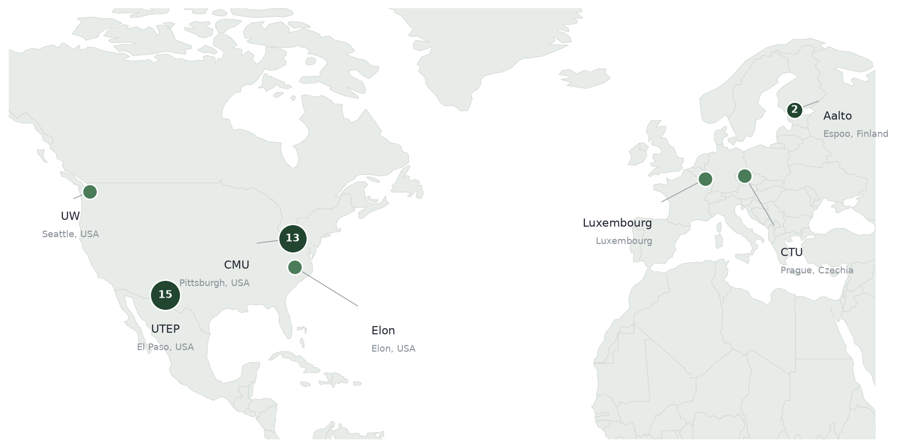

# Research

## **Find Answers...**

<mark style="color:$primary;">**What must an agent represent in order to act?**</mark> An agent that will act in a real operation has to model two worlds at once — the physical world of the network, and the mental world of the people in it: the intent, the attention, the context that decide what a move actually means. A defender that models the whole state space equally is spending its budget in the wrong place; one that treats the people in the loop as noise is modeling the wrong thing entirely. [Cyber World Modeling](../overview/3-year-agenda/cyber-world-modeling/) takes the first world — what to represent about the network and the adversary, and how to factor it so that being wrong about one is not being wrong about the other. [Mental World Modeling](../overview/3-year-agenda/mental-world-modeling/) takes the second — how the people the agent shares the problem with solve what they cannot solve alone, and how they read and misread each other across repeated play.

<mark style="color:$primary;">**How should a human and an AI combine when each knows things the other cannot say?**</mark> [Human-AI Complementarity](../overview/3-year-agenda/human-ai-complementarity/) treats collaboration as a structure rather than an attitude: who may authorize what, which actions must happen together, what each teammate is allowed to see. Written down, teamwork becomes something you can vary and measure instead of something you assert after the fact — and something detailed enough to say what went wrong, not only that it did.

<mark style="color:$primary;">**How to benchmark and stress-test agents so it can survive contact with a real deployment?**</mark> [Toward Deployment](../overview/3-year-agenda/toward-deployment/) is the discipline of not believing your own results — pinning down what anyone means by a "realistic" environment, what a heavier one costs to train in, and whether a policy that wins after moving to a new environment is winning for the right reasons or just reading the benchmark.

## With Friends...

<figure><figcaption>
34 people, 7 institutions, 4 countries.
</figcaption></figure>

[Publications](../publications.md)

_Last updated: 2026-08_
