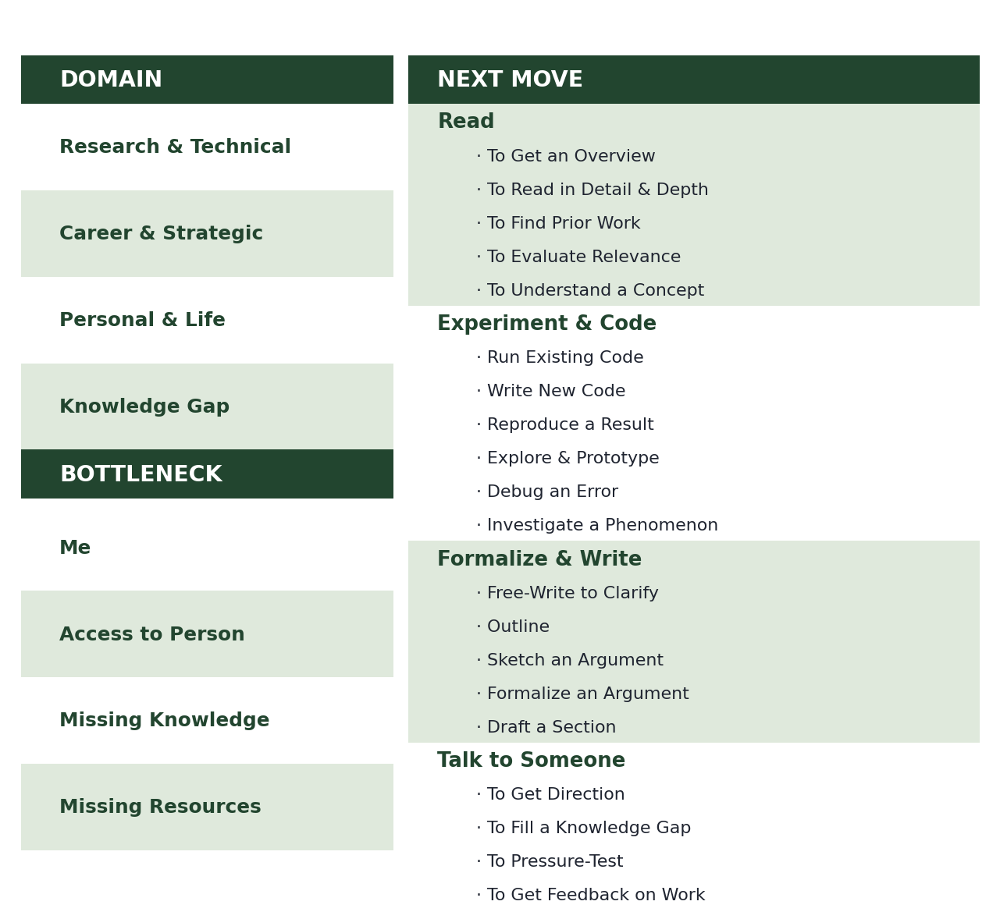

# Research

The craft parts of the job, which are taught by osmosis if at all.

## Deciding what to do next

Most stuck feels the same from the inside and isn't. Before reaching for a technique, it helps to name two things: which domain the problem sits in, and what the actual bottleneck is — me, access to a person, missing knowledge, or missing resources. The move follows from the pair.

<figure><figcaption>
Name the bottleneck first. The next move is usually obvious afterwards.
</figcaption></figure>

The right-hand column is the one that does the work. "Read" is not one activity — reading to get an overview and reading to evaluate relevance are different operations with different stopping rules, and confusing them is how an afternoon disappears. Same for writing: free-writing to clarify is not drafting a section, and treating them as the same task produces bad prose and no clarity.

## The shelf

* [Read](read.md) — how to get through a paper, and what to get out of it
* [Think](think.md) — problem-finding, intuition, and what expertise actually changes
* [Write](write/) — structure, headings, mathematical writing, usage, rigour
* [Present](present.md) — talks, and the reading group as its own genre
* [Project Management](project-management.md) — the stages a complex build passes through
* [Conferences](conferences.md) — venue fit, and what the registration metadata is actually for

_Last updated: 2026-08_
