# 2025 ASU Brown Bag Seminar

Invited talk, Brown Bag Seminar, Arizona State University.

## Slides

Scroll, or use the arrows on either side of each slide. Narration follows each one.

### Slide 1

<table><tr><td width="44"></td><td>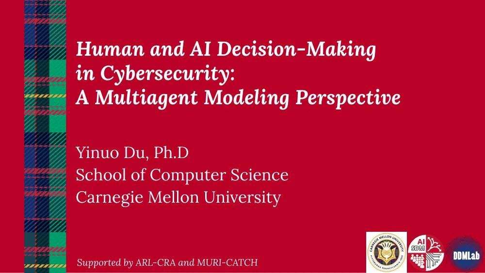</td><td width="44"><a href="#slide-2">→</a></td></tr></table>

Hi, in today’s talk I’ll share my work on the application of human and AI decision-making in cybersecurity.

### Slide 2

<table><tr><td width="44"><a href="#slide-1">←</a></td><td>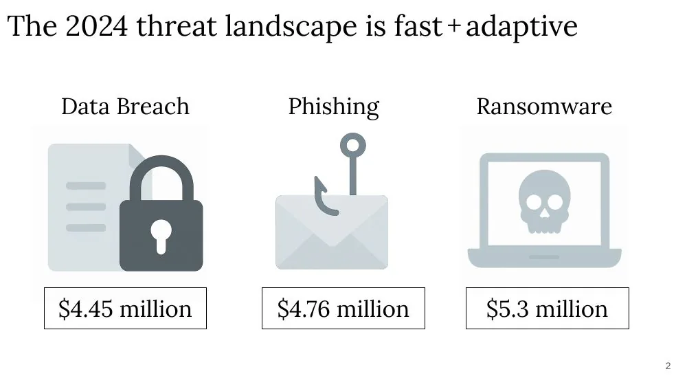</td><td width="44"><a href="#slide-3">→</a></td></tr></table>

The threat landscape is evolving at a high speed. Last year alone, there were roughly 4.76 million dollar loss caused through social engineering attacks like phishing. Ransomware is another big threat, causing around 5.3 million dollar loss.

### Slide 3

<table><tr><td width="44"><a href="#slide-2">←</a></td><td>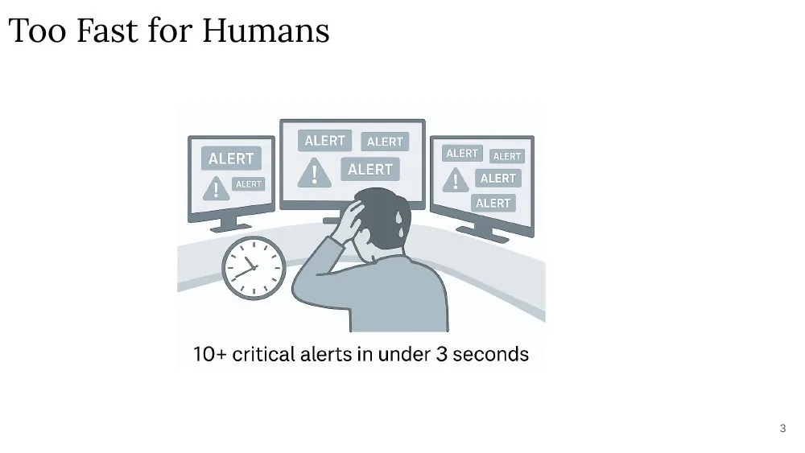</td><td width="44"><a href="#slide-4">→</a></td></tr></table>

This is the reality for a lot of cyber defenders today.

Dozens of alerts hit the screen within seconds. A single misstep could mean missing a breach — or overreacting to a false alarm.

But with this speed and volume, even experienced analysts are left overwhelmed.

By the time you’ve figured out what’s happening, it may already be too late.

### Slide 4

<table><tr><td width="44"><a href="#slide-3">←</a></td><td>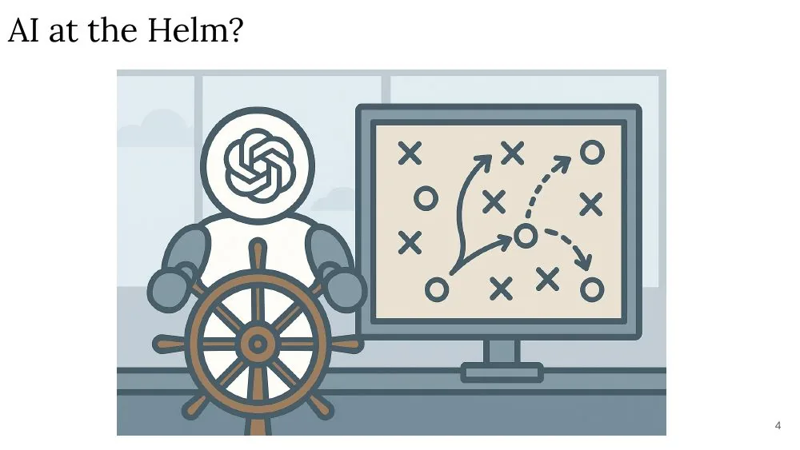</td><td width="44"><a href="#slide-5">→</a></td></tr></table>

To cope with the pace, we turn to AI.

It can monitor constantly, react faster than any human, and scale across networks.

But here’s the problem:

AI often acts without context — without understanding what’s at stake, or what’s reasonable.

It might block legitimate traffic, isolate the wrong host, or even escalate a situation it doesn’t fully understand.

Speed without strategy isn’t enough.

So the question becomes: what does it take for AI to act with the defender — not instead of them?

### Slide 5

<table><tr><td width="44"><a href="#slide-4">←</a></td><td>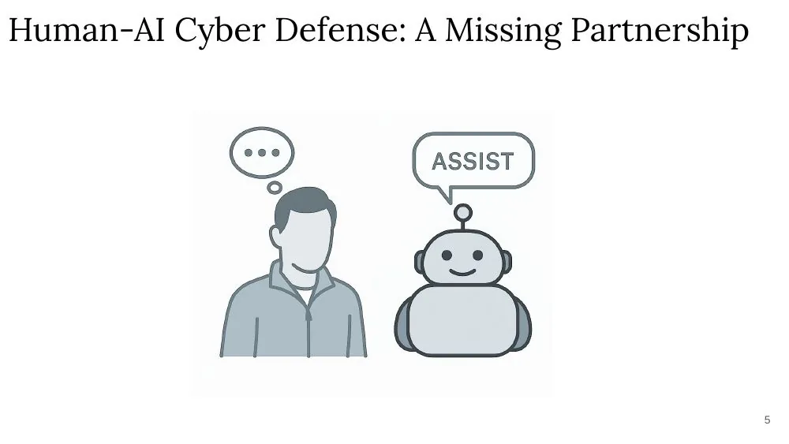</td><td width="44"><a href="#slide-6">→</a></td></tr></table>

The goal isn't to replace humans — it's to build systems that work with them.

Imagine an AI that doesn't just react, but explains.

One that proposes actions based on telemetry, simulates the attacker's next move, and highlights what really matters — all while learning from how human analysts think and respond.

This is what it means to team up — combining AI’s speed and pattern recognition with human judgment and strategy.

And that’s the vision behind the work I’m going to show you today.

### Slide 6

<table><tr><td width="44"><a href="#slide-5">←</a></td><td>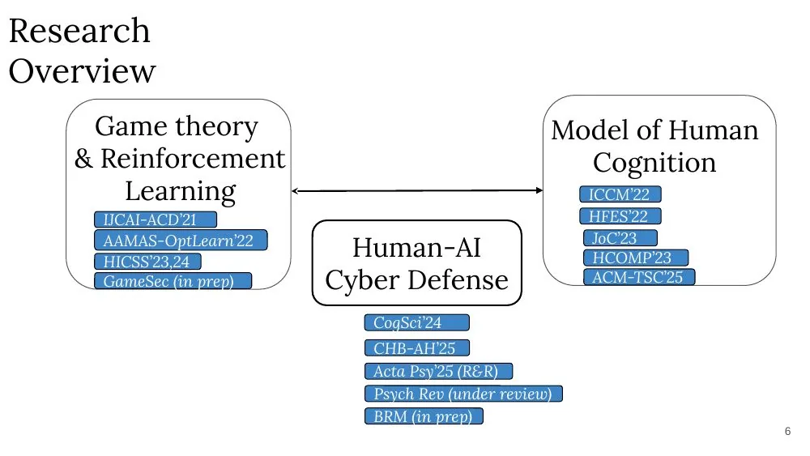</td><td width="44"><a href="#slide-7">→</a></td></tr></table>

I use game theory and reinforcement learning for autonomous defense. I use Cognitive Modeling to understand, predict, and collaborate with the humans on the cyber battlefield, including defenders, attackers, and end-users. I then use human-subject experimentation empirically evaluate the autonomous and human-AI defense techniques.

### Slide 7

<table><tr><td width="44"><a href="#slide-6">←</a></td><td>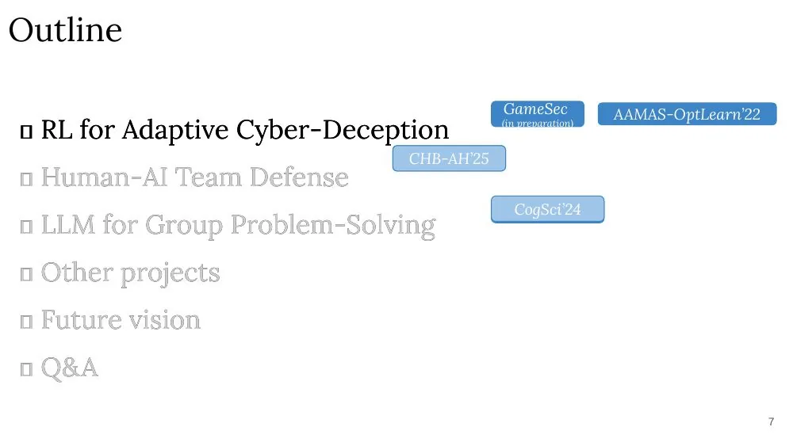</td><td width="44"><a href="#slide-8">→</a></td></tr></table>

In today’s talk, I’ll start with reinforcement learning for autonomous defense, zoom out to Human‑AI team team defense, and then flip perspective to model the attacker’s mind. Please feel free to ask clarification questions during the presentation. I am also happy to answer any questions during the Q&A afterward.

My first project is about adaptive cyber deception.

### Slide 8

<table><tr><td width="44"><a href="#slide-7">←</a></td><td>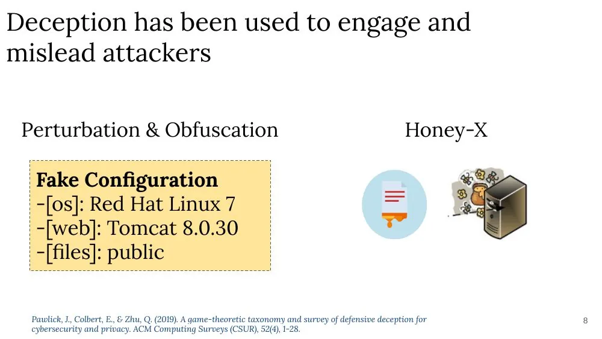</td><td width="44"><a href="#slide-9">→</a></td></tr></table>

Deception has been used to engage and mislead the attackers. One major type of deception is to manipulate the network’s appearance so that the attacker can’t tell the true configuration of the network. Another major type is to deploy honey-files, or honey-pots, to mislead the attacker from valuable assets.

Given a secret s, a user releases a perturbed observable o to an untrusted actor according to the channel probability σL (o | s). The adversary uses inference σF (ˆ s | o) to obtain estimate ˆ s. Perturbation limits the private information that the adversary learns about the user.

### Slide 9

<table><tr><td width="44"><a href="#slide-8">←</a></td><td>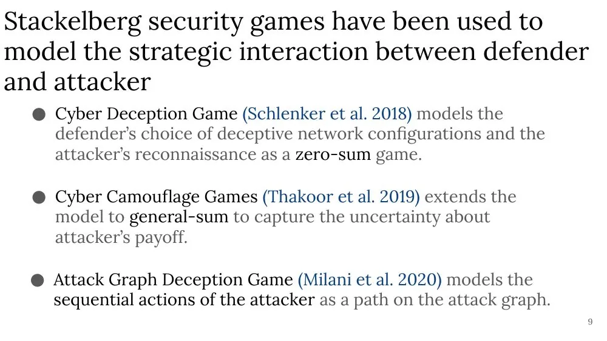</td><td width="44"><a href="#slide-10">→</a></td></tr></table>

Stackelberg Security Games have been used to model the strategic interaction between the defender and the attacker.

The cyber deception game, proposed by Schlenker in 2018, models the defender’s choice of deceptive network configurations and the attacker’s reconnaissance as a zero-sum game.

The Cyber Camouflage Games  proposed by Thakoor extended the model to general sum to capture the uncertainty about the attacker’s payoff.

And the attack graph deception game proposed by Milani modeled the sequential actions of the attacker as a path on the attack graph.

### Slide 10

<table><tr><td width="44"><a href="#slide-9">←</a></td><td>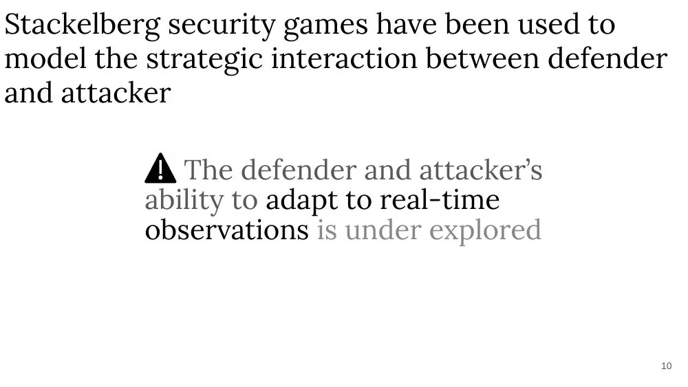</td><td width="44"><a href="#slide-11">→</a></td></tr></table>

However, no prior work considered the defender and attacker’s ability to adapt to their real-time observations.

### Slide 11

<table><tr><td width="44"><a href="#slide-10">←</a></td><td>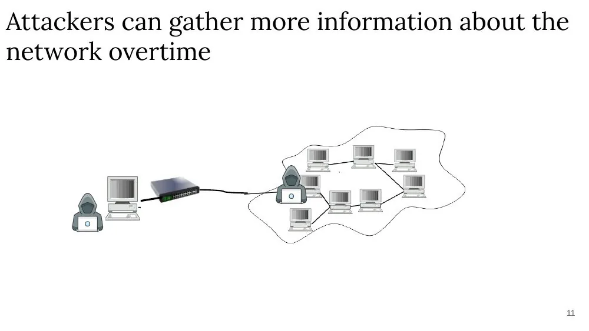</td><td width="44"><a href="#slide-12">→</a></td></tr></table>

The attackers can gather more information about the network overtime. For example, at the beginning of an attack, the attacker is only aware of the entry point to the network, while after gaining access to the first host in the network, the attacker can now collect extra information about all the neighboring machines as well.

### Slide 12

<table><tr><td width="44"><a href="#slide-11">←</a></td><td>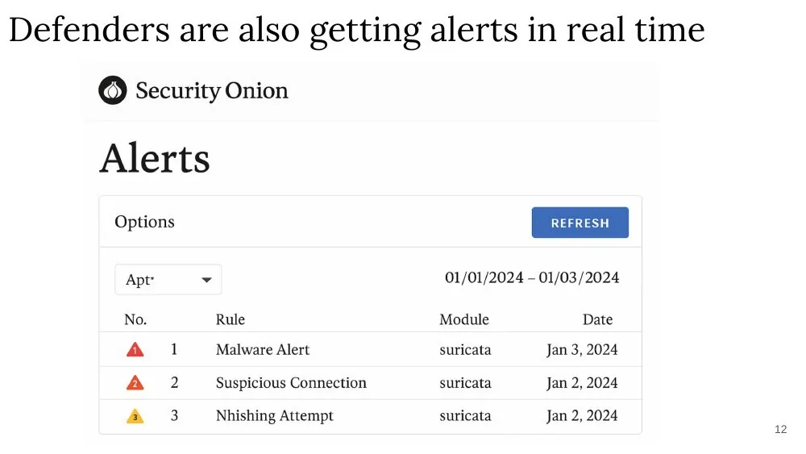</td><td width="44"><a href="#slide-13">→</a></td></tr></table>

The defenders can also get alerts about suspicious activity in the network through network package capture, file analysis logs, and many other tools that provide network and host visibility in real time.

### Slide 13

<table><tr><td width="44"><a href="#slide-12">←</a></td><td>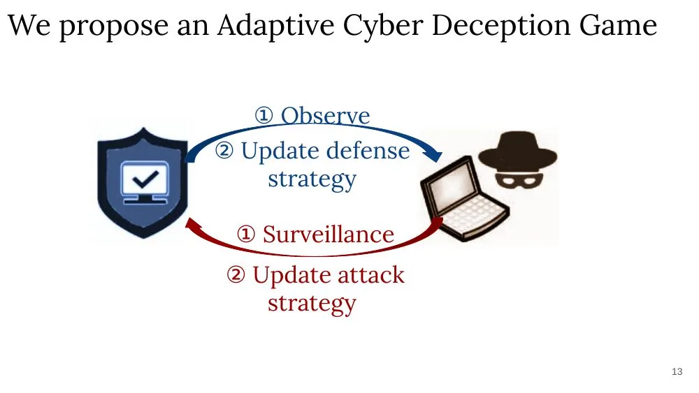</td><td width="44"><a href="#slide-14">→</a></td></tr></table>

We propose an Adaptive Cyber Deception Game, which is a two-player Markov game model that accounts for the sequential moves between the attacker and the defender.

At each turn, the defender first observes the network, the update its defense strategy. The attacker then conduct service to gather information about the defense strategy, and then update its attack strategy accordingly.

### Slide 14

<table><tr><td width="44"><a href="#slide-13">←</a></td><td>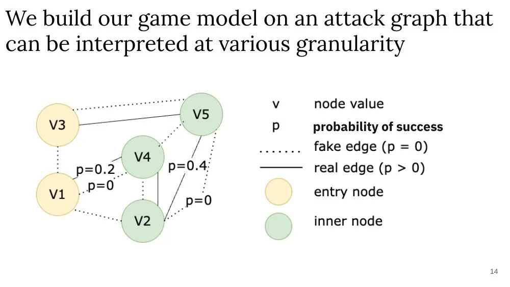</td><td width="44"><a href="#slide-15">→</a></td></tr></table>

We build our game model on an attack graph that can be interpreted at various granularity. For example, each node can either represent an attack status, or a host in the network. Each edge either represent an attack vector to advance the attacker’s status, or the connectivity among the hosts. Each node is associated with a value. Each edge is associated with a probability to successfully go through that edge. The probability to successfully go through a fake edge is 0.

### Slide 15

<table><tr><td width="44"><a href="#slide-14">←</a></td><td>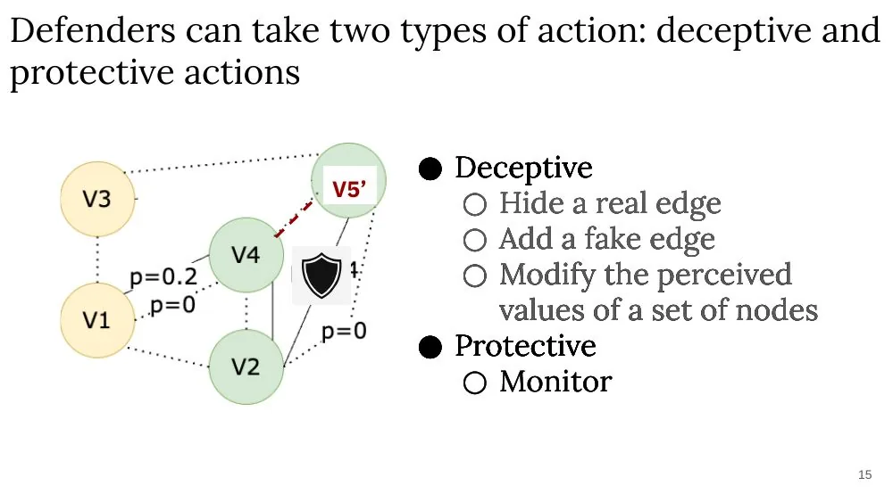</td><td width="44"><a href="#slide-16">→</a></td></tr></table>

The defenders can take two types of actions on the attack graph, deceptive and protective. Deceptive actions include hiding a real edge, adding a fake edge, or modify the perceived value of a set of node.

Protective action include the Monitoring of an edge, which can allow the defender to eradicate the attacker once it attempts to go through that edge.

### Slide 16

<table><tr><td width="44"><a href="#slide-15">←</a></td><td>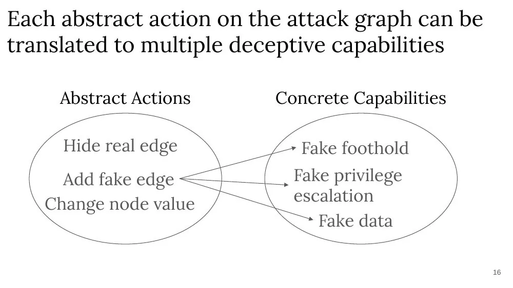</td><td width="44"><a href="#slide-17">→</a></td></tr></table>

Each abstract action on the attack graph can be translated to multiple deceptive capabilities. For example, the adding fake edge action can be implemented as adding a fake vulnerability to give the attacker the delusion of access to a host, or to make the attacker believe it successfully gained root access to a host, or to place honey file so that the attacker won’t go after the real valuable asset.

### Slide 17

<table><tr><td width="44"><a href="#slide-16">←</a></td><td>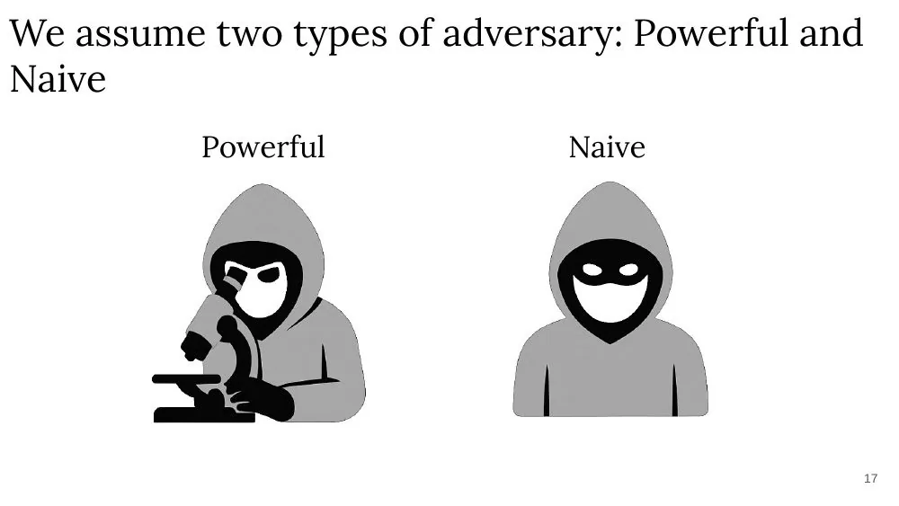</td><td width="44"><a href="#slide-18">→</a></td></tr></table>

We assume two types of adversary: powerful and naive. The powerful attacker can see through the deceptions. The naive attacker takes the presented information as truth.

### Slide 18

<table><tr><td width="44"><a href="#slide-17">←</a></td><td>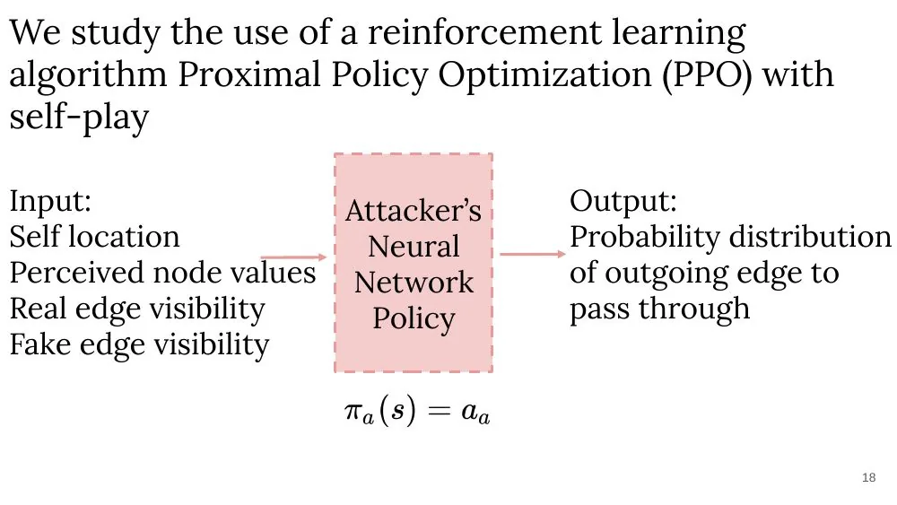</td><td width="44"><a href="#slide-19">→</a></td></tr></table>

We studied the use of a reinforcement learning algorithm, proximal policy optimization, with self-play.

The attacker and the defender each maintains a policy network, which takes their current observation of the network as input and outputs a probability distribution over possible actions.

The attacker’s observation include its current location, the value of nodes, and the real and fake edges between the nodes. The action is to choose an outgoing edge to pass through

### Slide 19

<table><tr><td width="44"><a href="#slide-18">←</a></td><td>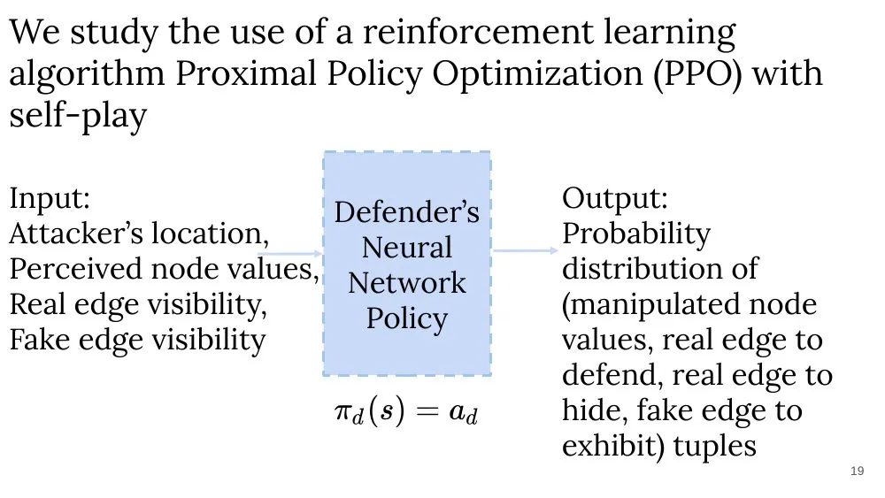</td><td width="44"><a href="#slide-20">→</a></td></tr></table>

The defender can see the same information as well, and they are allowed to choose a tuple of defense actions simultaneously.

### Slide 20

<table><tr><td width="44"><a href="#slide-19">←</a></td><td>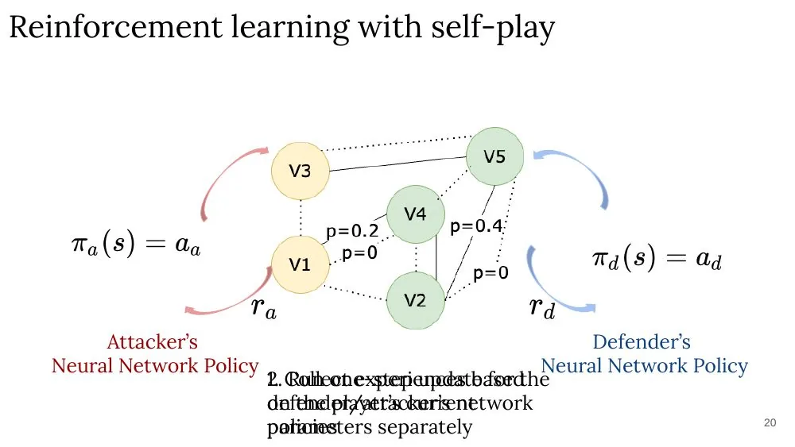</td><td width="44"><a href="#slide-21">→</a></td></tr></table>

Concretely, in each training step, we collect experiences based on the players' current policies and then run the one-step update for the defender's and attacker's network parameters using PPO separately.

the attacker’s observation is encoded with Long Short-Term Memory (LSTM) network or the attacker to observe conflicting node values and different visible edges in the history

### Slide 21

<table><tr><td width="44"><a href="#slide-20">←</a></td><td>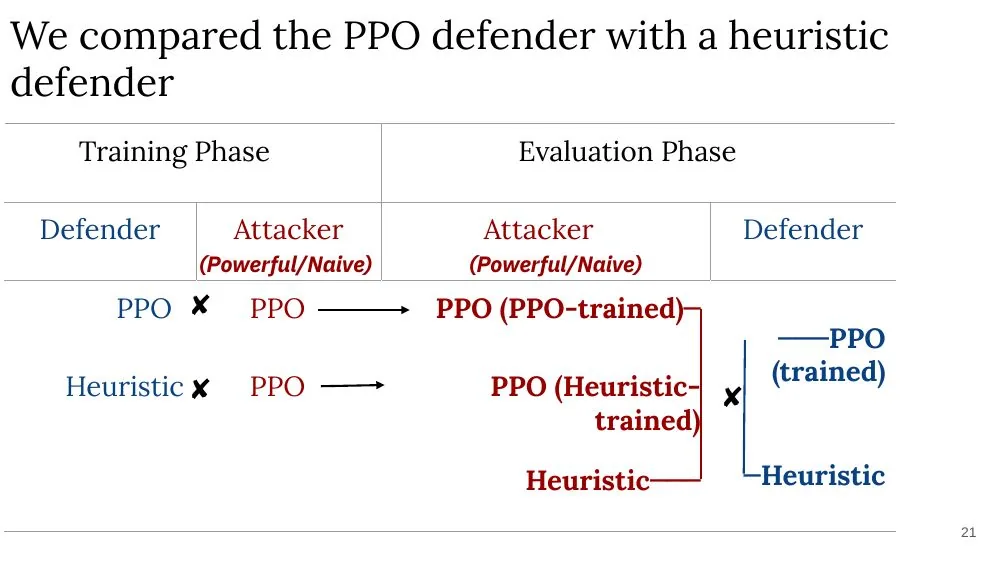</td><td width="44"><a href="#slide-22">→</a></td></tr></table>

To gauge the potential of using RL for autonomous defense, we compared the PPO defender with an expert designed heuristic defender. We tested each defender against three types of attackers, including PPO attackers trained in the self-play, PPO attackers trained against the Heuristic defender, and a heuristic attacker. Within each type, we used both the powerful attacker and the naive attacker.

The heuristic defender will first try to change the perceived value of nodes to have the highest-valued node that is non-differentiable from others. If the budget is not exhausted after masking, the defender will then randomly hide a real edge, add a fake edge, or defend a real edge in the following steps.

The first 3 of them are naive, the last 3 of them are powerful. Among the naive attackers, we have a heuristic attacker, a PPO-based attacker trained against the heuristic defender, and a ppo-based attacker trained against a PPO defender.

Same for the powerful category of attackers.

The heuristic attacker always moves to the observable node with the highest value.

what are the attacker policies? mention them briefly and prepare backup slides

The attackers we use are 1) the heuristic attacker; 2)  the PPO attacker trained against the heuristic defender; 3) the PPO attacker trained against a PPO defender in the PPO self-play.

### Slide 22

<table><tr><td width="44"><a href="#slide-21">←</a></td><td>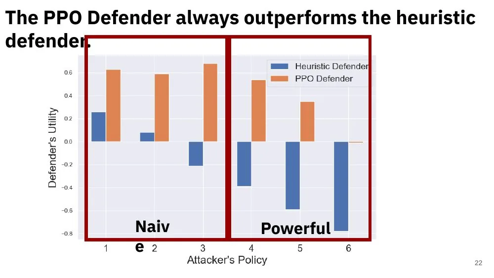</td><td width="44"><a href="#slide-23">→</a></td></tr></table>

We found that the PPO defender always outperforms the heuristic defender, against Naive attackers, and powerful attackers.

### Slide 23

<table><tr><td width="44"><a href="#slide-22">←</a></td><td>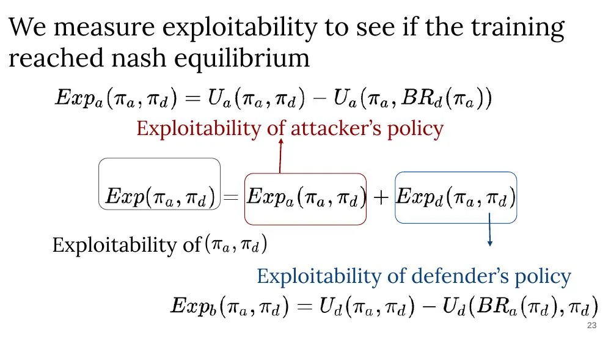</td><td width="44"><a href="#slide-24">→</a></td></tr></table>

To see if our agents learned stable strategies, and are already doing the best they can, given what the other is doing, we measure the exploitability of each pair of the policies.

The exploitability of a pair of policy is defined as the sum of the exploitability of the attacker’s policy, and the exploitability of the defender’s policy.

The attacker’s exploitability is calculated by the gap between the actual utility, and the counterfactual utility when the defender adopts the best response. Same thing applies for the defender.

So if the total exploitability is close to zero, it means neither side can gain much by changing their strategy — so the training likely reached equilibrium.

### Slide 24

<table><tr><td width="44"><a href="#slide-23">←</a></td><td>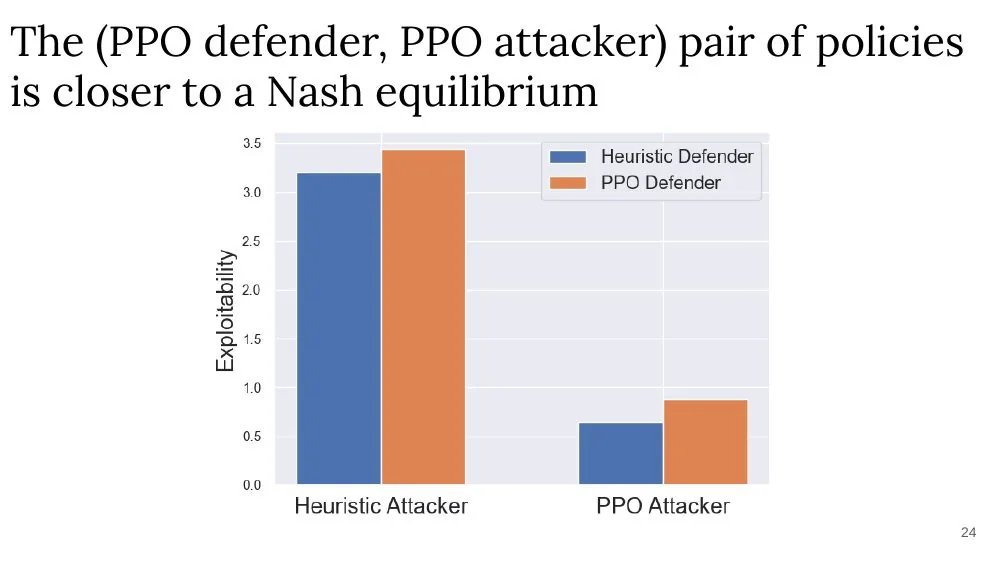</td><td width="44"><a href="#slide-25">→</a></td></tr></table>

Results showed that the pair of PPO-based attacker-defender policies is closer to a Nash equilibrium.

### Slide 25

<table><tr><td width="44"><a href="#slide-24">←</a></td><td>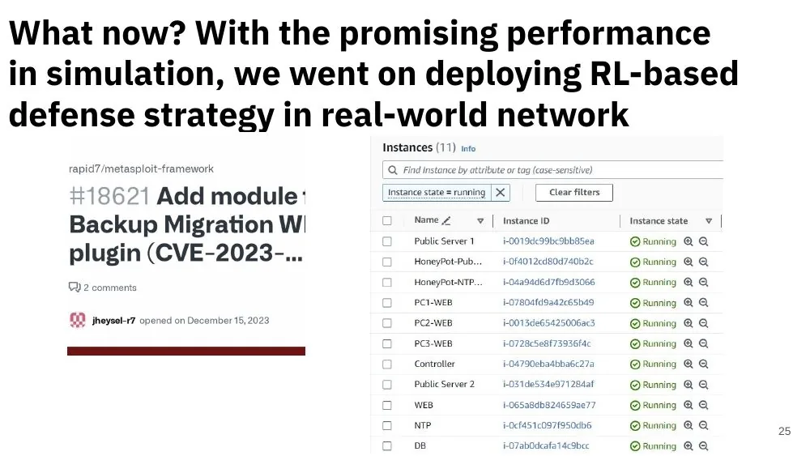</td><td width="44"><a href="#slide-26">→</a></td></tr></table>

With the promising performance in simulation, we went on deploying RL-based defense strategy in a realistic network on AWS.  The network topology resembles a typical enterprise network with public facing subnets, internal subnets, and core operation subnet. The virtual machines in the network each have some recently disclosed vulnerabilities injected through obsolete softwares.

Simplifications and Assumptions: Simulations typically involve simplifications and assumptions that do not hold in reality, such as perfect sensor accuracy or idealized physics.

Adapting to Real World: Adapting models trained in simulations to the real world can be complex, requiring techniques like transfer learning, domain adaptation, or fine-tuning with real-world data.

Sample Efficiency: Gathering real-world data for adaptation can be costly and time-consuming, and models must efficiently leverage limited real-world samples.

Simulated Scenarios Coverage: Ensuring that the simulated scenarios adequately cover the range of possible real-world conditions is challenging but essential for effective transfer.

### Slide 26

<table><tr><td width="44"><a href="#slide-25">←</a></td><td>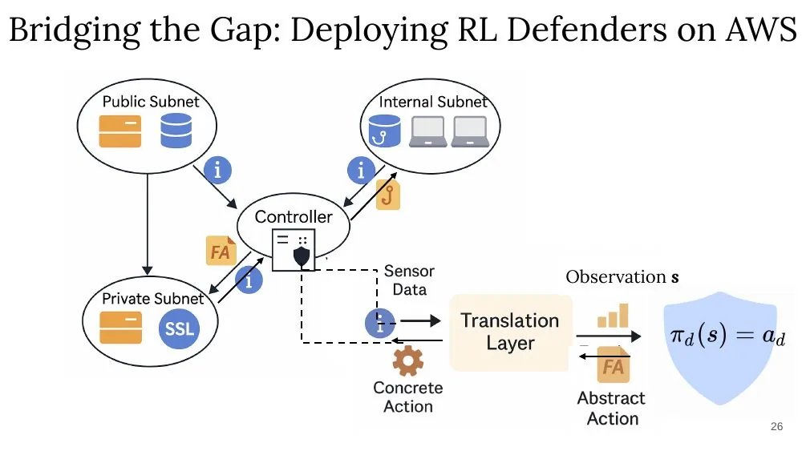</td><td width="44"><a href="#slide-27">→</a></td></tr></table>

We built a command and control architecture to collect sensor data from the network and deploys deception tactics like fake files and honeypots.

To make this tractable for reinforcement learning, we use a translation layer that turns raw logs and commands into vectorized representations.

The RL Defender Agent operates purely in abstract space — it receives a vectorized view of the world, selects an abstract deception strategy, and the system translates that back to concrete actions.

But from initial experiments, we found that the RL agents trained in simulation environments can be quite brittle, which is not entirely surprising because of the discrepancy between the simulator and the real network.

In reality, it is also unfeasible to build a high fidelity simulator for every network that we want to defend.

### Slide 27

<table><tr><td width="44"><a href="#slide-26">←</a></td><td>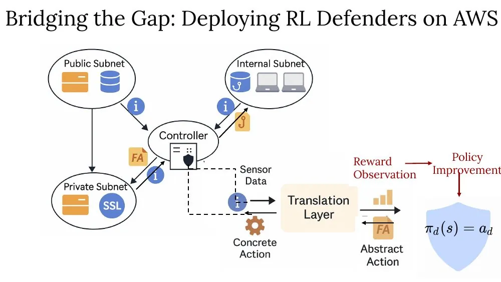</td><td width="44"><a href="#slide-28">→</a></td></tr></table>

To bypass this problem,  we decide to train the RL agent in a real network directly. That is, instead of querying the policy network for next actions, we also update the policy with new experience.

The new challenge then, is that enacting real attack and defense actions in a real network is very time consuming.  Previously we can collect thousands of samples in a minute, but now it can take a whole minute to even enact an action in the real network.

### Slide 28

<table><tr><td width="44"><a href="#slide-27">←</a></td><td>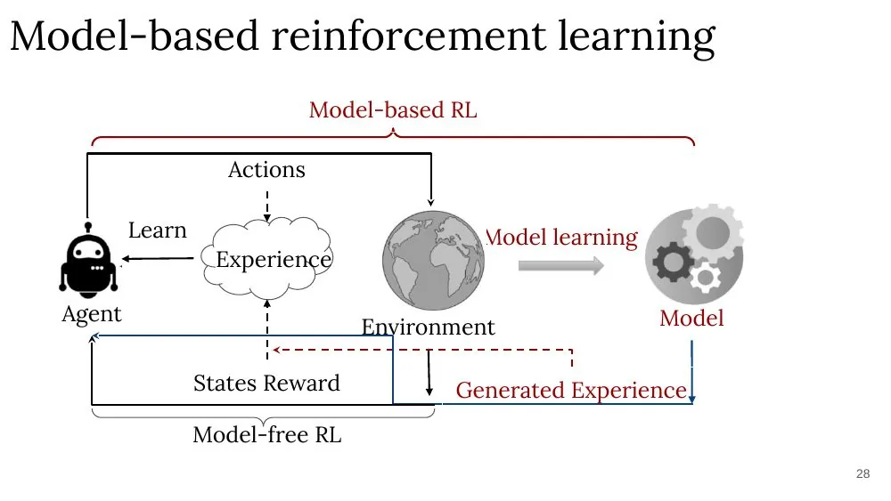</td><td width="44"><a href="#slide-29">→</a></td></tr></table>

So we are now trying to use sample-efficient reinforcement learning algorithms, like model-based reinforcement learning.

The first straightforward choice is Model-Based Policy Optimization (MBPO), as we have been using PPO. MBPO enhances sample efficiency by learning a  world model of the network environment, and the agent can collect samples through interaction with the learned model in addition to interacting with the real network.

In our current cybersecurity setup, the observation space is relatively minimal—essentially a binary indicator from each host's file watcher signaling asset access.​

But to be actually useful in a real network, we have extend our network's telemetry infrastructure, incorporating more detailed and potentially multi-modal data sources. This expansion necessitates us to explore advanced reinforcement learning methods like Dreamer, which operates by learning and planning within a latent space.​

### Slide 29

<table><tr><td width="44"><a href="#slide-28">←</a></td><td>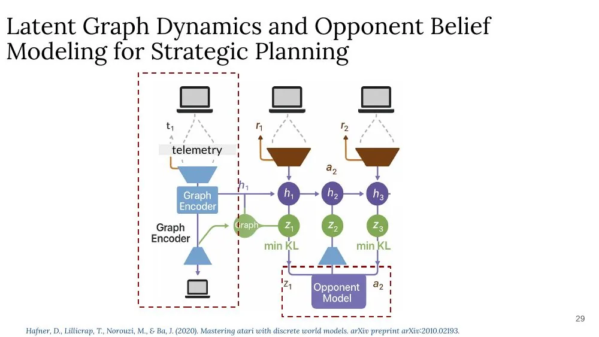</td><td width="44"><a href="#slide-30">→</a></td></tr></table>

The key idea is to construct a compact representation of the environment, and to simulate future trajectories internally and optimize the policy in the latent space. This approach has been proved particularly beneficial in environments with high-dimensional observations, such as visual pixel inputs.​

However, the alerts or events in network telemetry can be quite different from visual pixels. They don’t have the spatial and temporal continuity as visual inputs, which can make it challenging for the model to interpolate and generalize.

To solve these problems, we are extending this architecture in two key ways to support strategic cyber defense.

First, we replace the standard latent vector with a graph of latent variables — one per host or key entity in the network.

This gives the world model an inductive bias: it can propagate attacker influence across hosts using message passing, just like attacks spread laterally in a real network.

Defensive actions like isolating a host can modify edge structure or node features, while attacker actions correspond to predicted changes in the graph — for example, compromise propagation.

Second, we introduce an explicit opponent model.

So instead of folding all attacker behavior into latent uncertainty, we train a separate module to model the attacker’s policy. This also serves as a form of belief modeling in partially observable games — helping the defender agent infer where the attacker might be and what they’re likely to do next.

### Slide 30

<table><tr><td width="44"><a href="#slide-29">←</a></td><td>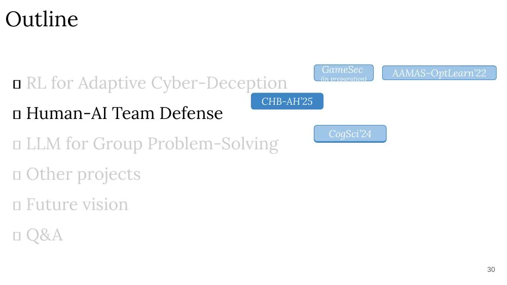</td><td width="44"><a href="#slide-31">→</a></td></tr></table>

So far, I’ve shown how reinforcement learning can be used to train adaptive defenders capable of outmaneuvering both naive and sophisticated attackers, and how we’ve even begun deploying these agents in real-world network environments.

While autonomous defenses are promising, in high-stakes domains like cybersecurity, where actions can disrupt services or violate policies, we cannot afford to remove humans from the decision loop.

So it is important to find a way to make the RL agent work with humans as a team

### Slide 31

<table><tr><td width="44"><a href="#slide-30">←</a></td><td>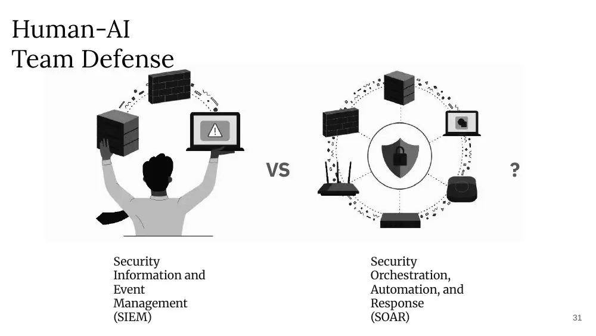</td><td width="44"><a href="#slide-32">→</a></td></tr></table>

Many questions need to be answered to make human-AI team defense possible. For example, how much autonomy do we want to grant to the AI partner? Do we want to use them solely for information management purposes, or do we want them to autonomously response to incidents and take risky actions?

To defend the evolving network against diverse adversaries, many AI tools have been developed in the recent years, there are SIEM, SOAR

On the defender side, there are human and AI components, it is a challenge to have these two parts work seamlessly together.

Cybersecurity professionals might be hesitant to rely on AI for making autonomous defensive actions, such as isolating parts of a network or deleting suspected malicious files, fearing unintended consequences.

### Slide 32

<table><tr><td width="44"><a href="#slide-31">←</a></td><td>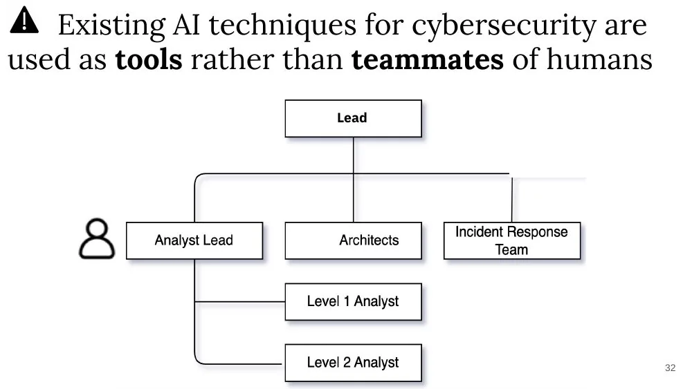</td><td width="44"><a href="#slide-33">→</a></td></tr></table>

Existing AI techniques for cybersecurity are used as tools rather than equal teammates of human analysts. This diagram demonstrates the structure of a typical cyber protection team. Ideally, we would like to offload some work of human analyst to an autonomous agent.

### Slide 33

<table><tr><td width="44"><a href="#slide-32">←</a></td><td>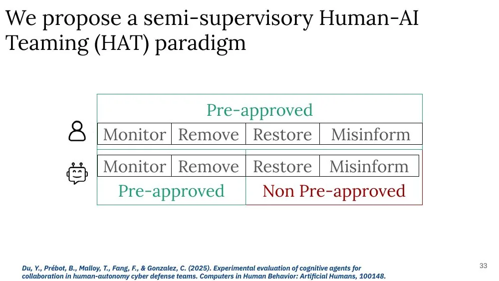</td><td width="44"><a href="#slide-34">→</a></td></tr></table>

We propose a semi-supervisory Human-AI teaming paradigm as one potential way for human and AI to work together as a team. In real world, human analysts have a set of pre-approved actions they can take for incident response, without further approval of the authority. We consider the AI partner as a team member with a smaller set of pre-approved actions, which the agent can take on its own. While for the actions that are costly or risky, the agent need to get approval from its human supervisor.

Monitor – Passive action to view network traffic.

Remove – disconnect the service from all users.

Restore – Turn service off completely are reset.

Misinform – Add a honeypot distractor on a service.

### Slide 34

<table><tr><td width="44"><a href="#slide-33">←</a></td><td>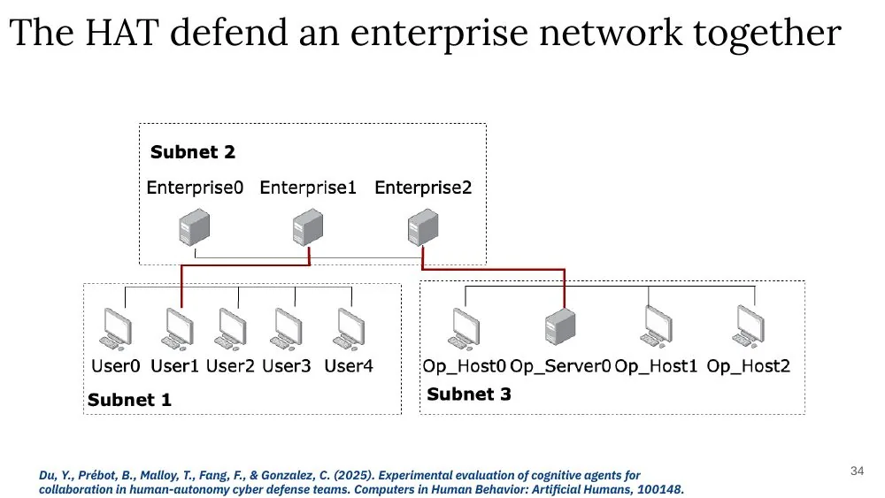</td><td width="44"><a href="#slide-35">→</a></td></tr></table>

The human-agent team is assigned to defend an enterprise network together. Here is the topology of the network. The task for the attacker is to make its way through the network from the subnet 1 to subnet 3 and impact the service on Operational Server 0.

### Slide 35

<table><tr><td width="44"><a href="#slide-34">←</a></td><td>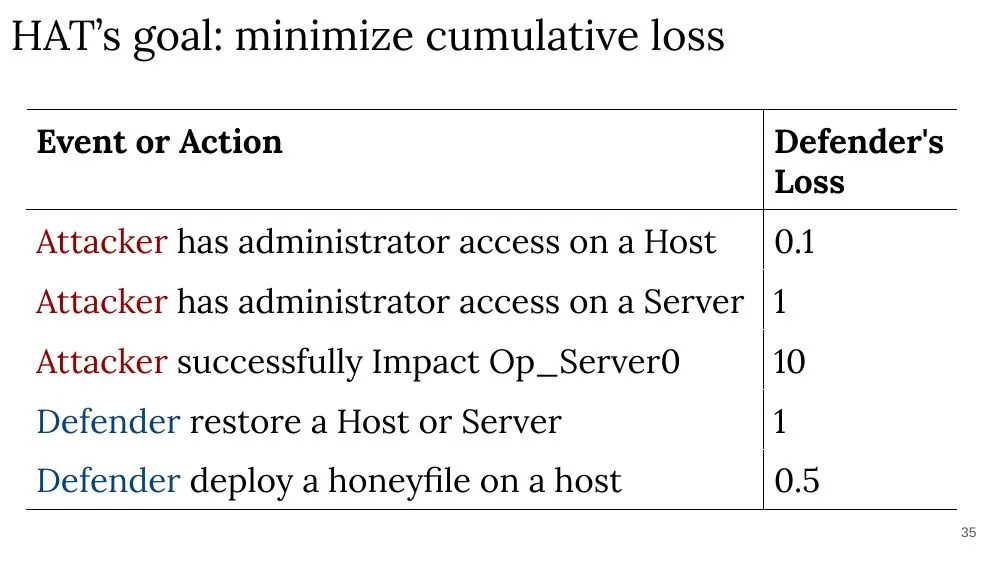</td><td width="44"><a href="#slide-36">→</a></td></tr></table>

The defender team’s goal is to stop the attacker from getting to the operational server, and minimize cumulative loss.

In addition to the loss induced by attacker’s access to the network, the defender is also punished for using the costly action: restoring a host or server, or deploy honeyfile on a host.

### Slide 36

<table><tr><td width="44"><a href="#slide-35">←</a></td><td>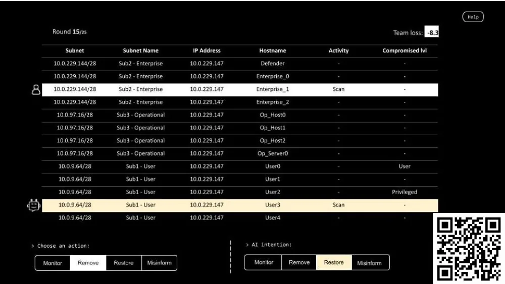</td><td width="44"><a href="#slide-37">→</a></td></tr></table>

This is the interface for the human defender in the team, which presents them with updated network status and allow them to choose defense action and target. The agent is provided with the same information and will choose an action for itself.

You can scan the QR code to play a simpler version of this game.

### Slide 37

<table><tr><td width="44"><a href="#slide-36">←</a></td><td>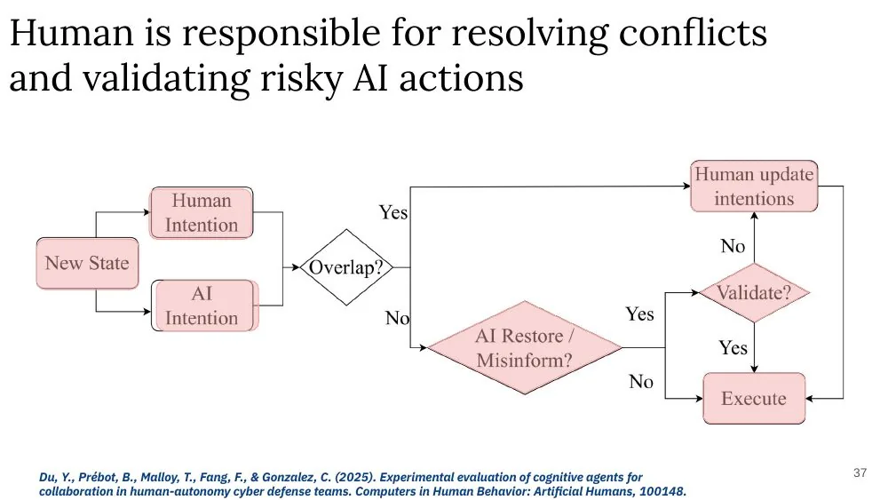</td><td width="44"><a href="#slide-38">→</a></td></tr></table>

More specifically, at each round, both the human participant and the AI agent are presented with the new network status, and each of them will present their intended defense action. The human is responsible to resolve conflicts when the human and agent are trying to take action on the same target and getting in each other’s way.

The human is also responsible for validating the agent’s decision if it choose to take one of the risky or costly actions. If the human decides it’s not the best to do so, they are allowed to modify the agent’s decision to something they see fit. They can also change their own course of action after seeing what the agent wants to do.

Monitor – Passive action to view network traffic.

Remove – disconnect the service from all users.

Restore – Turn service off completely are reset.

Misinform – Add a honeypot distractor on a service.

### Slide 38

<table><tr><td width="44"><a href="#slide-37">←</a></td><td>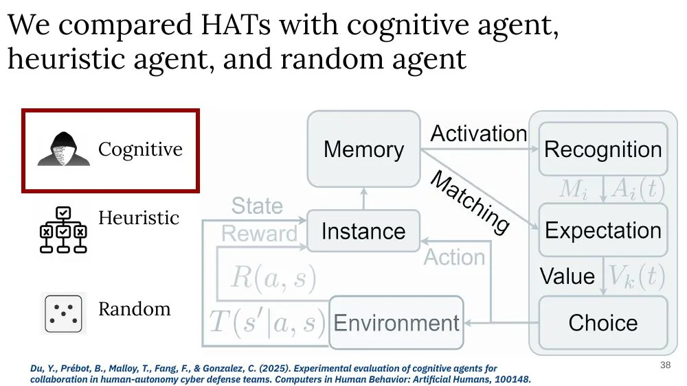</td><td width="44"><a href="#slide-39">→</a></td></tr></table>

To find out what makes a good autonomous agent teammate, we compared teams with humans and three types of agents, including a cognitive agent, which resembles human decision making process. It is a learning agent and can adapt to the environment & its teammate.

### Slide 39

<table><tr><td width="44"><a href="#slide-38">←</a></td><td>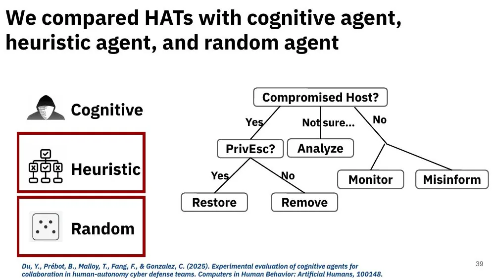</td><td width="44"><a href="#slide-40">→</a></td></tr></table>

The second type is a heuristic agent, that take actions according to a fixed set of rules. This agent is not adaptive it is almost equally as competent as the cognitive agent.

And finally the Random agent, that makes decisions completely randomly. It is neither adaptive, nor competent.

### Slide 40

<table><tr><td width="44"><a href="#slide-39">←</a></td><td>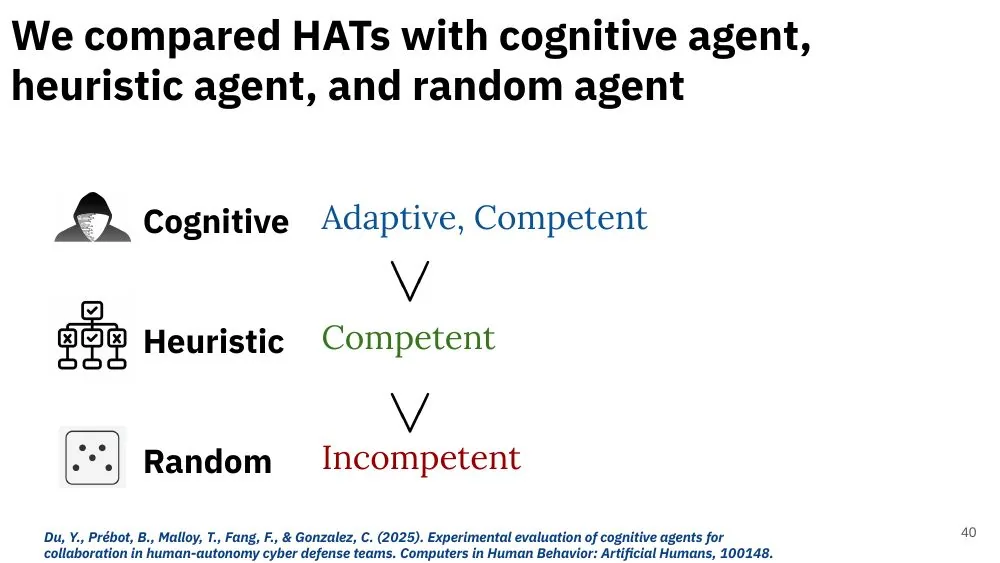</td><td width="44"><a href="#slide-41">→</a></td></tr></table>

Thus, we expect the cognitive agent to be the best AI partner, followed by the heuristic partner, followed by the random partner

### Slide 41

<table><tr><td width="44"><a href="#slide-40">←</a></td><td>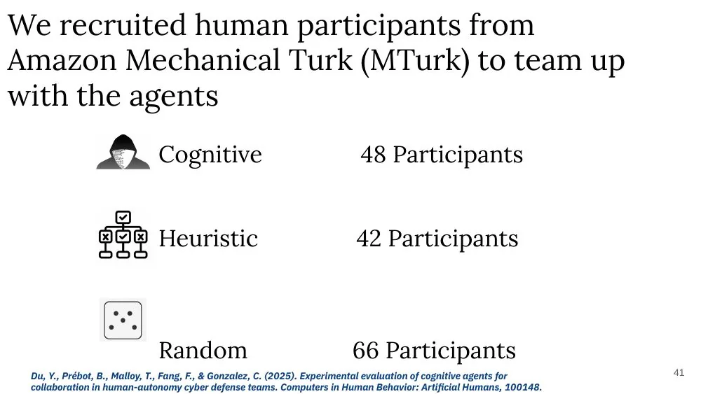</td><td width="44"><a href="#slide-42">→</a></td></tr></table>

We recruited human participants from Amazon MTurk to team up with the agents.

### Slide 42

<table><tr><td width="44"><a href="#slide-41">←</a></td><td>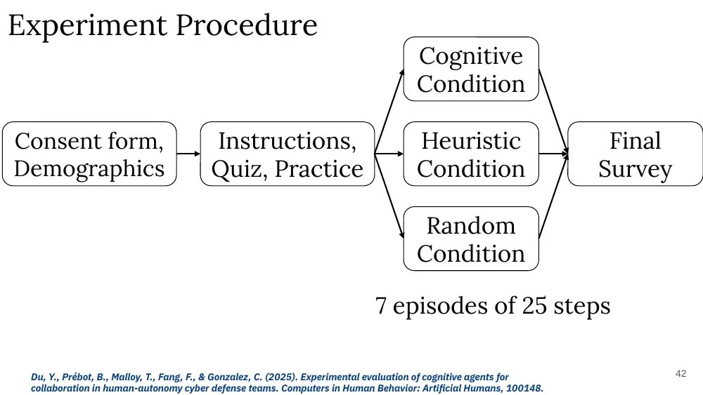</td><td width="44"><a href="#slide-43">→</a></td></tr></table>

The experiment starts with consent forms and demographic questions. The participants are then presented with instructions about the game, a quiz to test their understanding of the instructions, and a practice round for the to experience the potential situations they would encounter in the game. The participants are then assigned to play with one type of autonomous team mate, for 7 episodes, each with 25 steps. Afterwards, the participants takes a survey in which they give a score of their agent partner, and answer an open-ended questionnaire.

### Slide 43

<table><tr><td width="44"><a href="#slide-42">←</a></td><td>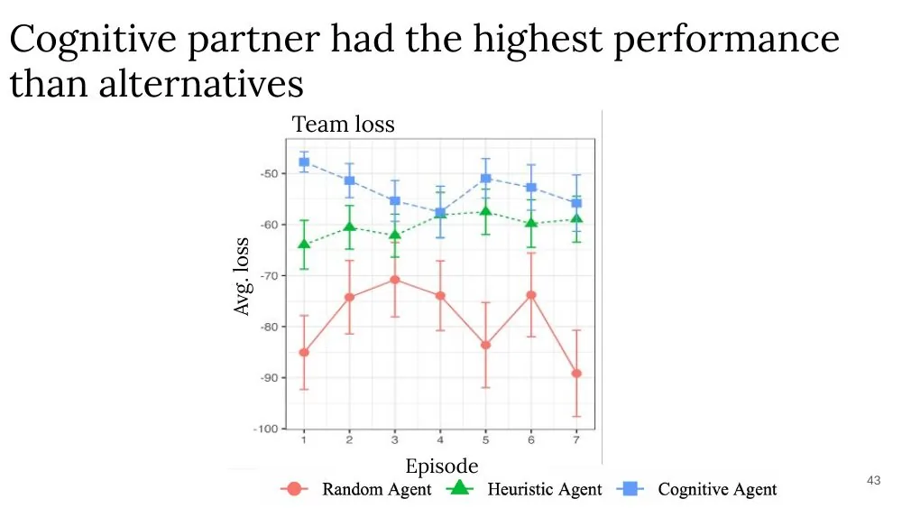</td><td width="44"><a href="#slide-44">→</a></td></tr></table>

The first important finding is that cognitive partner had the highest performance than others. The figure shows the loss of human-AI team across seven episodes of interaction with the attacker. The blue line is the average loss of teams with a cognitive agent. Teams with the other competent agent -- the heuristic agent, is slightest worse, and the teams with random agent got most loss.

### Slide 44

<table><tr><td width="44"><a href="#slide-43">←</a></td><td>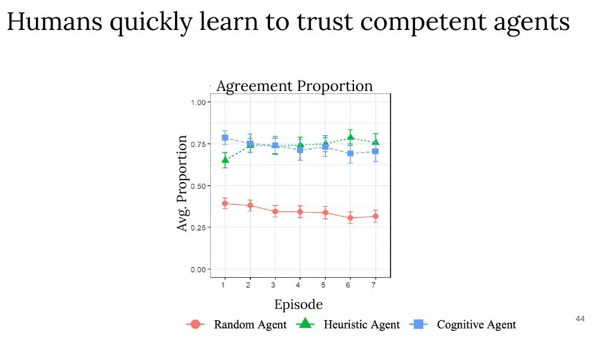</td><td width="44"><a href="#slide-45">→</a></td></tr></table>

To see how much did the agents contributed to the team performance, we need to know if the agents’ actions were executed at all. This plot shows the proportions of agents’ decisions validated by their human partner.

It is interesting to see that the humans quickly learned to trust the competent agents. The proportion of agreement for Cognitive and Heuristic agents are much higher from the first episode.

Another interesting point is that the trend of the cognitive agent is downward and the trend of the heuristic agent is upward. From post-experiment questionnaires, we learned that the adaptivity of cognitive agents makes it unpredictable and difficult to work with. We will investigate this further in future studies.

### Slide 45

<table><tr><td width="44"><a href="#slide-44">←</a></td><td>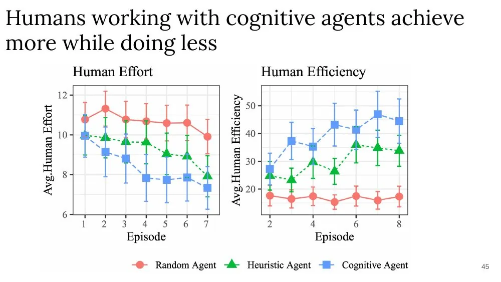</td><td width="44"><a href="#slide-46">→</a></td></tr></table>

As for the humans themselves, we found that the humans make the least effort when they are team with a cognitive agent. By effort we mean the humans actively take actions instead of monitoring the network. But further inspection shows that their actions are actually becoming more effective overtime, as shown in the efficiency panel. Human’s efficiency are increasing overtime when they are paired with Cognitive and Heuristic agent.

### Slide 46

<table><tr><td width="44"><a href="#slide-45">←</a></td><td>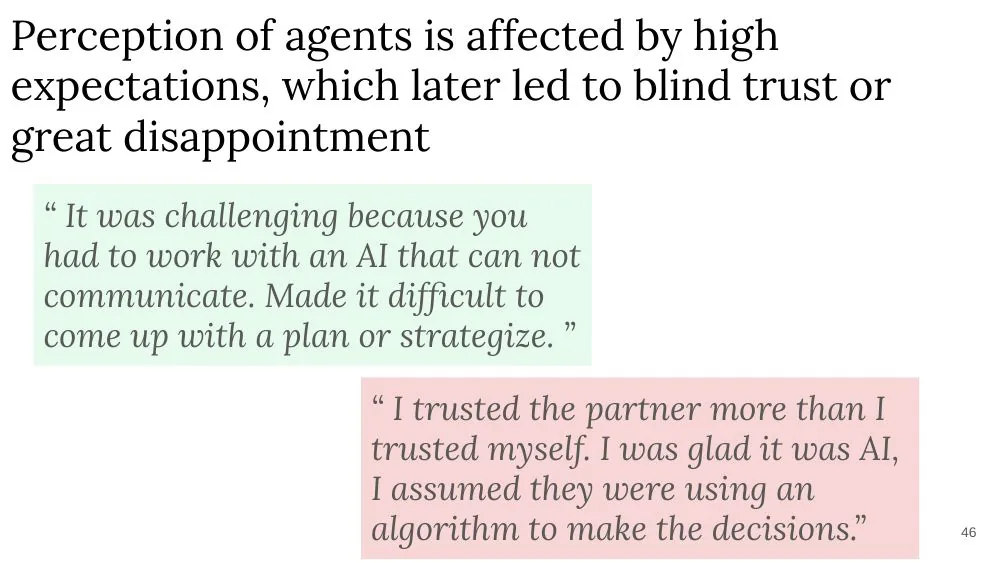</td><td width="44"><a href="#slide-47">→</a></td></tr></table>

To better understand the humans rationale, we asked the participants comment on their agent teammate. It is evident that their perceptions of agents is largely affected by their high expectations for AI, which either led to blind trust or huge disappointment.

For example, a participant who teamed with a heuristic agent is very frustrated because the agent can’t communicate with them. The other participant who teamed with a random agent, however, had a great experience and trusted the partner more than themselves.

So we should not solely rely on likert scales of trustworthiness, and instead, we may want to look at things like effort or efficiency, as a behavioral signal of trust.

### Slide 47

<table><tr><td width="44"><a href="#slide-46">←</a></td><td>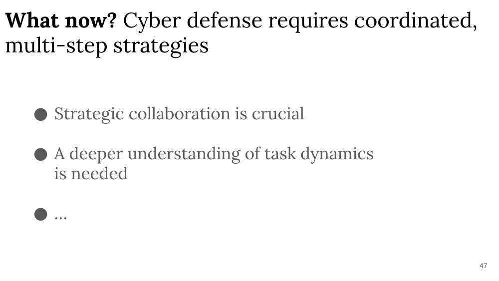</td><td width="44"><a href="#slide-48">→</a></td></tr></table>

As pointed out by one of the participant, effective cyber defense requires coordinated multi-step strategies. Strategic collaboration is crucial, communication is important

Cyber defense requires coordinated, multi-step strategies. A simplistic "one-step-at-a-time" approach to cybersecurity, guided by a supervisory plan, is inadequate for addressing the complexity and unpredictability of real-world scenarios.

Strategic collaboration is crucial. Humans and agents must co-create defense plans, continuously exchange information, and adapt dynamically to shifting adversarial tactics. Effective defense demands more than sequential task execution; it requires creative, joint problem-solving and distributed decision-making between human and AI teammates.

A deeper understanding of task dynamics is needed. As researchers, we need a better grasp of the interdependencies and complexities within cybersecurity tasks. This knowledge will enable us to facilitate organic, flexible collaboration between human and AI agents, ensuring a synergy that supports adaptive defense in complex environments.

### Slide 48

<table><tr><td width="44"><a href="#slide-47">←</a></td><td>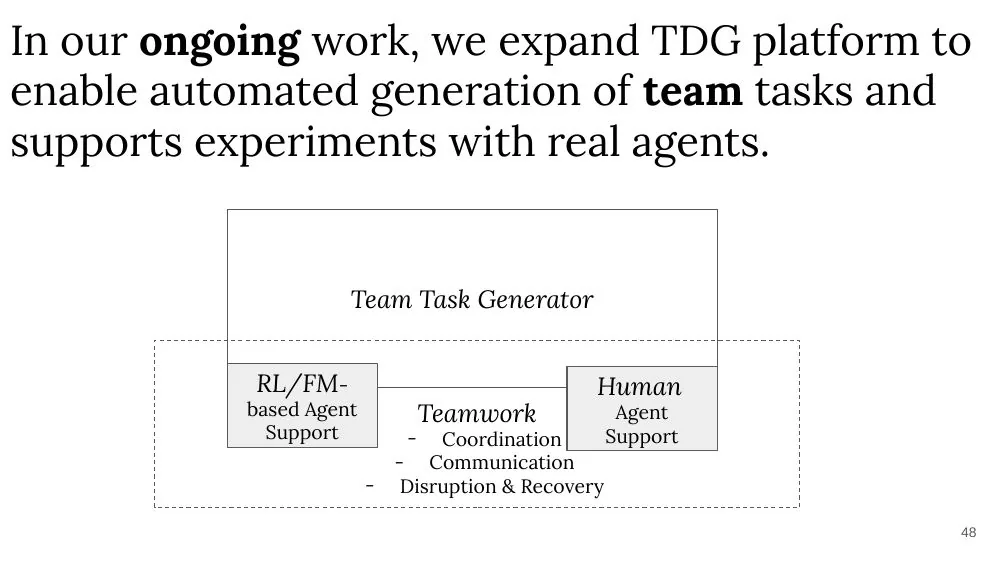</td><td width="44"><a href="#slide-49">→</a></td></tr></table>

In our ongoing work, we are expanding the team defense game platform to support more realistic experiments for human-AI team defense.

To provide more diverse training scenarios, we designed an automatic team task generator to enforce inherent interdependence among the team members.

We use Jax to build the game environment so that experimenters can plug in  the state-of-the art RL based and Foundation model based agents seamlessly.

Finally, to enable the interaction with more than one human team members, and the communication between humans and agents.

### Slide 49

<table><tr><td width="44"><a href="#slide-48">←</a></td><td>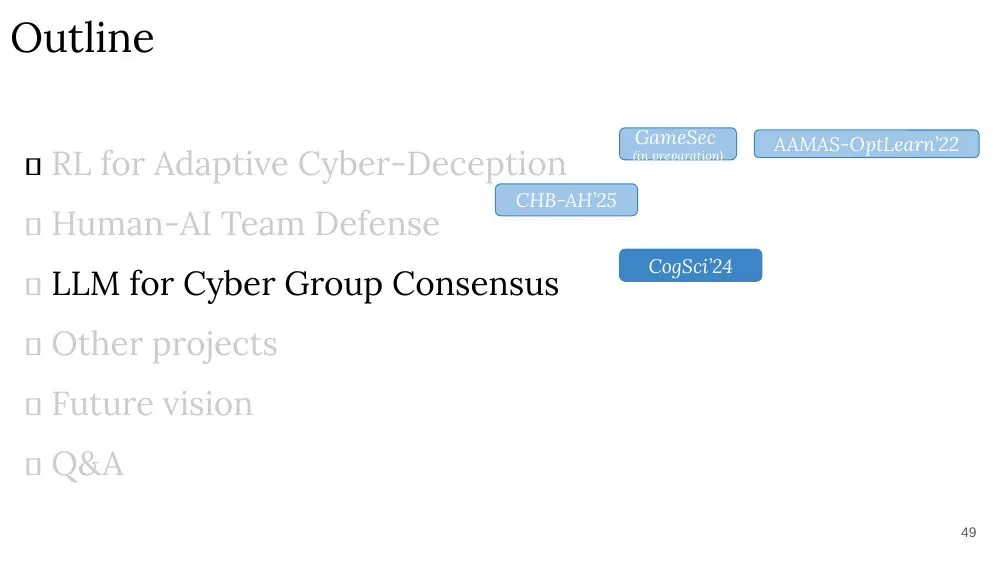</td><td width="44"><a href="#slide-50">→</a></td></tr></table>

We’ve just seen how pairing a human analyst with a competent AI agent can lead to more effective cyber defense. But cybersecurity is rarely a solo task—defense teams must collaborate, pool information, and reach joint decisions under pressure.

So before we design AI agents to join these conversations, we need to first understand how human groups naturally solve problems together—what makes collaboration effective, where breakdowns occur, and how knowledge, opinions, and trust are shared or withheld.

### Slide 50

<table><tr><td width="44"><a href="#slide-49">←</a></td><td>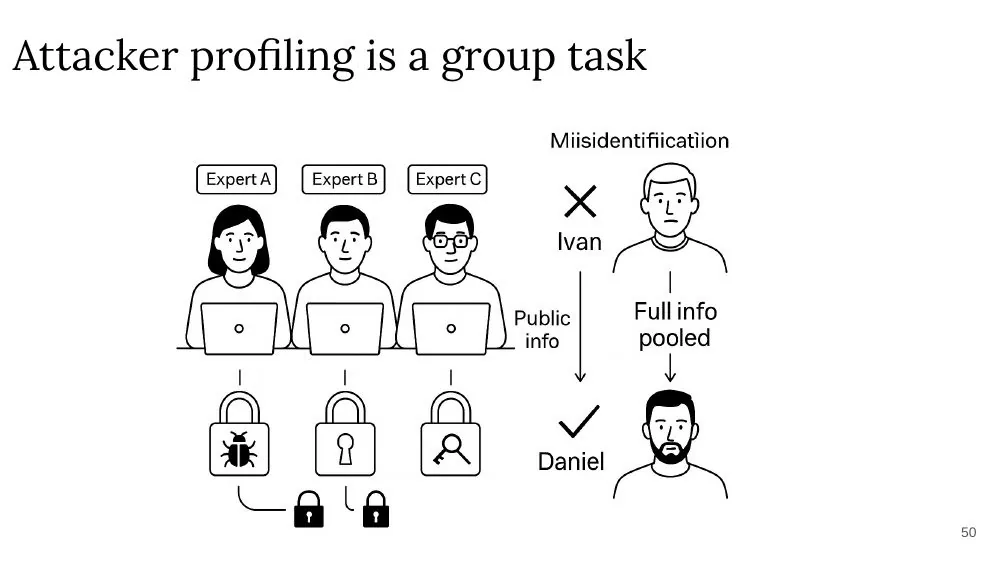</td><td width="44"><a href="#slide-51">→</a></td></tr></table>

One canonical task is attacker profiling—a process that often involves multiple analysts each bringing partial, sometimes ambiguous pieces of information to the table.

Solving this kind of problem isn't just about analyzing data—it's about coordinating perspectives, deciding what information is relevant, and negotiating uncertainty as a team.

If the group fails to piece together key information, they may converge prematurely on the wrong culprit. Only when the right pieces are surfaced and aligned across members can the group correctly identify the actual attacker.

### Slide 51

<table><tr><td width="44"><a href="#slide-50">←</a></td><td>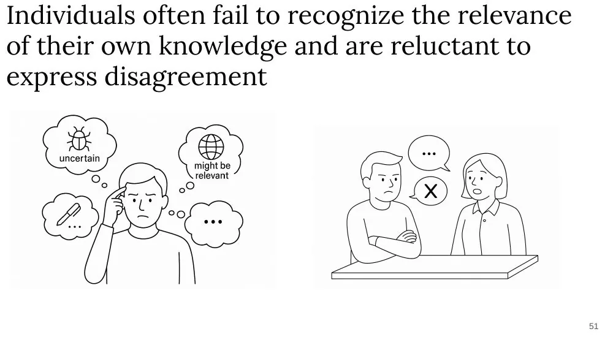</td><td width="44"><a href="#slide-52">→</a></td></tr></table>

But in practice, human groups often struggle to collaborate effectively.

Individuals may fail to recognize how their knowledge connects to the group’s goal—not because the information is unimportant, but because they lack the global context to see its relevance. In complex tasks, people tend to focus on what’s directly in front of them, and miss opportunities to contribute what might be a crucial piece of the puzzle.

Others may withhold disagreement or uncertainty, even when they suspect the group is going down the wrong path. This can happen out of politeness, fear of being wrong, or simply because they assume someone else knows better. And as a result, groups can reach fast but fragile consensus—one that excludes dissenting insights that were never voiced

### Slide 52

<table><tr><td width="44"><a href="#slide-51">←</a></td><td>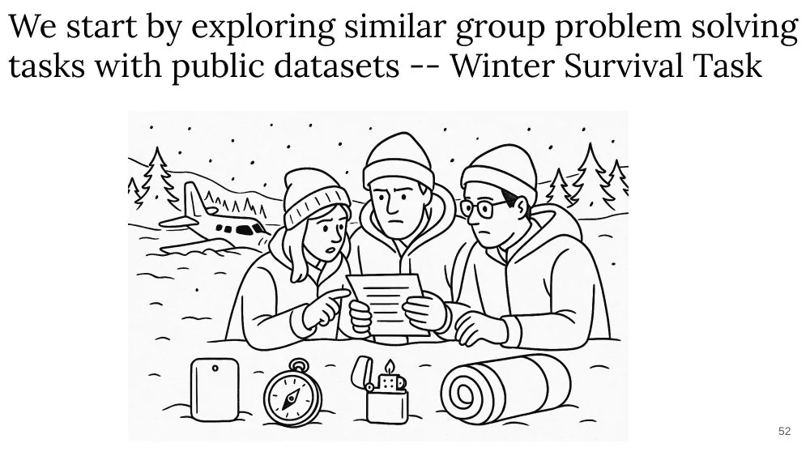</td><td width="44"><a href="#slide-53">→</a></td></tr></table>

To investigate group reasoning in a controlled way, we started with a non-cyber task, since real cybersecurity data is often sensitive and not readily accessible for experimentation.

The Winter Survival Task offers a clean, well-established setting where the stakes are still high. After a plane crash in subzero conditions, a group must rank survival items in order of importance.

Like attacker profiling, this task requires each member to share what they know—and explain why certain items matter. If they fail to identify the most critical items, the group could make a decision that costs them their lives.

### Slide 53

<table><tr><td width="44"><a href="#slide-52">←</a></td><td>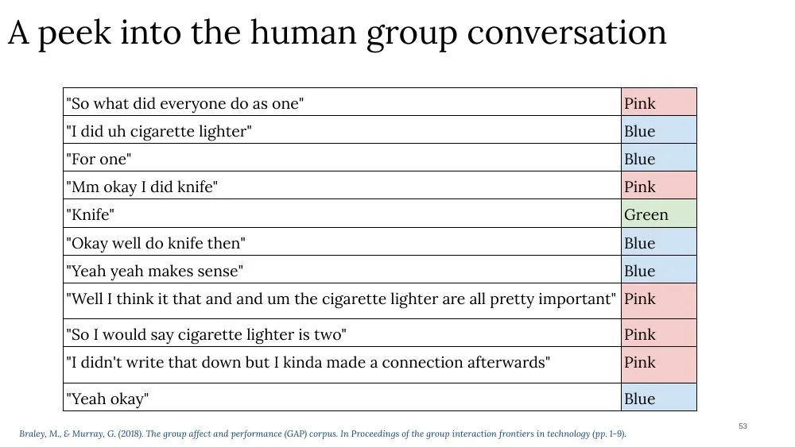</td><td width="44"><a href="#slide-54">→</a></td></tr></table>

Here’s a glimpse into what real human group conversations look like in the Winter Survival Task.

What’s striking in this exchange is the asymmetry in participation. The pink participant takes a strong lead—asserting opinions early and confidently, often steering the group’s direction. The blue participant is actively engaged, echoing others and helping build consensus, but is generally more agreeable. And the green participant barely speaks.

### Slide 54

<table><tr><td width="44"><a href="#slide-53">←</a></td><td>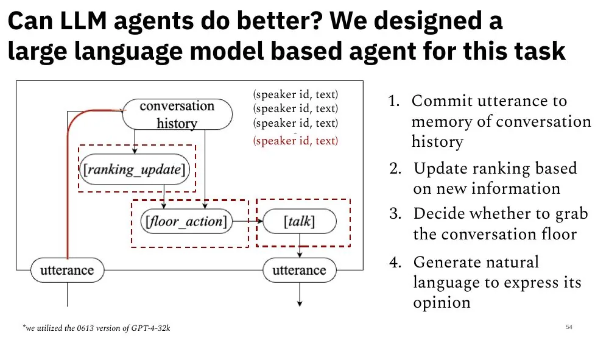</td><td width="44"><a href="#slide-55">→</a></td></tr></table>

Now the question is, can we do better? With large language models?

To explore this, we designed a large language model based agent for this group task.

Each agent in the group observes utterances made by other agents during the conversation and remembers it using a conversation history.

After observing an utterance, the agent first commit it to its memory of the conversation history,

It then update the ranking of the 15 items based on the new information received from that utterance

With the updated ranking, the agent decide whether it has anything to contribute to the group and need to grab the conversation

Finally, if the agent chooses to speak up, it will generate natural language and express its opinion to others

The update of ranking, decision to grab the floor, and generation of natural language are all achieved by prompts to GPT-4

### Slide 55

<table><tr><td width="44"><a href="#slide-54">←</a></td><td>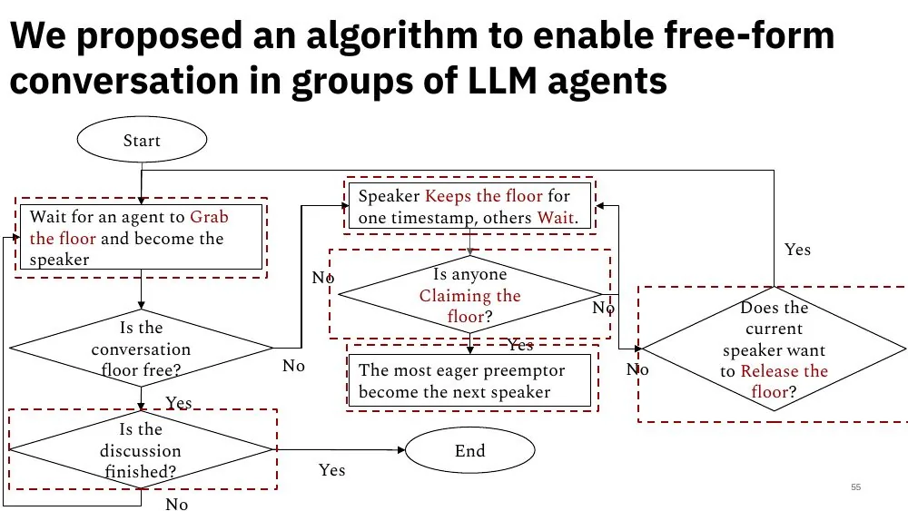</td><td width="44"><a href="#slide-56">→</a></td></tr></table>

The language agents engage in free form conversation following this algorithm. Instead of imposing rules and orders for the conversational agents to talk, we let the agents decide for themselves whether to speak up and what to say.

The speaker who utters the first sentence initiates the conversation and grabs possession of the ”conversation floor.”

The remaining agents in the group observe what is being said by the speaking agent.

The speaker keeps the floor until another agent tries to claim the floor.

If more than one agent attempts to claim the floor, one of them is randomly chosen as the next speaker.

If no one attempts to claim the floor, the speaker keeps talking until the agent determines to release the floor to others.

When the conversation floor is free, and a consensus has not yet been reached, the agents are repeatedly prompted to reassess the situation and decide whether to speak up. If none of the agents recognizes the obligation to speak up and continue the discussion, the conversation is ceased, and the group task ends in failure.

### Slide 56

<table><tr><td width="44"><a href="#slide-55">←</a></td><td>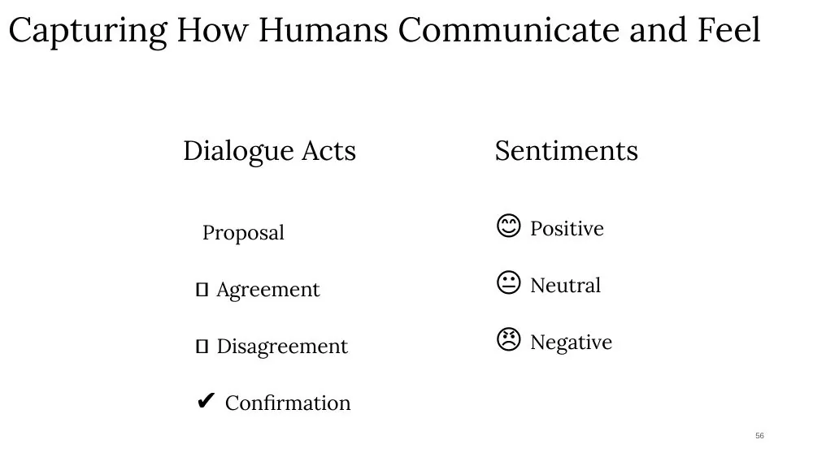</td><td width="44"><a href="#slide-57">→</a></td></tr></table>

To analyze how the participants & agents engage in group discussion, we annotated the dialogue along two key dimensions. On the left, you see the dialogue acts—what type of contribution each utterance represents, whether it’s a new proposal, an agreement, a disagreement, or a confirmation.

On the right, we capture the sentiment behind each message—whether it’s positive, neutral, or negative.

These annotations allow us to analyze not just what the agents are saying, but also how they’re interacting—socially, emotionally, and strategically.

Both are done automatically, with the state-of-the art algorithm on dialogue act classification and sentiment annotation tasks. The models are first fine-tuned on 60% of annotated human corpus, and achieved over 70% agreement with human labeler on the rest human corpus.

### Slide 57

<table><tr><td width="44"><a href="#slide-56">←</a></td><td>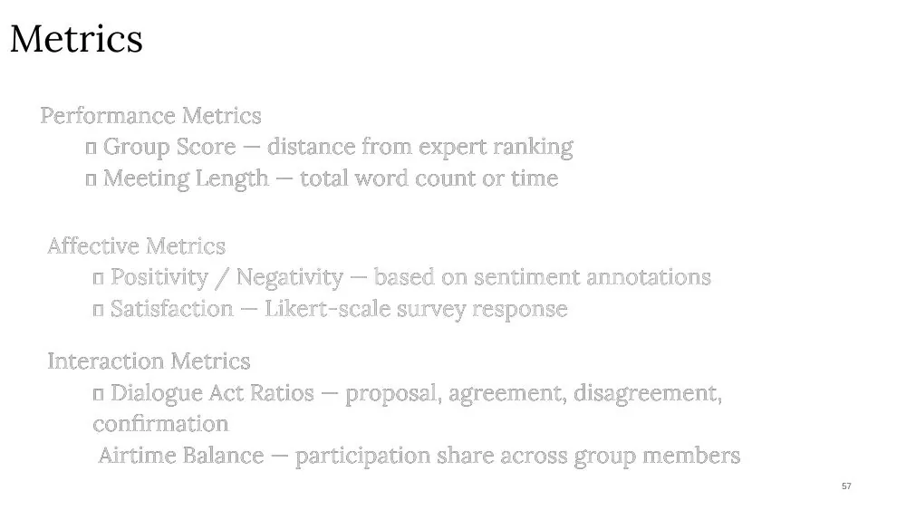</td><td width="44"><a href="#slide-58">→</a></td></tr></table>

We then compared following metrics of the human corpus and the synthetic metrics.

Group score is the distance from the ranking submitted by the group and expert’s ranking. Meeting length is to measure in terms of the number of words, since the agents are communicating through texts.

Affect and Satisfaction measures include the sentiment labels of each utterance, and the post-experiment questionnaire about group work satisfaction. Same as human experiments, we prompted the large language agents to answer a questionnaire.

Finally, in terms of group action, we measured the proportion of each type of dialogue act in the group conversations.

### Slide 58

<table><tr><td width="44"><a href="#slide-57">←</a></td><td>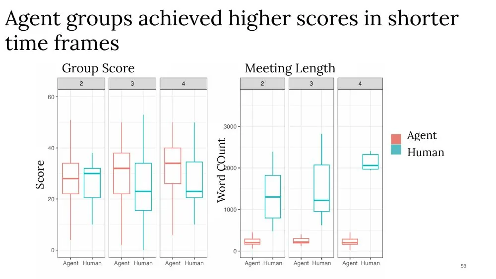</td><td width="44"><a href="#slide-59">→</a></td></tr></table>

The first major finding is that agent groups perform better than human groups, agent groups achieved higher group scores than humans

### Slide 59

<table><tr><td width="44"><a href="#slide-58">←</a></td><td>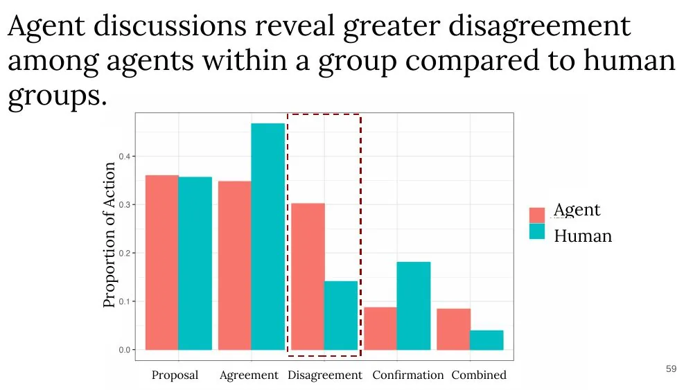</td><td width="44"><a href="#slide-60">→</a></td></tr></table>

The second major finding is that agent discussions involve more disagreements with each other.

### Slide 60

<table><tr><td width="44"><a href="#slide-59">←</a></td><td>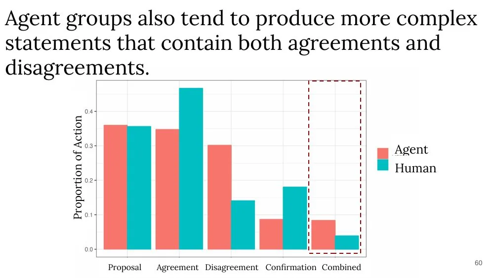</td><td width="44"><a href="#slide-61">→</a></td></tr></table>

There are also more complex statements, which are labeled as multiple dialogue acts. One utterance is often an agreement or disagreement followed by a proposal.

### Slide 61

<table><tr><td width="44"><a href="#slide-60">←</a></td><td>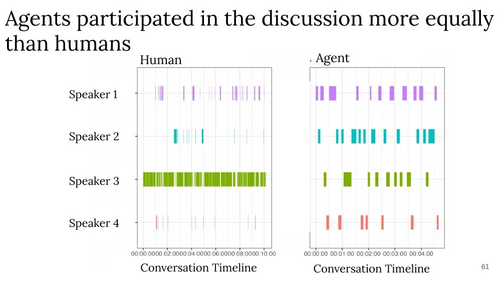</td><td width="44"><a href="#slide-62">→</a></td></tr></table>

Finally, we find that agents participated in the discussion more equally than humans. In human groups, especially the groups with three or more members, there’s always one or two who are more actively engaged in the conversation, while the rest becomes bystanders.

### Slide 62

<table><tr><td width="44"><a href="#slide-61">←</a></td><td>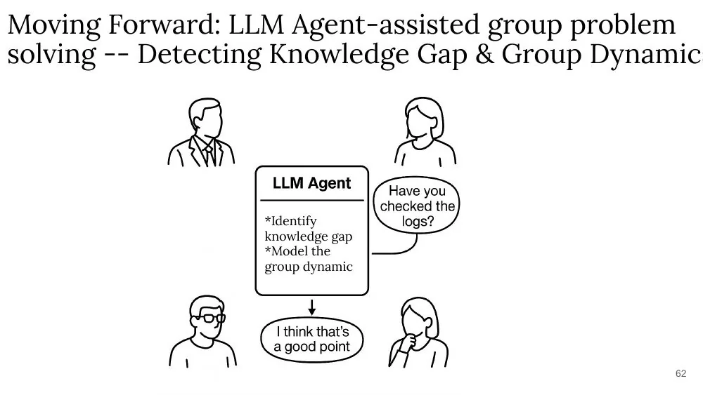</td><td width="44"><a href="#slide-63">→</a></td></tr></table>

From the previous results, we saw that LLM agents can already outperform human groups in many ways—producing better solutions, engaging more equally, and even surfacing more nuanced disagreement.

But those gains came from simulating agent-only groups. The bigger question is: can an LLM agent meaningfully assist a human group?

There are two driving forces in group conversations: Gain information and Maintain relationship.

Our vision is to build large language model powered agent to facilitate human groups along these two dimensions: Information wise, the agent will help can identify knowledge gap, and nudge the group toward most information topics; Relationship wise, the agent will model the group dynamics, modulate the sentimental tone of the conversation, and encourage equal participation in the conversation.

### Slide 63

<table><tr><td width="44"><a href="#slide-62">←</a></td><td>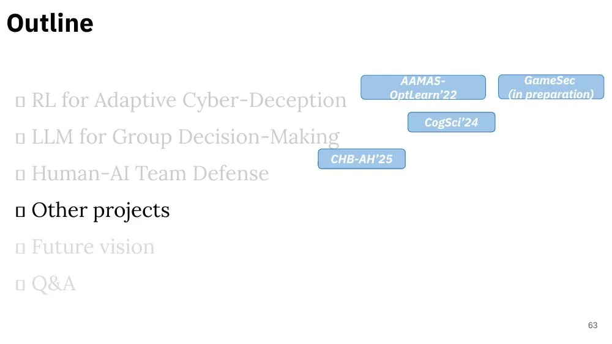</td><td width="44"><a href="#slide-64">→</a></td></tr></table>

We've now covered the three core projects that form the backbone of my recent work on human-AI decision-making. Before I conclude, I want to briefly highlight a few other projects. These studies extend the same central theme — using AI to model, support, or collaborate with humans — in domains like group decision-making and adaptive behavior modeling.

### Slide 64

<table><tr><td width="44"><a href="#slide-63">←</a></td><td>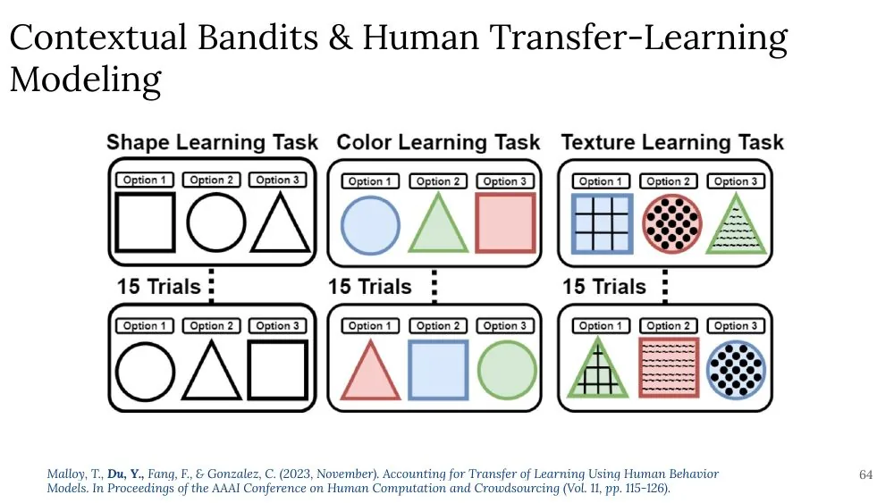</td><td width="44"><a href="#slide-65">→</a></td></tr></table>

This work tackles a core challenge in modeling human behavior — how people transfer what they've learned in one context to a new but related one.

We designed a sequential decision-making experiment using contextual bandit tasks, where features like shape, color, and texture are introduced step by step. Participants have to learn which combinations lead to higher rewards, and transfer that knowledge as the task becomes more complex.

To capture this behavior, we proposed a cognitive model that integrates compositional reasoning, causal inference, and optimal forgetting — three mechanisms inspired by how humans generalize and adapt.

Our model not only fits human data better than standard baselines, but ablation studies show that each cognitive component contributes meaningfully to predicting human transfer behavior

### Slide 65

<table><tr><td width="44"><a href="#slide-64">←</a></td><td>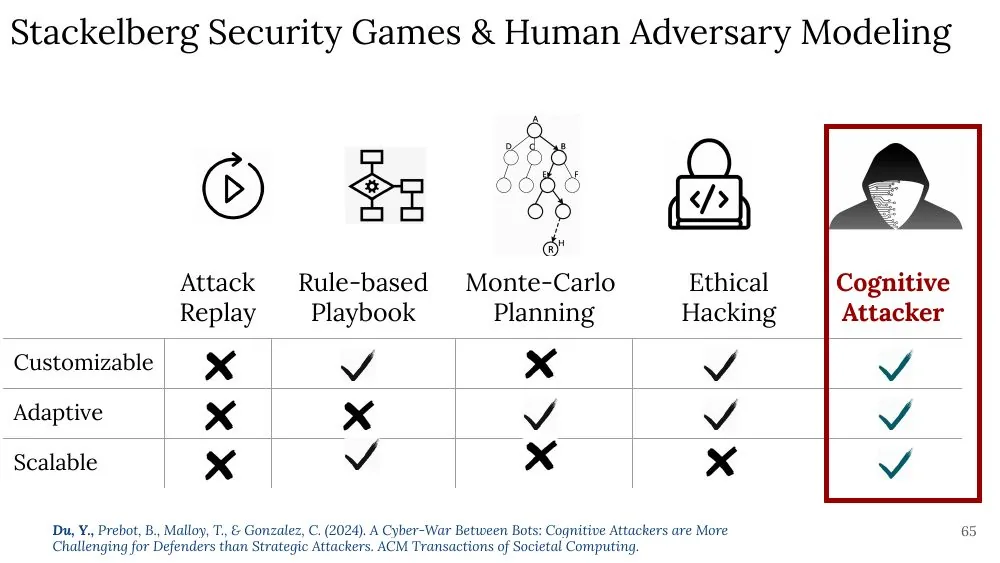</td><td width="44"><a href="#slide-66">→</a></td></tr></table>

In this work, we asked: what kinds of attackers are truly challenging for defenders?

We compared three types of attackers — a deterministic optimal attacker, a random attacker, and a cognitive attacker that adapts over time. Across simulations and human experiments, we found that adaptive, experience-driven attackers consistently posed the greatest challenge.

Defenders—both automated and human—could eventually learn to stop strategic or random attackers. But against adaptive attackers, even experienced defenders struggled. These adversaries maintained pressure, forced defenders to consider more options, and resisted being exploited.

The takeaway is clear: if we want to prepare defenders for real-world threats, we need to train them against adaptive opponents that change as they lear

### Slide 66

<table><tr><td width="44"><a href="#slide-65">←</a></td><td>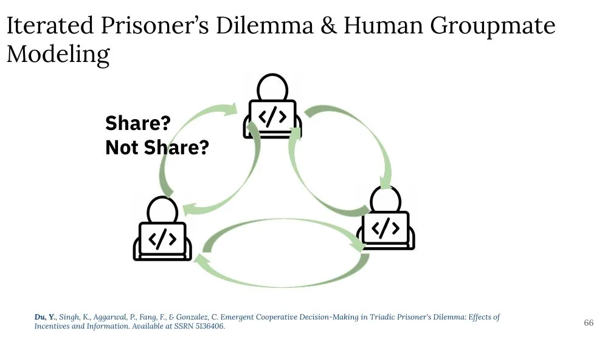</td><td width="44"><a href="#slide-67">→</a></td></tr></table>

To better understand cooperation in small groups, I take both an empirical and theoretical approach.

On the empirical side, I conducted behavioral experiments using a three-player cybersecurity game where participants decide whether to share threat intelligence. The findings show that cooperation improves when incentives are stronger or when participants can observe others’ actions and outcomes. But interestingly, giving players full payoff information actually reduced cooperation—likely because it made the temptation to defect more salient and disrupted early trust formation​

.

To explain these behavioral patterns, I developed a cognitive model of interdependent decision-making in groups. The model integrates three psychological mechanisms—dynamic prosociality, category learning, and contrast effects—to capture how people decide who to trust and how much. It not only reproduces key patterns from the experiment, like the shift from universal to selective cooperation, but also reveals how relationship imbalances and third-party effects emerge when people manage multiple social ties under cognitive constraints​

### Slide 67

<table><tr><td width="44"><a href="#slide-66">←</a></td><td>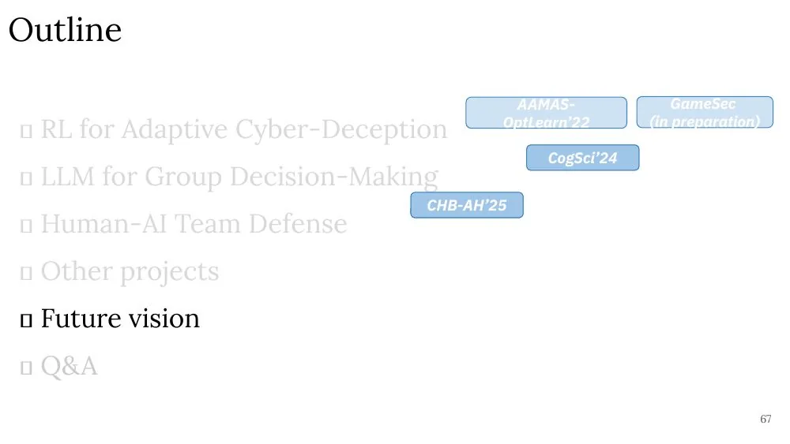</td><td width="44"><a href="#slide-68">→</a></td></tr></table>

### Slide 68

<table><tr><td width="44"><a href="#slide-67">←</a></td><td>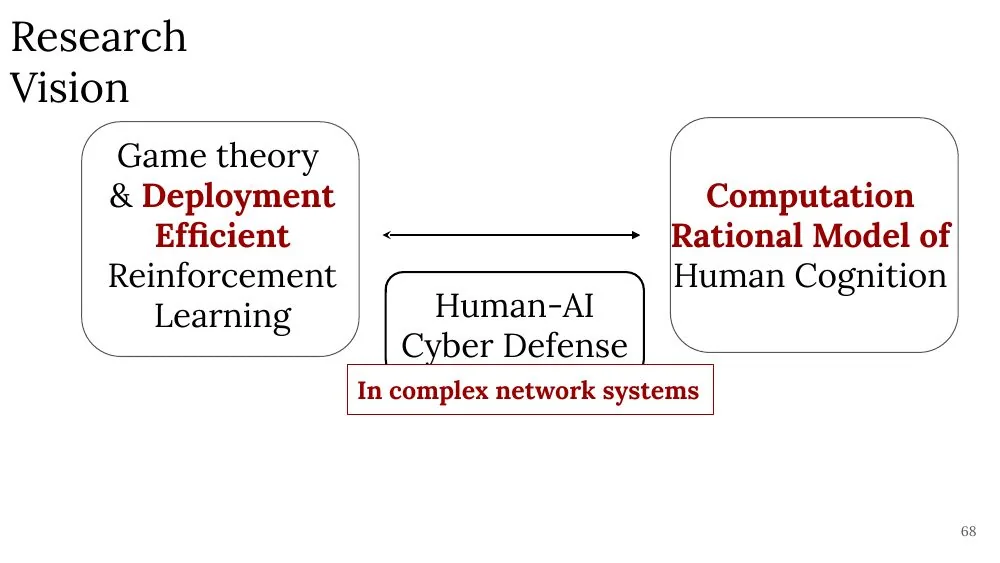</td><td width="44"><a href="#slide-69">→</a></td></tr></table>

### Slide 69

<table><tr><td width="44"><a href="#slide-68">←</a></td><td>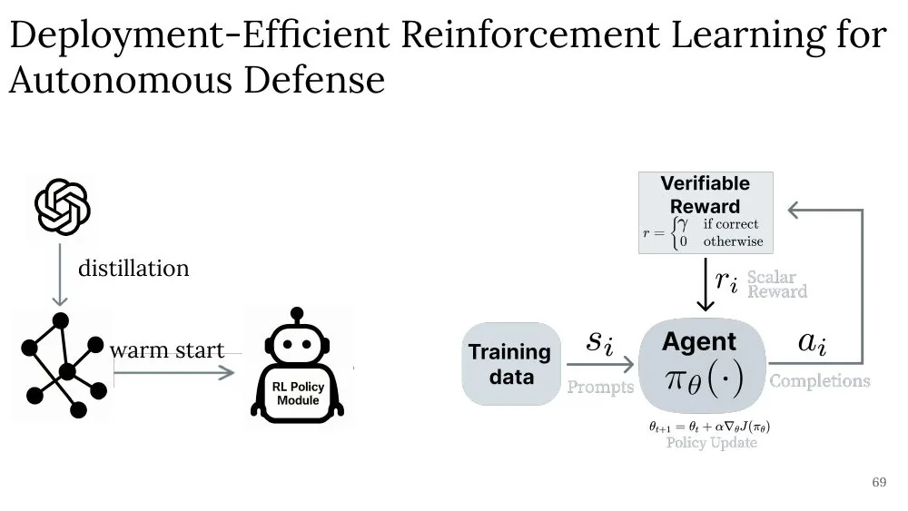</td><td width="44"><a href="#slide-70">→</a></td></tr></table>

There are two directions I’m particularly interested in for making reinforcement learning more practical and trustworthy in real-world cyber defense.

First, leverage domain knowledge.

Instead of relying solely on trial-and-error, we can warm up the agent’s learning process by integrating knowledge graphs — capturing relationships between attack techniques, vulnerabilities, and system components.

These graphs can come from human experts, or increasingly, from language models like GPT, which we can use to extract and formalize cybersecurity knowledge from text.

Second, learn human feedback. This is another way to make the learning process more auditable, and allow us to trace why a behavior was reinforced.

Traditional RLHF often relies on immediate preferences, which can be tricky because when you give a thumbs up or thumbs for each action, you might be training the RL agent to lie to you.

So in security settings, we need to combine immediate feedback with reflective feedback, to make sure the optimality of the sequence of actions in addition to aligning with human preferences.

### Slide 70

<table><tr><td width="44"><a href="#slide-69">←</a></td><td>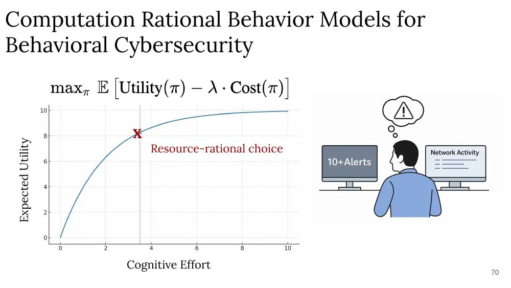</td><td width="44"><a href="#slide-71">→</a></td></tr></table>

In cybersecurity, we often expect defenders to be perfectly rational — to analyze every alert, weigh every outcome, and act optimally. But real defenders operate under real constraints: limited time, attention, and memory.

Computational rationality asks a more realistic question: What’s the best decision someone can make, given their cognitive limits?

Instead of maximizing utility alone, people make decisions that trade off performance against mental effort — captured in this formulation: E[Utility(π)−λ⋅Cost(π)]

The curve illustrating this trade-off: more effort gives higher utility, but only up to a point.

The resource-rational choice lies not at the far end — but at the sweet spot where the gain no longer justifies the cost.

Here, π is the chosen strategy. Utility could be catching threats; cost might be cognitive load.

And λ reflects how heavily effort is penalized.

A concrete example is alert prioritization.

Cyber analysts are often overwhelmed by simultaneous alerts must decide where to focus.

By modeling cognitive limits, a computational rational agent can help prioritize — surfacing the most urgent or relevant threats, and pacing information flow.

This makes AI support not just responsive, but truly aligned with how humans make decisions under pressure.

### Slide 71

<table><tr><td width="44"><a href="#slide-70">←</a></td><td></td><td width="44"><a href="#slide-72">→</a></td></tr></table>

### Slide 72

<table><tr><td width="44"><a href="#slide-71">←</a></td><td>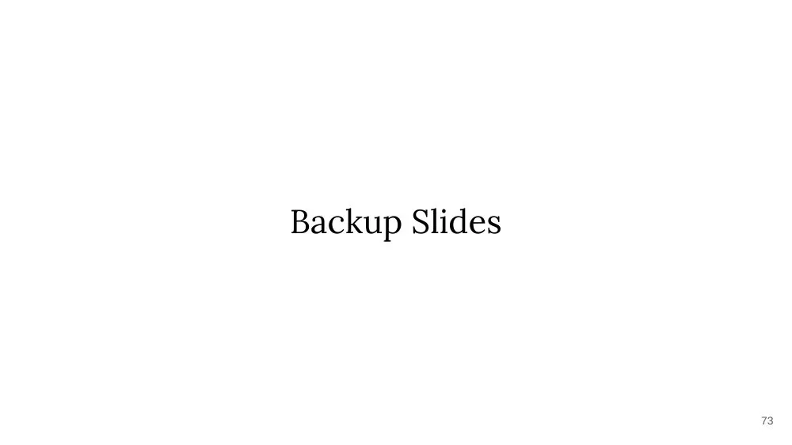</td><td width="44"><a href="#slide-73">→</a></td></tr></table>

### Slide 73

<table><tr><td width="44"><a href="#slide-72">←</a></td><td>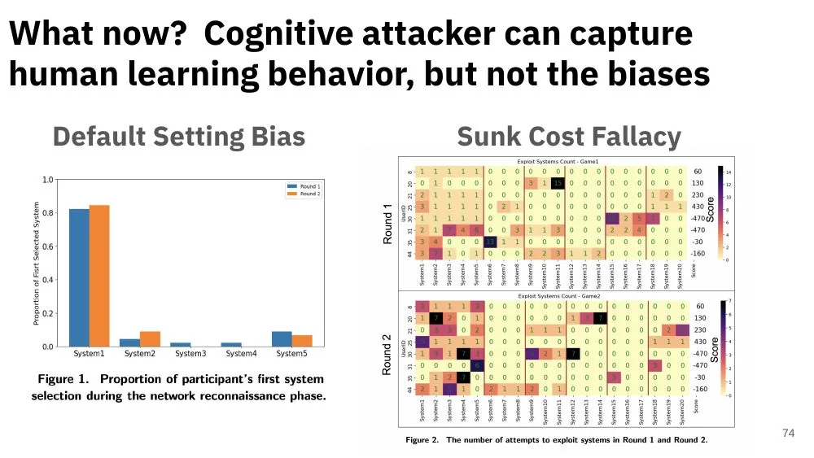</td><td width="44"><a href="#slide-74">→</a></td></tr></table>

### Slide 74

<table><tr><td width="44"><a href="#slide-73">←</a></td><td>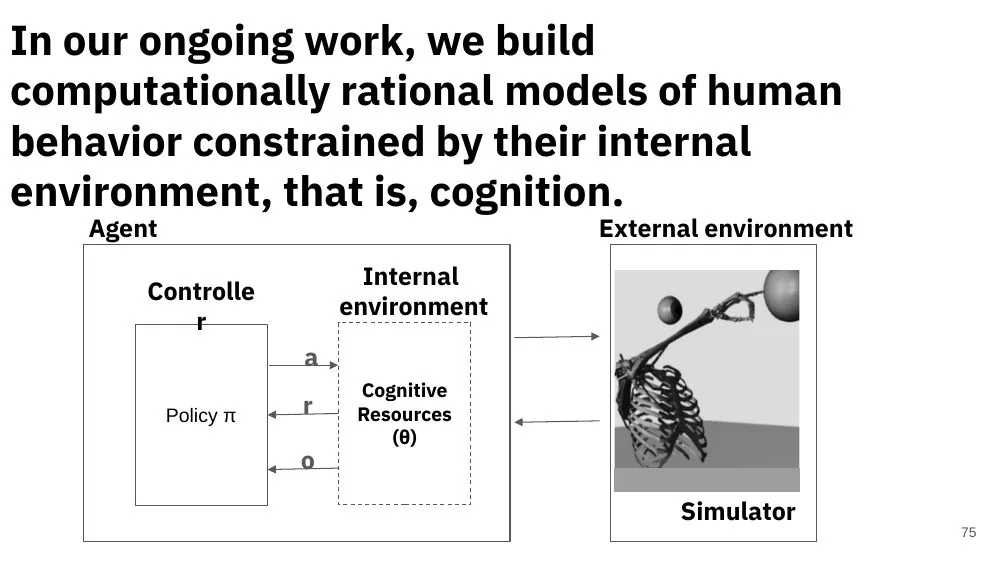</td><td width="44"><a href="#slide-75">→</a></td></tr></table>

### Slide 75

<table><tr><td width="44"><a href="#slide-74">←</a></td><td>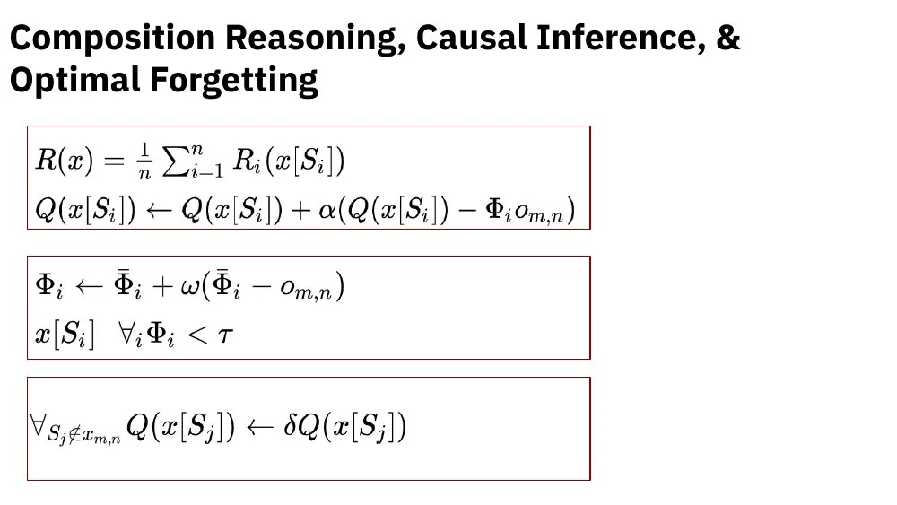</td><td width="44"><a href="#slide-76">→</a></td></tr></table>

### Slide 76

<table><tr><td width="44"><a href="#slide-75">←</a></td><td>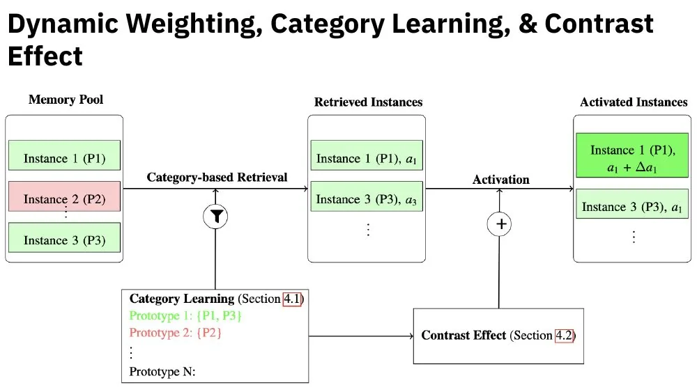</td><td width="44"></td></tr></table>

This is the computational representation of the three key mechanisms that we proposed, the model learns a factorized Q-value of the states, update the causal links between a feature and the outcome when its weight drops under a certain threshold, and represent the forgetting process with this parameter zeta, which means the value of a feature will decay if it’s not frequently visited.

We were happy to validate our conjecture, and our model match human data much more accurately than previous methods.
