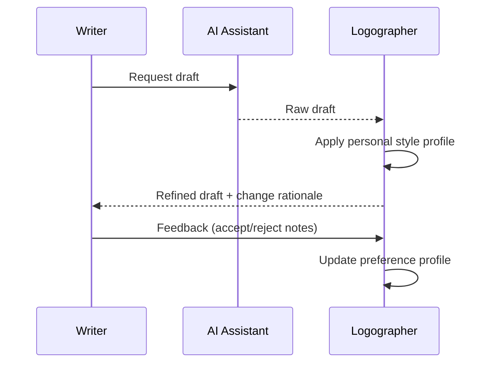

# Logographer

## Intent
Reduce the friction of agent-generated writing by learning a writer's readability preferences and applying them consistently.

## Interaction flow

## MVP panels
1. Preference profile summary
2. Raw vs refined side-by-side
3. Rule activations with confidence
4. Quick feedback controls
5. Export refined text

## Quality targets
- lower rejection rate over time
- reduced reading friction
- stable voice and structure consistency

**Related:** [Tools](overview.md) | [Tool roadmap](tool-roadmap-and-status-board.md)

_Last updated: 2026-08_
